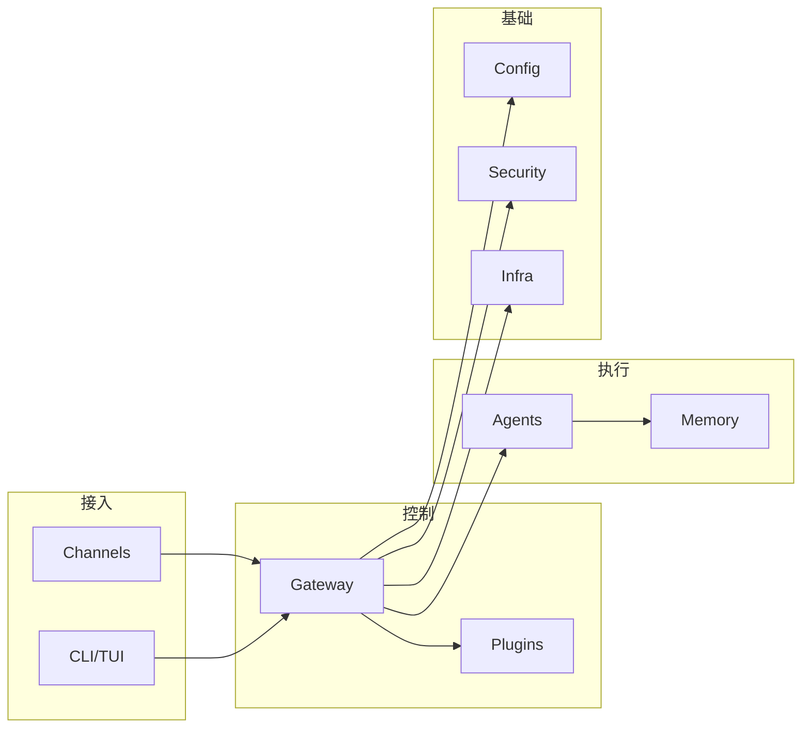

# OpenClaw 源码分析文档

本文档对 OpenClaw 项目 `src/` 目录（**50 个子模块，2500+ 源文件**）进行了深度源码分析，涵盖核心架构、模块实现及开发指南。

## 项目概览

OpenClaw 是一个企业级 AI 代理框架，通过多种渠道（Telegram, Discord, Slack, WhatsApp, Signal, Web 等）提供智能交互服务。采用**一切皆插件**的模块化设计，具备完善的 Gateway/Daemon 后台机制和多模型混合调度能力。

## 架构全景

> 📖 **[架构设计文档](./architecture.md)** — 含 Mermaid 分层架构图、消息生命周期序列图、插件生态拓扑图

---

## 模块文档索引

### 🚀 启动与运行

| 文档                                               | 覆盖模块                               | 要点                                         |
| -------------------------------------------------- | -------------------------------------- | -------------------------------------------- |
| [启动引导与运行时](./modules/bootstrap-runtime.md) | `entry.ts`, `globals.ts`, `runtime.ts` | Respawn 机制、Fast Path、运行时解耦          |
| [网关与守护进程](./modules/gateway-daemon.md)      | `src/gateway/`, `src/daemon/`          | 41KB server.impl、RPC、热重载、跨平台 Daemon |
| [CLI 与命令系统](./modules/cli-commands.md)        | `src/cli/`, `src/commands/`            | 176 CLI 文件、延迟加载、Commander.js         |

### 🧠 AI 核心

| 文档                                            | 覆盖模块                             | 要点                               |
| ----------------------------------------------- | ------------------------------------ | ---------------------------------- |
| [代理与认知循环](./modules/agents-logic.md)     | `src/agents/` (579 files)            | Pi Runner、subagent 编排、工具策略 |
| [记忆与上下文引擎](./modules/memory-context.md) | `src/memory/`, `src/context-engine/` | 混合搜索、embeddings、RAG 注入     |
| [自动回复与分发](./modules/auto-reply.md)       | `src/auto-reply/`                    | 状态机、指令检测、心跳分发         |

### 📡 通讯与路由

| 文档                                        | 覆盖模块                        | 要点                               |
| ------------------------------------------- | ------------------------------- | ---------------------------------- |
| [渠道与路由](./modules/channels-routing.md) | `src/channels/`, `src/routing/` | 多平台抽象、session-key、allowlist |
| [会话与凭据](./modules/sessions-secrets.md) | `src/sessions/`, `src/secrets/` | 会话 ID 解析、模型覆盖、凭证管理   |

### 🔧 系统基础

| 文档                                     | 覆盖模块                     | 要点                                 |
| ---------------------------------------- | ---------------------------- | ------------------------------------ |
| [配置系统](./modules/config-system.md)   | `src/config/` (215 files)    | Zod Schema、配置 IO、环境变量、迁移  |
| [安全模型](./modules/security-model.md)  | `src/security/`              | 安全审计、执行审批、DM 策略          |
| [基础设施](./modules/infra-core.md)      | `src/infra/` (393 files)     | exec-approvals、心跳、服务发现、更新 |
| [进程与工具](./modules/process-utils.md) | `src/process/`, `src/utils/` | 子进程桥接、watchdog、限流           |

### 🔌 扩展生态

| 文档                                              | 覆盖模块                   | 要点                                 |
| ------------------------------------------------- | -------------------------- | ------------------------------------ |
| [插件系统](./modules/extensibility.md)            | `src/plugins/` (138 files) | 45KB loader、29KB hooks、marketplace |
| [二次开发指南](./modules/dev-extensions.md)       | `src/plugin-sdk/`          | Provider/Channel/Skill 开发实战      |
| [扩展生态概览](./modules/extensions-ecosystem.md) | `extensions/`              | 渠道、提供商、技能、存储插件         |

### 📦 能力与辅助

| 文档                                       | 覆盖模块                                   | 要点                         |
| ------------------------------------------ | ------------------------------------------ | ---------------------------- |
| [高级能力](./modules/capabilities.md)      | `src/acp/`, `src/tui/`, `src/canvas-host/` | ACP 协议、终端 UI、Canvas    |
| [多媒体特性](./modules/media-features.md)  | `src/media/`, `src/image-generation/`      | Sharp、FFmpeg、PDF、图像生成 |
| [定时任务](./modules/cron.md)              | `src/cron/`                                | 调度引擎、防并发、持久化恢复 |
| [配置向导](./modules/setup-wizard.md)      | `src/wizard/`, `src/commands/onboard*`     | 交互式引导、渠道接入         |
| [辅助系统](./modules/auxiliary-systems.md) | `src/logging/`, `src/tts/`, `src/i18n/`    | 日志脱敏、语音合成、国际化   |

---

## 源码统计

| 指标       | 数值                          |
| ---------- | ----------------------------- |
| 顶级子目录 | 50 个                         |
| 最大模块   | `agents/` — 579 文件          |
| 基础设施   | `infra/` — 393 文件           |
| 命令系统   | `commands/` — 295 文件        |
| 网关       | `gateway/` — 250 文件         |
| 配置       | `config/` — 215 文件          |
| 测试覆盖   | 大量 `*.test.ts` 协同测试文件 |
