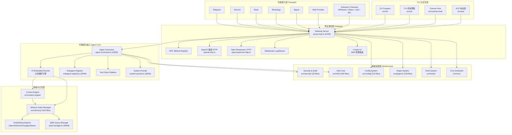
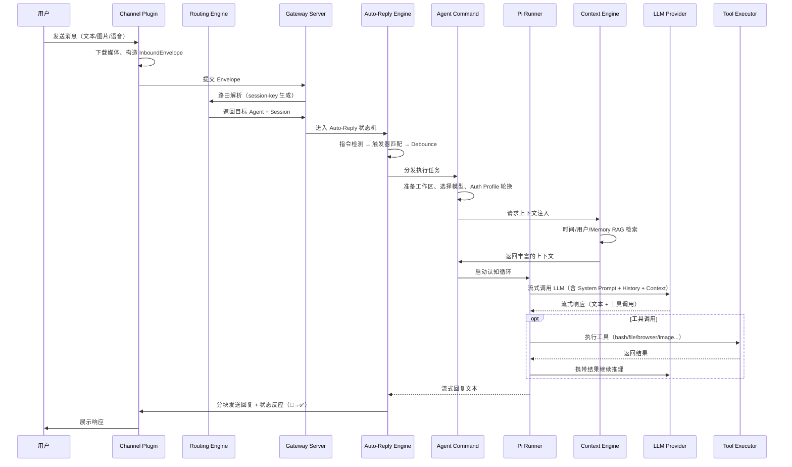
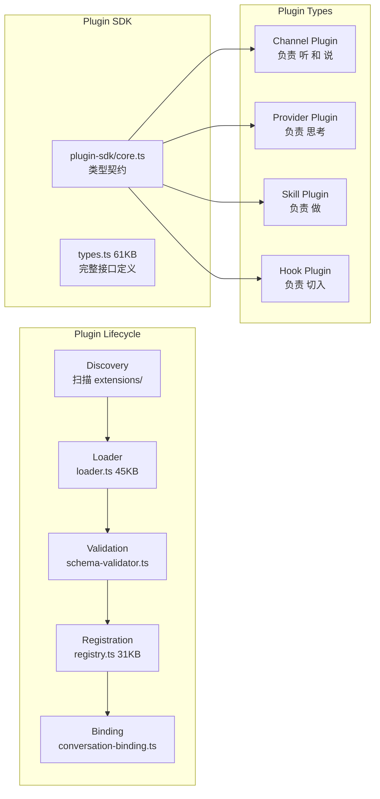

# OpenClaw 架构设计文档

本文档从整体设计角度阐述 OpenClaw 的核心架构、组件交互和关键技术选型。

## 设计目标

| 目标           | 实现手段                                                  |
| -------------- | --------------------------------------------------------- |
| **高可用**     | Gateway/Daemon 后台持久运行，心跳监控，看门狗自动恢复     |
| **极度可扩展** | 一切皆插件：Channel / Provider / Skill / Hook 四大扩展轴  |
| **安全**       | 执行审批系统、沙箱隔离、配置安全审计、DM 策略守卫         |
| **高性能**     | CLI 命令延迟加载、V8 编译缓存、混合搜索记忆、并发控制     |
| **跨平台**     | macOS launchd / Linux systemd / Windows schtasks 三端统一 |

---

## 系统分层架构



---

## 消息处理全生命周期



---

## 插件生态模型



---

## 技术栈

| 类别     | 选型                 | 说明                              |
| -------- | -------------------- | --------------------------------- |
| 语言     | TypeScript (ESM)     | 严格类型，Node 22+ & Bun 双运行时 |
| 配置校验 | Zod                  | Schema 即文档，162KB 配置 Schema  |
| 图像处理 | Sharp + macOS Sips   | 平衡性能与平台兼容                |
| 音频处理 | FFmpeg               | 转码、格式转换                    |
| 向量存储 | SQLite + sqlite-vec  | 本地高性能向量搜索                |
| 全文搜索 | SQLite FTS5          | 关键词匹配                        |
| 打包     | tsdown               | 生产构建                          |
| 测试     | Vitest + V8 Coverage | 70% 覆盖率门槛                    |
| Lint     | Oxlint + Oxfmt       | 高性能格式化/检查                 |
| 包管理   | pnpm (Bun 兼容)      | Monorepo workspace                |

---

## 关键目录结构

```
src/
├── entry.ts              # 物理入口（Respawn、Fast Path）
├── index.ts              # Library 导出
├── cli/                  # CLI 命令层（176 文件）
├── commands/             # 业务命令实现（295 文件）
├── gateway/              # 网关服务器（250 文件）
├── agents/               # Agent 核心（579 文件）⭐ 最大模块
├── auto-reply/           # 自动回复状态机（67 文件）
├── channels/             # 渠道抽象（67 文件）
├── routing/              # 路由引擎（11 文件）
├── config/               # 配置系统（215 文件）
├── plugins/              # 插件系统（141 文件）
├── hooks/                # 生命周期钩子（38 文件）
├── memory/               # 记忆引擎（103 文件）
├── context-engine/       # 上下文注入（7 文件）
├── infra/                # 基础设施（397 文件）
├── security/             # 安全审计（35 文件）
├── sessions/             # 会话管理（13 文件）
├── media/                # 媒体处理（41 文件）
├── cron/                 # 定时任务
├── daemon/               # 守护进程
├── tui/                  # 终端 UI
├── acp/                  # Agent Client Protocol
├── browser/              # 浏览器自动化
├── tts/                  # 语音合成
└── ...                   # 更多子模块
```
