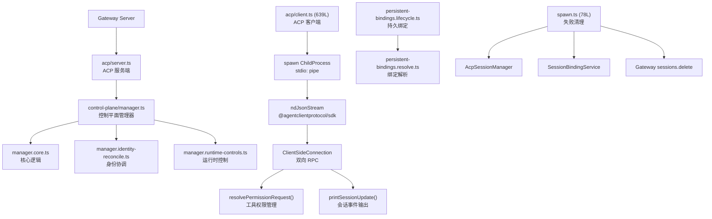
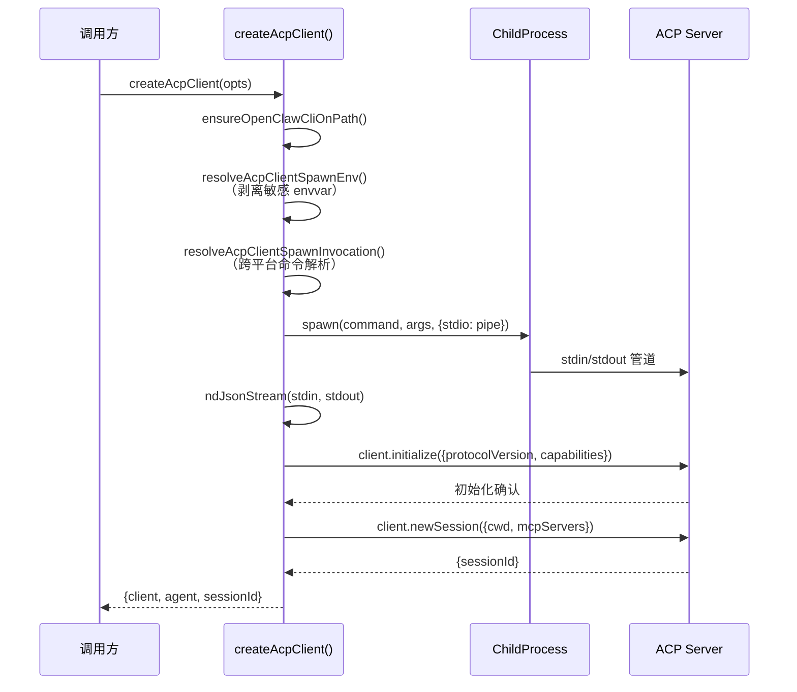
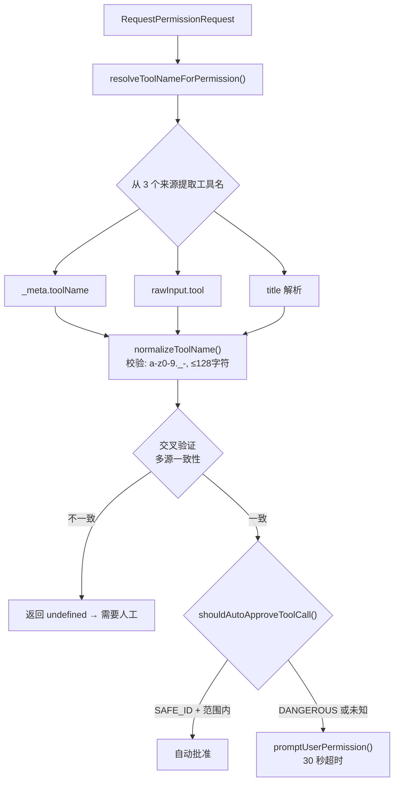
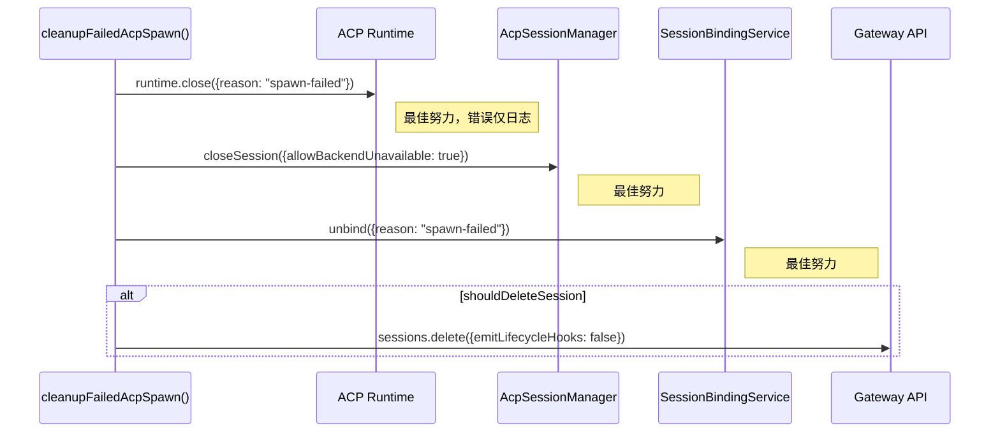

# 模块深度分析：Agent Client Protocol (ACP)

> 基于 `src/acp/`（55 个文件）源码逐行分析，覆盖客户端、控制平面、持久绑定、会话身份、权限系统。

## 1. 架构概览



## 2. ACP 客户端（`client.ts` — 639L）

### 2.1 客户端创建流程



### 2.2 工具权限自动审批

```typescript
// 安全自动批准的工具列表
const SAFE_AUTO_APPROVE_TOOL_IDS = new Set(["read", "search", "web_search", "memory_search"]);

// read 工具额外约束: 必须在 cwd 范围内
function isReadToolCallScopedToCwd(params, toolName, toolTitle, cwd): boolean {
  if (toolName !== "read") return false;
  const absolutePath = resolveAbsoluteScopedPath(rawPath, cwd);
  return isPathWithinRoot(absolutePath, path.resolve(cwd));
}

// 危险工具始终需要人工批准
import { DANGEROUS_ACP_TOOLS } from "../security/dangerous-tools.js";
```

### 2.3 权限解析流程



### 2.4 环境变量安全

```typescript
// 自动剥离 Provider Auth 环境变量（防止凭据泄露到 ACP 子进程）
function shouldStripProviderAuthEnvVarsForAcpServer(params): boolean;
// 仅当 ACP 使用默认 openclaw 命令时才剥离
// 自定义 serverCommand 保留原始环境

// 还须剥离: activeSkillEnvKeys（技能环境变量）
const stripKeys = buildAcpClientStripKeys({
  stripProviderAuthEnvVars: true,
  activeSkillEnvKeys: getActiveSkillEnvKeys(),
});
```

### 2.5 会话事件输出

```typescript
// printSessionUpdate() — 4 种事件类型
switch (update.sessionUpdate) {
  case "agent_message_chunk":  // 流式文本输出
  case "tool_call":            // 工具调用
  case "tool_call_update":     // 工具状态更新
  case "available_commands_update": // 可用命令更新
}
```

---

## 3. Spawn 失败清理（`spawn.ts` — 78L）



4 层资源清理，每层独立 catch（不中断后续清理）。

---

## 4. 控制平面管理器

### 管理器组件

| 文件 | 行数 | 职责 |
|------|------|------|
| `manager.core.ts` | ~400 | Agent 生命周期、spawn/stop |
| `manager.identity-reconcile.ts` | ~200 | 身份链接与解除关联 |
| `manager.runtime-controls.ts` | ~150 | 运行时参数控制 |
| `manager.types.ts` | ~100 | 管理器类型定义 |
| `manager.utils.ts` | ~80 | 工具函数 |

### 运行时缓存

```typescript
// runtime-cache.ts
type RuntimeCache = Map<string, {
  runtimeId: string;
  sessionKey: string;
  lastActivity: number;
}>;
```

---

## 5. 持久绑定（Persistent Bindings）

```typescript
// persistent-bindings.types.ts
type PersistentBinding = {
  sessionKey: string;       // 绑定的会话键
  runtimeSessionName: string; // ACP 运行时会话名
  backend: string;          // ACP Provider 名
  createdAt: number;        // 创建时间
};
```

## 6. 会话身份系统

```typescript
// runtime/session-identity.ts — 会话唯一标识
// runtime/session-identifiers.ts — 多标识符解析
// runtime/session-meta.ts — 创建时间、活动时间、turn计数、token用量
```

## 7. ACP 策略

```typescript
// policy.ts
type AcpPolicy = {
  enabled: boolean;
  allowSpawn: boolean;
  maxConcurrent: number;
  timeoutMs: number;
};
```

## 8. 关键文件清单

| 目录/文件 | 文件数 | 职责 |
|-----------|--------|------|
| `client.ts` | 1 (639L) | ACP 客户端、权限、spawn |
| `server.ts` | 1 | ACP 服务端 |
| `control-plane/` | 12 | 管理器、缓存、spawn 清理 |
| `runtime/` | 10 | 注册表、会话身份、错误 |
| `persistent-bindings*` | 5 | 持久绑定生命周期 |
| `event-mapper.ts` | 1 | ACP↔OpenClaw 事件映射 |
| `policy.ts` | 1 | ACP 策略 |
| `session*.ts` | 3 | 会话管理 |
| `translator*.ts` | 5 | 协议翻译 |
