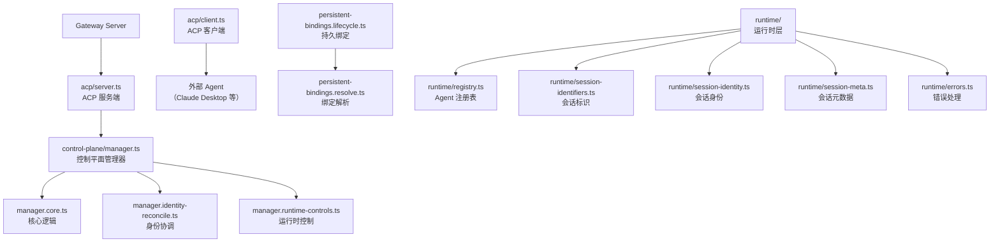
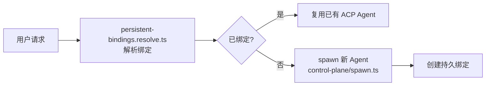

# 模块深度分析：Agent Client Protocol (ACP)

> 基于 `src/acp/`（55 个文件）源码分析，覆盖控制平面、持久绑定、会话身份。

## 1. 架构概览



## 2. 控制平面管理器

`control-plane/manager.ts` 是 ACP 的核心，负责：

### 管理器组件

| 文件 | 职责 |
|------|------|
| `manager.core.ts` | Agent 生命周期、spawn/stop |
| `manager.identity-reconcile.ts` | 身份链接与解除关联 |
| `manager.runtime-controls.ts` | 运行时参数控制 |
| `manager.types.ts` | 管理器类型定义 |
| `manager.utils.ts` | 工具函数 |

### 运行时缓存

```typescript
// runtime-cache.ts — ACP 会话缓存
type RuntimeCache = Map<string, {
  runtimeId: string;
  sessionKey: string;
  lastActivity: number;
  // ...
}>;
```

## 3. 持久绑定（Persistent Bindings）



绑定类型（`persistent-bindings.types.ts`）：
- **会话绑定**：sessionKey → ACP Runtime
- **Agent 绑定**：agentId → ACP Provider

## 4. 会话身份系统

```typescript
// runtime/session-identity.ts
type SessionIdentity = {
  sessionKey: string;
  agentId: string;
  peerId?: string;
  channel?: string;
  // ACP 会话唯一标识
};
```

### 会话元数据

```typescript
// runtime/session-meta.ts
type SessionMeta = {
  createdAt: number;
  lastActivityAt: number;
  turnCount: number;
  tokenUsage: { input: number; output: number };
};
```

## 5. 事件映射

```typescript
// event-mapper.ts — ACP 事件 ↔ OpenClaw 事件
// ACP text_delta → Agent stream.text_delta
// ACP tool_use → Agent tool.call
// ACP error → Agent error
```

## 6. ACP 策略

```typescript
// policy.ts
type AcpPolicy = {
  enabled: boolean;
  allowSpawn: boolean;      // 允许创建新 Agent
  maxConcurrent: number;    // 最大并发 Agent 数
  timeoutMs: number;        // 超时（毫秒）
};
```

## 7. 关键文件清单

| 目录 | 文件数 | 职责 |
|------|--------|------|
| `control-plane/` | 12 | 控制平面（管理器、缓存、spawn） |
| `runtime/` | 10 | 运行时（注册表、会话、错误） |
| `persistent-bindings*` | 5 | 持久绑定 |
| 根文件 | 10+ | 客户端、服务器、事件、策略 |
