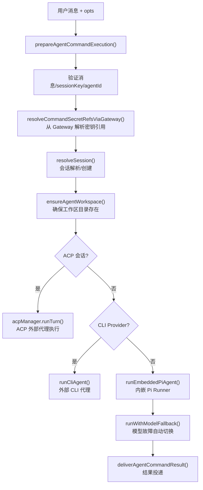
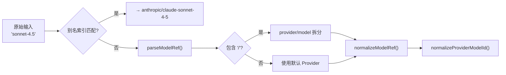
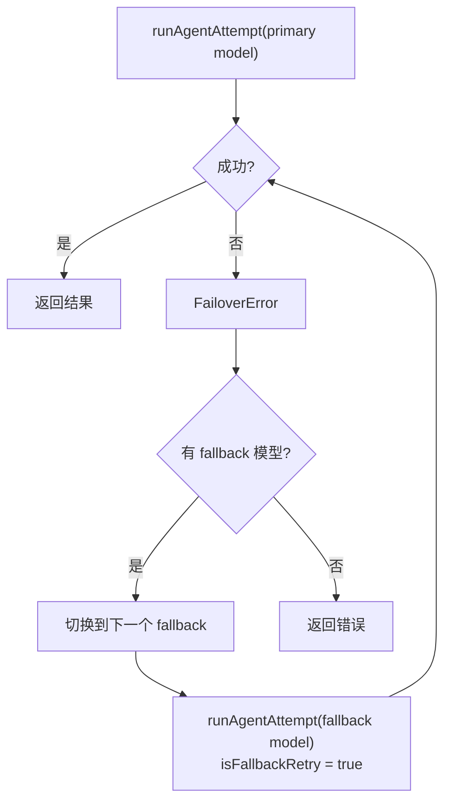

# 模块深度分析：Agent 引擎

> 基于 `src/agents/` 源码逐行分析，覆盖 Agent 执行流程、模型选择、会话管理、子代理系统。

## 1. Agent 命令执行全流程

`agent-command.ts`（1334 行 / 43KB）是 Agent 执行的核心入口。`agentCommandInternal()` 的完整流程：



### 1.1 会话准备阶段（`prepareAgentCommandExecution`）

关键步骤（L536-L708）：

```typescript
// 1. 消息校验：空消息直接抛异常
if (!message.trim()) throw new Error("Message (--message) is required");

// 2. 内部事件注入：将系统事件前置到用户消息
const body = prependInternalEventContext(message, opts.internalEvents);

// 3. 密钥解析：通过 Gateway RPC 解析 ${SECRET_REF}
const { resolvedConfig, diagnostics } = await resolveCommandSecretRefsViaGateway({...});

// 4. Agent ID 验证：检查 agentId 是否存在于配置
const knownAgents = listAgentIds(cfg);
if (!knownAgents.includes(agentId)) throw new Error(`Unknown agent id...`);

// 5. 会话解析：查找或创建会话（sessionId + sessionKey → sessionEntry）
const sessionResolution = resolveSession({ cfg, to, sessionId, sessionKey, agentId });

// 6. 工作区初始化：创建 Agent 工作目录及引导文件
const workspace = await ensureAgentWorkspace({ dir, ensureBootstrapFiles: !skipBootstrap });
```

### 1.2 Agent 执行分发（`runAgentAttempt`）

三种执行路径（L352-L534）：

| 路径 | 条件 | 执行方式 |
|------|------|---------|
| **CLI Provider** | `isCliProvider(provider)` | `runCliAgent()` — 外部进程调用 Claude CLI / Codex CLI |
| **ACP** | `acpResolution.kind === "ready"` | `acpManager.runTurn()` — Agent Client Protocol 外部代理 |
| **嵌入式 Pi** | 默认路径 | `runEmbeddedPiAgent()` — 内嵌 @mariozechner/pi-coding-agent |

**CLI Session 过期处理**（L412-L483）：
```typescript
// CLI provider 返回 FailoverError(reason="session_expired") 时
// 1. 清除 sessionStore 中的过期 sessionId
// 2. 无 sessionId 重试 → 创建新 CLI session
// 3. 成功后将新 sessionId 写回 sessionStore
```

---

## 2. 模型选择引擎

`model-selection.ts`（676 行）实现了多层模型解析策略：

### 2.1 模型引用解析（ModelRef）



### 2.2 Provider 特定标准化

```typescript
// Anthropic 短名称映射（L96-L108）
"opus-4.6"   → "claude-opus-4-6"
"sonnet-4.5" → "claude-sonnet-4-5"

// Google 模型 ID 标准化（L121-L123）
normalizeGoogleModelId(model)  // gemini-2.0-flash → gemini-2.0-flash

// OpenRouter 无斜杠模型补全（L128-L130）
"aurora-alpha" → "openrouter/aurora-alpha"  // 原生 OpenRouter 模型加前缀
```

### 2.3 模型白名单系统（`buildAllowedModelSet`）

```typescript
// L409-L505 — 构建允许的模型集合
const rawAllowlist = Object.keys(cfg.agents?.defaults?.models ?? {});
// 空白名单 → allowAny: true（允许所有目录中的模型）
// 非空白名单 → 严格匹配，但自动包含 fallback 模型
```

### 2.4 默认模型回退策略（`resolveConfiguredModelRef`）

```typescript
// L271-L335 — 当配置的默认 provider 不可用时
const configuredProviders = cfg.models?.providers;
if (!hasDefaultProvider) {
  // 查找第一个有模型的 provider 作为回退
  const availableProvider = Object.entries(configuredProviders).find(
    ([, cfg]) => cfg?.models?.length > 0
  );
  return { provider: providerName, model: firstModel.id };
}
```

### 2.5 Thinking 级别解析

7 个级别：`off` → `minimal` → `low` → `medium` → `high` → `xhigh` → `adaptive`

优先级链：
1. 每模型配置（`models[key].params.thinking`）
2. 全局默认（`agents.defaults.thinkingDefault`）
3. 模型自动检测（`resolveThinkingDefaultForModel()`）

---

## 3. 模型故障转移（Model Fallback）

`model-fallback.ts` 实现了自动模型切换：



**关键行为**：
- `isFallbackRetry = true` 时，替换用户消息为 "Continue where you left off. The previous model attempt failed or timed out."
- Fallback 重试时**不携带原始图片**（`images: undefined`）
- 由 `resolveEffectiveModelFallbacks()` 从配置中解析 fallback 链

---

## 4. 子代理系统（Subagent）

### 4.1 子代理模型选择

```typescript
// model-selection.ts L377-L407
resolveSubagentConfiguredModelSelection():
  1. Agent 专属子代理模型 → agents[id].subagents.model
  2. 全局子代理默认 → agents.defaults.subagents.model
  3. Agent 自身模型 → agents[id].model
```

### 4.2 子代理注册

`subagent-registry.ts` 维护全局子代理注册表，`initSubagentRegistry()` 在 Gateway 启动时调用。

---

## 5. ACP（Agent Client Protocol）执行路径

当会话绑定到 ACP 外部代理时（L760-L860）：

```typescript
// 1. ACP 策略检查
const dispatchPolicyError = resolveAcpDispatchPolicyError(cfg);
const agentPolicyError = resolveAcpAgentPolicyError(cfg, acpAgent);

// 2. ACP 转发执行
await acpManager.runTurn({
  text: body, mode: "prompt", requestId: runId,
  onEvent: (event) => {
    if (event.type === "text_delta") {
      // 使用 AcpVisibleTextAccumulator 过滤 SILENT_REPLY_TOKEN
      const result = visibleTextAccumulator.consume(event.text);
      if (result) emitAgentEvent({ stream: "text", data: { delta: result.delta } });
    }
  }
});

// 3. ACP 会话记录持久化
await persistAcpTurnTranscript({ body, finalText, sessionFile, ... });
```

**Silent Reply 过滤**（L195-L270）：`createAcpVisibleTextAccumulator()` 缓冲初始文本，检测是否以 `SILENT_REPLY_TOKEN` 开头，如果是则抑制输出。

---

## 6. 会话生命周期

### 会话条目字段

```typescript
type SessionEntry = {
  sessionId: string;
  providerOverride?: string;   // 会话级 Provider 覆盖
  modelOverride?: string;      // 会话级模型覆盖
  authProfileOverride?: string;
  thinkingLevel?: ThinkLevel;
  verboseLevel?: VerboseLevel;
  compactionCount?: number;    // 上下文压缩次数
  inputTokens?: number;
  outputTokens?: number;
  totalTokens?: number;
  cacheRead?: number;          // 缓存命中 Token
  cacheWrite?: number;         // 缓存写入 Token
  updatedAt?: number;
  // ...
};
```

### 覆盖字段清理

12 个覆盖字段在会话删除时清理（L106-L127）：
`providerOverride`, `modelOverride`, `authProfileOverride`, `authProfileOverrideSource`, `authProfileOverrideCompactionCount`, `fallbackNoticeSelectedModel`, `fallbackNoticeActiveModel`, `fallbackNoticeReason`, `claudeCliSessionId`
