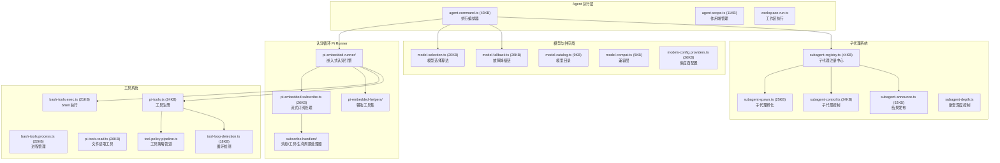
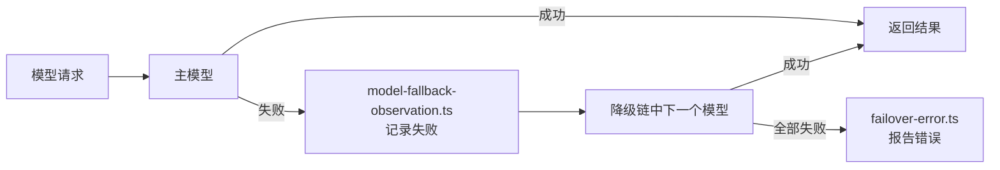
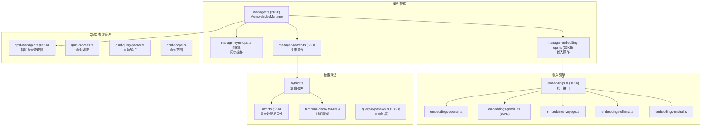

# 模块分析：Agents, Context & Memory

## 代理核心 — `src/agents/` (579 文件) ⭐ 最大模块

Agents 模块是 OpenClaw 的"灵魂"，驱动 AI 推理、工具调用、子代理编排和会话管理。

### Agent Command — 执行编排器

`agent-command.ts`（43KB）是单次"代理回合"的总指挥：

1. 解析会话背景、Agent 配置
2. 准备工作空间（沙箱路径、引导文件）
3. 选择模型（`model-selection.ts`）并处理 Auth Profile 轮换
4. 构建 System Prompt（`system-prompt.ts` 32KB）
5. 启动 Pi Runner 认知循环
6. 处理子代理孵化请求

### Pi Embedded Runner — 认知循环

核心 AI 推理引擎，负责：

- 维护对话历史（含压缩 `compaction.ts` 15KB）
- 应用 System Prompt + 上下文注入
- 流式响应处理（`pi-embedded-subscribe.ts` 26KB）
- 工具调用执行与结果注入
- 会话写锁（`session-write-lock.ts` 16KB）防止并发冲突

### Model Fallback — 故障降级

### Subagent 系统

支持层级式子代理编排：

- **注册中心** (`subagent-registry.ts` 44KB)：管理子代理生命周期
- **孵化器** (`subagent-spawn.ts` 25KB)：创建子代理实例，传递工作上下文
- **控制器** (`subagent-control.ts` 24KB)：暂停/恢复/终止子代理
- **发布器** (`subagent-announce.ts` 52KB)：子代理完成后向父级汇报结果
- **深度控制** (`subagent-depth.ts`)：防止无限递归嵌套

### Auth Profiles — 认证配置

管理 LLM 供应商 API 密钥的核心模块：

- 多密钥轮换（Round Robin）
- 故障冷却机制（Cooldown + Auto-expiry）
- 运行时快照保存
- CLI 外部同步

---

## 上下文引擎 — `src/context-engine/` (7 文件)

动态上下文注入的核心模块。

| 文件                 | 用途                 |
| -------------------- | -------------------- |
| `registry.ts` (10KB) | 上下文注入器注册中心 |
| `delegate.ts`        | 注入委托器           |
| `types.ts` (5KB)     | 上下文类型定义       |
| `init.ts`            | 初始化               |
| `legacy.ts`          | 兼容层               |

### 注入内容

注入到 Agent Prompt 的上下文包括：

- 当前时间与时区
- 用户/发送者信息
- 工作区文件内容
- Memory 检索结果（RAG）
- 插件注入的自定义上下文

---

## 记忆引擎 — `src/memory/` (102 文件)

为 Agent 提供持久化记忆和知识检索能力。

### 核心特性

- **混合检索**：向量语义搜索 + FTS5 关键词搜索，自动合并权重
- **MMR 算法**：确保搜索结果多样性，避免信息冗余
- **时间衰减**：优先推荐较新的记忆
- **查询扩展**：自动扩展用户查询以提高召回率
- **批量嵌入**：支持 Gemini/Voyage 等供应商的批量处理 API
- **自动索引**：监控工作区 Markdown 文件，自动更新索引
- **QMD 智能管理**：69KB 的查询管理器，支持复杂的记忆检索场景

### 存储后端

- **SQLite + sqlite-vec**：向量存储与检索
- **SQLite FTS5**：全文搜索索引
- 支持远程 embedding 服务 (`embeddings-remote-*.ts`)
