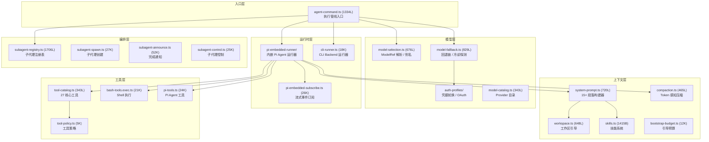
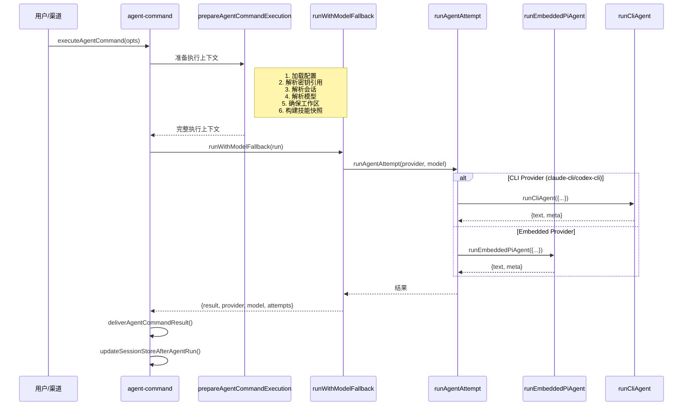
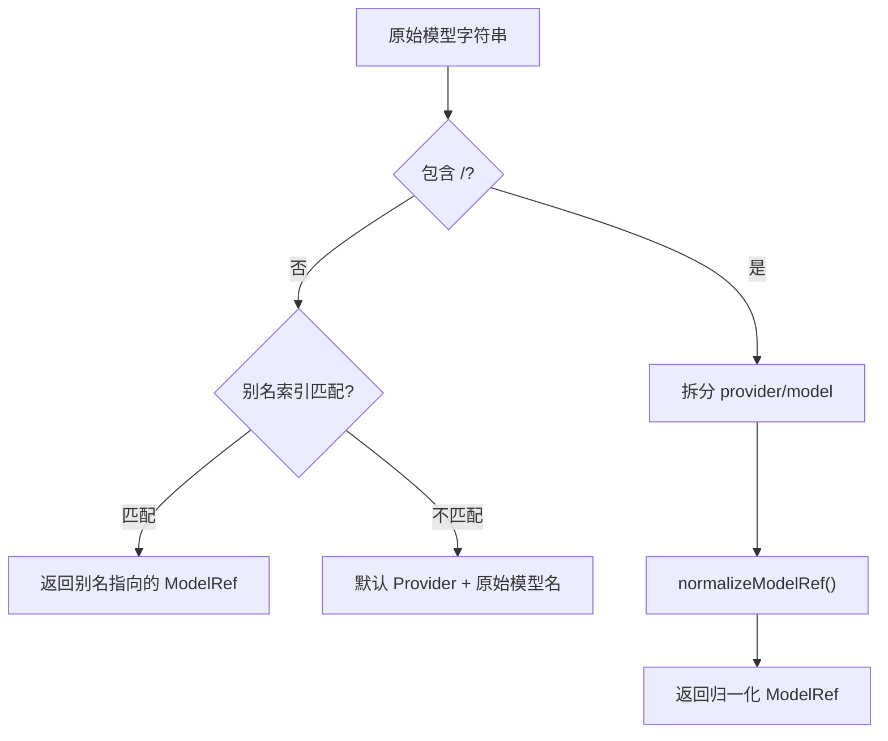
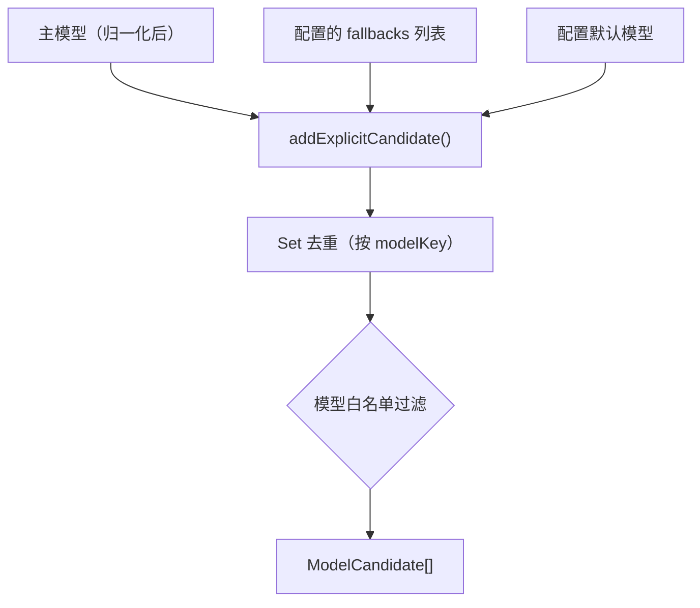
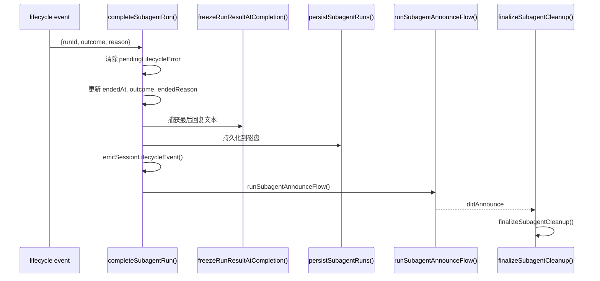
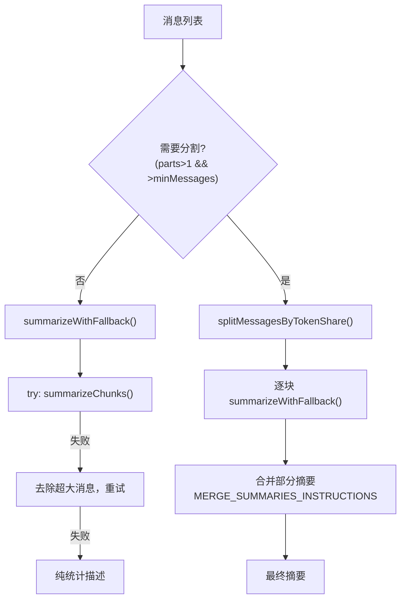
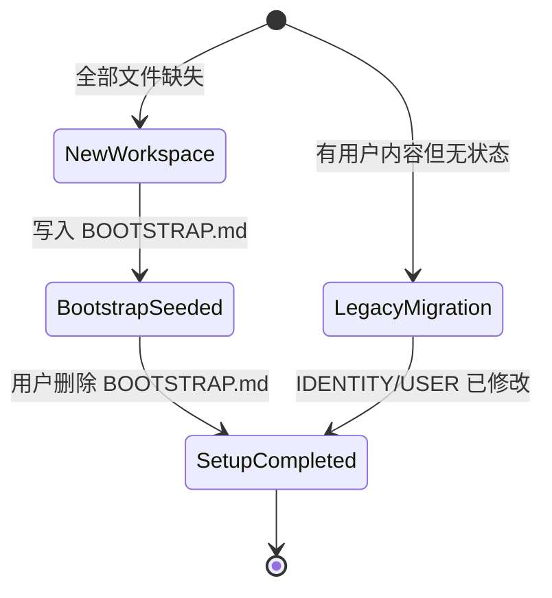

# 模块深度分析：Agent 系统（src/agents/）

> 基于 583 个文件、11 个子目录的逐行源码分析，覆盖执行管线、模型选择/回退、system prompt 合成、子代理注册表、工具目录、上下文压缩、工作区引导。

## 1. 模块总览



---

## 2. 执行管线入口（`agent-command.ts` — 1334L）

### 2.1 核心执行流程



### 2.2 Provider 路由决策

```typescript
// runAgentAttempt 内的路由逻辑
if (isCliProvider(providerOverride, cfg)) {
  // CLI Provider: claude-cli, codex-cli, 或自定义 cliBackends
  return runCliAgent({...});
} else {
  // 内嵌 Provider: anthropic, openai, google, ollama, ...
  return runEmbeddedPiAgent({...});
}
```

### 2.3 ACP 运行时集成

当消息来自 ACP 客户端时，`agent-command` 特殊处理：
- 使用 `createAcpVisibleTextAccumulator()` 累积可见文本（跳过 SILENT_REPLY_TOKEN 前缀）
- 通过 `persistAcpTurnTranscript()` 将 ACP 轮次写入 Pi 会话转录文件
- ACP 转录使用零值 Usage（`input: 0, output: 0`）

### 2.4 会话覆盖处理

```typescript
// 10 个可通过 /delete 清除的覆盖字段
const OVERRIDE_FIELDS_CLEARED_BY_DELETE = [
  "providerOverride",
  "modelOverride",
  "authProfileOverride",
  "authProfileOverrideSource",
  "authProfileOverrideCompactionCount",
  "fallbackNoticeSelectedModel",
  "fallbackNoticeActiveModel",
  "fallbackNoticeReason",
  "claudeCliSessionId",
];
```

---

## 3. 模型选择引擎（`model-selection.ts` — 676L）

### 3.1 ModelRef 数据结构

```typescript
type ModelRef = {
  provider: string;  // 归一化后的 Provider ID
  model: string;     // 归一化后的模型 ID
};

type ModelAliasIndex = {
  byAlias: Map<string, { alias: string; ref: ModelRef }>;
  byKey: Map<string, string[]>;
};
```

### 3.2 模型 ID 归一化

| Provider | 归一化规则 |
|----------|-----------|
| anthropic | `opus-4.6` → `claude-opus-4-6`, `sonnet-4.5` → `claude-sonnet-4-5` |
| google / google-vertex | `normalizeGoogleModelId()` |
| openrouter | 无 `/` 时前缀 `openrouter/` |
| vercel-ai-gateway | 无 `/` 的 claude 模型加 `anthropic/` 前缀 |

### 3.3 模型解析优先级



### 3.4 Thinking Level 系统

```typescript
type ThinkLevel = "off" | "minimal" | "low" | "medium" | "high" | "xhigh" | "adaptive";
```

---

## 4. 模型回退引擎（`model-fallback.ts` — 829L）

### 4.1 候选列表构建



### 4.2 Auth 冷却探测

```typescript
// 探测节流参数
const MIN_PROBE_INTERVAL_MS = 30_000;  // 每个 provider 每 30s 最多探测一次
const PROBE_MARGIN_MS = 2 * 60_000;    // 冷却即将到期前 2 分钟允许探测
const PROBE_STATE_TTL_MS = 24 * 60 * 60 * 1000; // 探测状态 24h TTL
const MAX_PROBE_KEYS = 256;            // 最多跟踪 256 个 provider

// 冷却决策类型: "skip" | "attempt"
// 原因: rate_limit | overloaded | billing | auth | auth_permanent | unknown
```

### 4.3 回退流程

```
For each candidate in [Primary, Fallback1, Fallback2, ...]:
  1. 检查 Auth Profile 冷却状态
  2. 冷却中 → resolveCooldownDecision():
     - auth/auth_permanent → skip（永久）
     - billing → skip（除非探测窗口开放）
     - rate_limit/overloaded → attempt（每 provider 单次探测）
  3. 运行候选 → runFallbackCandidate()
  4. AbortError → 直接抛出（不回退）
  5. ContextOverflow → 直接抛出（不回退到更小窗口模型）
  6. FailoverError → 记录, 继续下一个候选
  7. 所有候选失败 → throwFallbackFailureSummary()
```

---

## 5. System Prompt 合成（`system-prompt.ts` — 720L）

### 5.1 三种 Prompt 模式

| 模式 | 用途 | 包含段落 |
|------|------|---------|
| `full` | 主 Agent | 全部 15+ 段落 |
| `minimal` | 子代理 | Tooling, Workspace, Runtime 等核心段落 |
| `none` | 极简 | 仅一行身份声明 |

### 5.2 段落构建器

| 构建器 | 职责 |
|--------|------|
| `buildSkillsSection()` | 技能发现指引（先扫描 → 精确匹配 → 读取 SKILL.md） |
| `buildMemorySection()` | Memory Recall 指引 + 引用模式 |
| `buildUserIdentitySection()` | 授权发送者（HMAC/SHA256 哈希或原始值） |
| `buildTimeSection()` | 用户时区 |
| `buildReplyTagsSection()` | 回复标签（`[[reply_to_current]]`） |
| `buildMessagingSection()` | 消息路由、inline 按钮、channel 选项 |
| `buildVoiceSection()` | TTS 提示 |
| `buildDocsSection()` | 文档路径 + 链接 |

### 5.3 工具摘要表

`system-prompt.ts` 定义了 **27 个核心工具**的摘要：

```typescript
const coreToolSummaries = {
  read: "Read file contents",
  write: "Create or overwrite files",
  edit: "Make precise edits to files",
  exec: "Run shell commands (pty available)",
  web_search: "Search the web (Brave API)",
  browser: "Control web browser",
  sessions_spawn: "Spawn sub-agent session",
  // ... 共 27 个
};
```

### 5.4 Runtime Line 格式

```
Runtime: agent=<agentId> | host=<hostname> | repo=<repoRoot> | os=<os> (<arch>) |
         node=<version> | model=<model> | shell=<shell> | channel=<channel> |
         capabilities=<caps> | thinking=<level>
```

---

## 6. 子代理注册表（`subagent-registry.ts` — 1706L）

### 6.1 核心数据结构

```typescript
const subagentRuns = new Map<string, SubagentRunRecord>();
// SubagentRunRecord 包含:
// - runId, childSessionKey, requesterSessionKey
// - startedAt, endedAt, endedReason, outcome
// - task, label, spawnMode ("run" | "session")
// - frozenResultText (完成时冻结的结果)
// - announceRetryCount, lastAnnounceRetryAt
// - cleanup, archiveAtMs
// - suppressAnnounceReason ("killed" | "steer-restart")
```

### 6.2 生命周期常量

| 常量 | 值 | 用途 |
|------|-----|------|
| `SUBAGENT_ANNOUNCE_TIMEOUT_MS` | 120s | 通知流超时 |
| `MIN_ANNOUNCE_RETRY_DELAY_MS` | 1s | 最小重试延迟 |
| `MAX_ANNOUNCE_RETRY_DELAY_MS` | 8s | 最大重试延迟 |
| `MAX_ANNOUNCE_RETRY_COUNT` | 3 | 最大重试次数 |
| `ANNOUNCE_EXPIRY_MS` | 5min | 非完成通知过期 |
| `ANNOUNCE_COMPLETION_HARD_EXPIRY_MS` | 30min | 完成通知硬过期 |
| `LIFECYCLE_ERROR_RETRY_GRACE_MS` | 15s | 错误重试宽限 |
| `FROZEN_RESULT_TEXT_MAX_BYTES` | 100KB | 冻结结果大小上限 |

### 6.3 完成流程



### 6.4 孤儿恢复

- `reconcileOrphanedRun()`: 修复缺失 session entry 或 session ID 的运行
- `reconcileOrphanedRestoredRuns()`: 重启后批量修复
- `scheduleOrphanRecovery()`: 延迟导入 `subagent-orphan-recovery.js`，等待 Gateway 完全启动

---

## 7. 工具目录（`tool-catalog.ts` — 343L）

### 7.1 工具分组（11 组）

| 组 | 工具 |
|----|------|
| Files | read, write, edit, apply_patch |
| Runtime | exec, process |
| Web | web_search, web_fetch |
| Memory | memory_search, memory_get |
| Sessions | sessions_list/history/send/spawn/yield, subagents, session_status |
| UI | browser, canvas |
| Messaging | message |
| Automation | cron, gateway |
| Nodes | nodes |
| Agents | agents_list |
| Media | image, image_generate, tts |

### 7.2 Profile 系统（4 级）

| Profile | 包含工具 |
|---------|---------|
| minimal | session_status |
| coding | read/write/edit/exec/process/web/memory/sessions/cron/image 等 |
| messaging | sessions_list/history/send, message, session_status |
| full | 所有工具 |

---

## 8. 上下文压缩（`compaction.ts` — 465L）

### 8.1 核心算法

```typescript
// Token 估算
estimateMessagesTokens(messages): number  // chars/4 启发式

// 自适应分块比
computeAdaptiveChunkRatio(messages, contextWindow): number
// 基础比率 0.4, 最小 0.15, 安全边距 1.2x

// 按 Token 份额分割
splitMessagesByTokenShare(messages, parts): AgentMessage[][]

// 按最大 Token 分块
chunkMessagesByMaxTokens(messages, maxTokens): AgentMessage[][]
```

### 8.2 分阶段摘要



### 8.3 安全保护

- `stripToolResultDetails()`: toolResult.details 中可能包含不可信内容，压缩前剥离
- `repairToolUseResultPairing()`: 修复分块后断裂的 tool_use/tool_result 配对
- 标识符保护策略：`strict` | `custom` | `off`，默认严格保留 UUID/hash/IP/URL

---

## 9. 工作区引导（`workspace.ts` — 648L）

### 9.1 引导文件

| 文件 | 用途 |
|------|------|
| `AGENTS.md` | Agent 规则与约束 |
| `SOUL.md` | 人格与语调 |
| `TOOLS.md` | 工具使用指南 |
| `IDENTITY.md` | 身份定义 |
| `USER.md` | 用户信息 |
| `HEARTBEAT.md` | 心跳配置 |
| `BOOTSTRAP.md` | 首次设置向导 |
| `MEMORY.md` | 记忆存储 |

### 9.2 工作区状态机



### 9.3 安全边界文件读取

```typescript
readWorkspaceFileWithGuards({ filePath, workspaceDir });
// 1. openBoundaryFile(): 限制在 workspaceDir 内 + 大小限制 (2MB)
// 2. inode/dev/size/mtime 缓存标识
// 3. stripFrontMatter(): 移除 YAML front matter
```

---

## 10. 其他核心子系统

### 10.1 Bash 工具（bash-tools.*）

| 文件 | 行数 | 职责 |
|------|------|------|
| `bash-tools.exec.ts` | 21K | 核心 Shell 执行 |
| `bash-tools.exec-runtime.ts` | 19K | 执行运行时管理 |
| `bash-tools.exec-host-node.ts` | 13K | Node 主机执行 |
| `bash-tools.exec-host-gateway.ts` | 10K | Gateway 主机执行 |
| `bash-tools.exec-host-shared.ts` | 12K | 共享执行逻辑 |
| `bash-tools.process.ts` | 22K | 后台进程管理 |
| `bash-tools.exec-approval-request.ts` | 7K | 执行审批请求 |
| `bash-process-registry.ts` | 8K | 进程注册表 |

### 10.2 技能系统（skills.*）

| 文件 | 行数 | 职责 |
|------|------|------|
| `skills-install.ts` | 13K | 技能安装管线 |
| `skills-install-download.ts` | 7K | 下载管理 |
| `skills-install-extract.ts` | 6K | 解压逻辑 |
| `skills-status.ts` | 7K | 技能状态报告 |
| `skills.ts` | 1K | 工作区技能快照 |

### 10.3 认证 Profiles（auth-profiles/）

| 文件 | 行数 | 职责 |
|------|------|------|
| `oauth.ts` | - | OAuth 凭据刷新 |
| `store.ts` | - | Profile 持久化存储 |
| `order.ts` | - | Profile 优先级排序 |
| `credential-state.ts` | - | 凭据状态管理 |
| `session-override.ts` | - | 会话级 Profile 覆盖 |
| `state-observation.ts` | - | 状态监察 |

### 10.4 沙箱（sandbox/）

- `sandbox.ts`: 沙箱上下文解析
- `sandbox-paths.ts`: 沙箱路径映射
- `sandbox-tool-policy.ts`: 沙箱工具策略

### 10.5 Provider 特定实现

| Provider | 文件 | 特性 |
|----------|------|------|
| OpenAI | `openai-ws-stream.ts` (34K) | WebSocket 流式 |
| Anthropic | `anthropic-payload-log.ts` | 请求日志 |
| Ollama | `ollama-stream.ts` (16K) | Ollama 流适配 |
| HuggingFace | `huggingface-models.ts` (8K) | 模型发现 |
| Venice | `venice-models.ts` (18K) | 模型管理 |
| Chutes | `chutes-models.ts` (18K) | 模型+OAuth |
| Bedrock | `bedrock-discovery.ts` (6K) | AWS 区域发现 |

---

## 11. 关键文件清单（按行数排序）

| 文件 | 行数 | 职责 |
|------|------|------|
| `subagent-announce.ts` | 52K | 子代理完成通知 |
| `subagent-registry.ts` | 51K | 运行注册表 |
| `agent-command.ts` | 43K | **执行管线入口** |
| `openai-ws-stream.ts` | 34K | OpenAI WS 流 |
| `system-prompt.ts` | 32K | **System Prompt 合成** |
| `tool-display-common.ts` | 32K | 工具显示 |
| `model-fallback.ts` | 26K | **模型回退引擎** |
| `subagent-spawn.ts` | 27K | 子代理创建 |
| `pi-embedded-subscribe.ts` | 26K | 流事件订阅 |
| `subagent-control.ts` | 25K | 子代理控制 |
| `pi-tools.ts` | 24K | Pi Agent 工具 |
| `models-config.providers.ts` | 26K | Provider 配置 |
| `bash-tools.process.ts` | 22K | 后台进程管理 |
| `bash-tools.exec.ts` | 21K | Shell 执行 |
| `model-selection.ts` | 20K | **模型选择引擎** |
| `workspace.ts` | 19K | **工作区引导** |
| `bash-tools.exec-runtime.ts` | 19K | 执行运行时 |
| `venice-models.ts` | 18K | Venice 模型 |
| `chutes-models.ts` | 18K | Chutes 模型 |
| `cli-runner.ts` | 18K | CLI 运行器 |
| `model-auth.ts` | 17K | 模型认证 |
| `openai-ws-connection.ts` | 17K | OpenAI WS 连接 |
| `apply-patch.ts` | 17K | 补丁应用 |
| `session-write-lock.ts` | 16K | 会话写锁 |
| `ollama-stream.ts` | 16K | Ollama 流 |
| `compaction.ts` | 15K | **上下文压缩** |
| `context.ts` | 15K | 上下文管理 |
| `memory-search.ts` | 13K | 记忆搜索 |
| `skills-install.ts` | 13K | 技能安装 |
