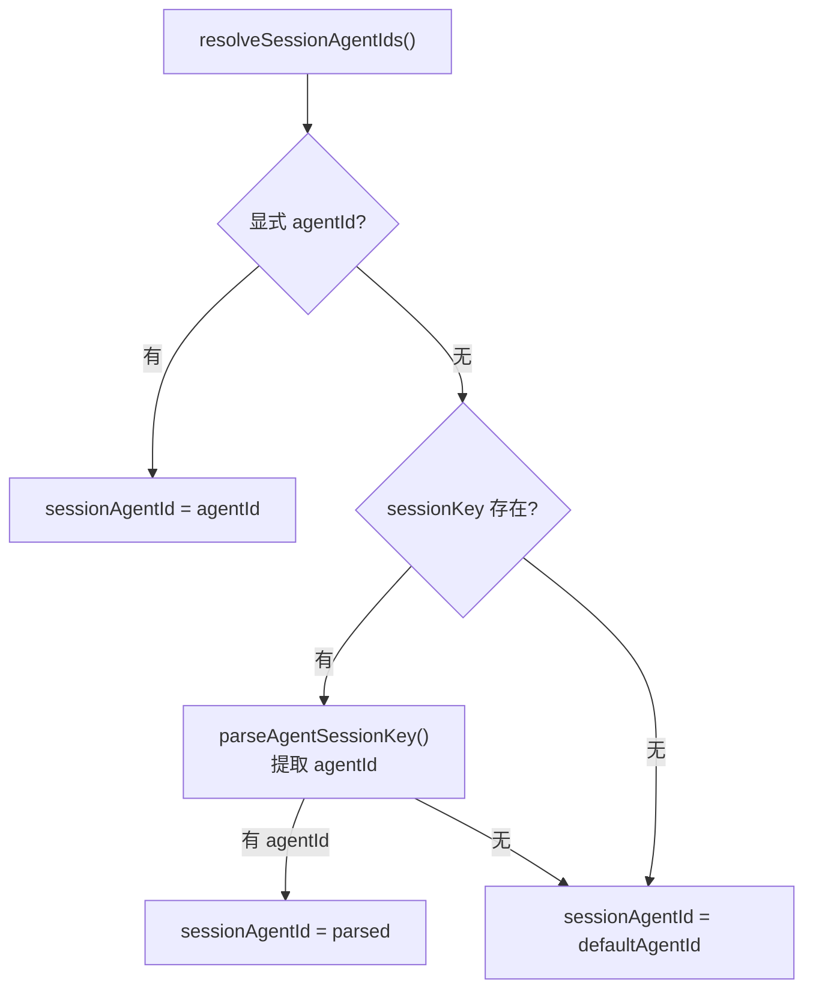
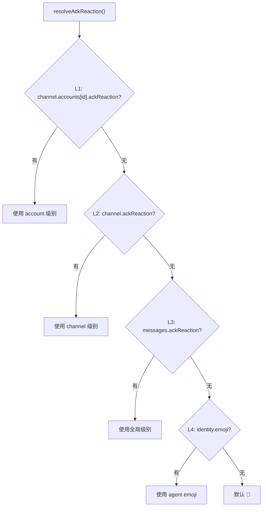

# 代理作用域与身份系统

> 深度剖析 `agent-scope.ts` (343L) + `identity.ts` (172L) 的完整业务逻辑。

## 1. 代理作用域解析（`agent-scope.ts`）

### 1.1 多代理配置

```typescript
// agents.list 配置:
agents:
  list:
    - id: "bot"
      default: true
      workspace: "~/workspace/main"
      model: "anthropic/claude-sonnet-4-5"
      skills: ["web", "code"]
    - id: "helper"
      workspace: "~/workspace/helper"
      model:
        primary: "google/gemini-2.5-pro"
        fallbacks: ["anthropic/claude-sonnet-4-5"]
```

### 1.2 默认代理选择

```typescript
resolveDefaultAgentId(cfg):
  1. 无 agents.list → "default"
  2. 单个 default=true → 使用该 agent
  3. 多个 default=true → 使用第一个 (打印一次警告)
  4. 无 default=true → 使用列表第一个
```

### 1.3 Session Agent ID 解析



---

## 2. 工作区路径解析

### 2.1 路径来源优先级

```
1. agents.list[agentId].workspace    (agent 级别)
2. agents.defaults.workspace         (仅默认 agent)
3. ~/.openclaw/workspace             (默认 agent 默认值)
4. ~/.openclaw/state/workspace-{id}  (非默认 agent)

多 profile: ~/.openclaw/workspace-{OPENCLAW_PROFILE}
```

### 2.2 反向映射：路径 → Agent ID

```typescript
resolveAgentIdsByWorkspacePath(cfg, workspacePath):
  → 对每个 agentId 计算 workspaceDir
  → 使用 realpath 标准化路径 (含符号链接)
  → isPathWithinRoot() 检查包含关系
  → 按路径深度降序排列 (最深匹配优先)
  → 同深度按配置顺序
```

### 2.3 安全: Null 字节清理

```typescript
stripNullBytes(s):
  → s.replace(/\0/g, "")
  // 防止路径中的 null 字节导致 ENOTDIR 错误
```

---

## 3. Model Override 链

### 3.1 Primary Model

```
1. agents.list[agentId].model.primary   (agent 级别显式)
2. agents.defaults.model.primary        (全局默认)
3. 硬编码: anthropic/claude-sonnet-4-5
```

### 3.2 Fallbacks Override

```typescript
resolveAgentModelFallbacksOverride(cfg, agentId):
  → agents.list[agentId].model.fallbacks
  → 空数组 [] = 显式禁用全局 fallbacks
  → undefined = 继承全局 fallbacks
```

### 3.3 有效 Fallbacks

```typescript
resolveEffectiveModelFallbacks({cfg, agentId, hasSessionModelOverride}):
  1. agent 级别 fallbacks override
  2. 有会话级别 model override → 使用全局 fallbacks
  3. 否则 → 仅 agent 级别
```

---

## 4. 代理身份系统（`identity.ts`）

### 4.1 Ack Reaction 四级解析



### 4.2 Response Prefix 四级解析

```
L1: channels[channel].accounts[accountId].responsePrefix
L2: channels[channel].responsePrefix
L4: messages.responsePrefix
默认: undefined (无前缀)

特殊值 "auto" → resolveIdentityNamePrefix()
  → 例: agents.list[id].identity.name = "Lucy" → "[Lucy]"
```

### 4.3 Message Prefix 解析

```typescript
resolveMessagePrefix(cfg, agentId, {configured, hasAllowFrom, fallback}):
  1. 显式配置 (messages.messagePrefix) → 使用配置
  2. hasAllowFrom=true → "" (空前缀)
  3. identity name → "[Lucy]"
  4. fallback → "[openclaw]"
```

### 4.4 Human Delay 配置

```typescript
resolveHumanDelayConfig(cfg, agentId):
  → 合并 agents.list[agentId].humanDelay + agents.defaults.humanDelay
  → { mode, minMs, maxMs }
  // 模拟人类输入延迟, 使消息看起来更自然
```

---

## 5. 代理目录

### 5.1 Agent Dir 解析

```
1. agents.list[agentId].agentDir     (agent 级别配置)
2. ~/.openclaw/state/agents/{id}/agent  (默认)
```

### 5.2 Skills Filter

```typescript
resolveAgentSkillsFilter(cfg, agentId):
  → agents.list[agentId].skills → normalizeSkillFilter()
  // 返回白名单: 仅加载指定技能
  // undefined: 加载全部技能
```
