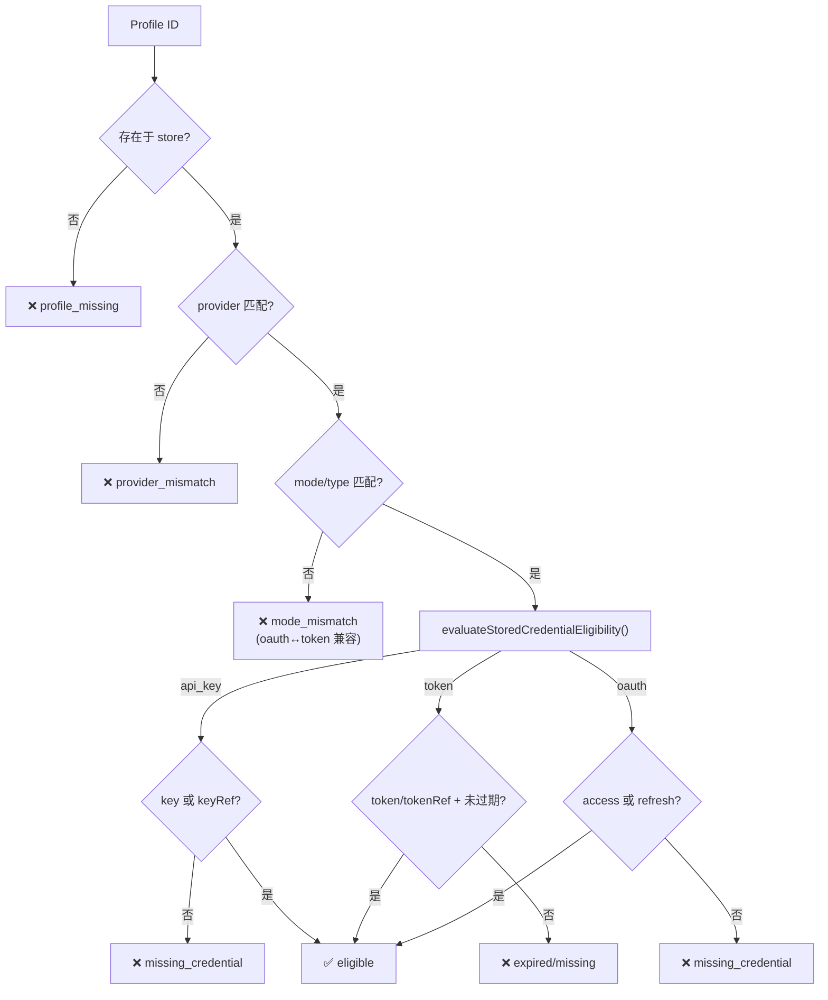
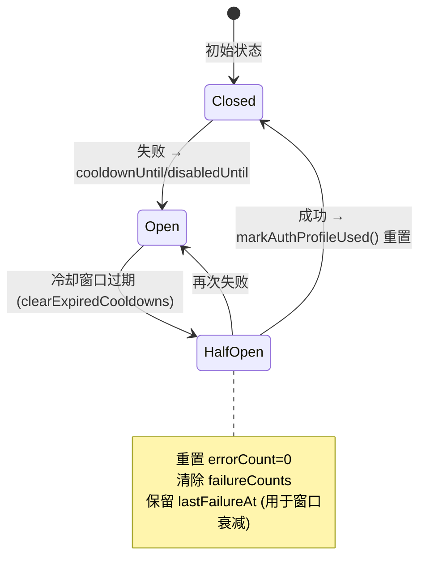
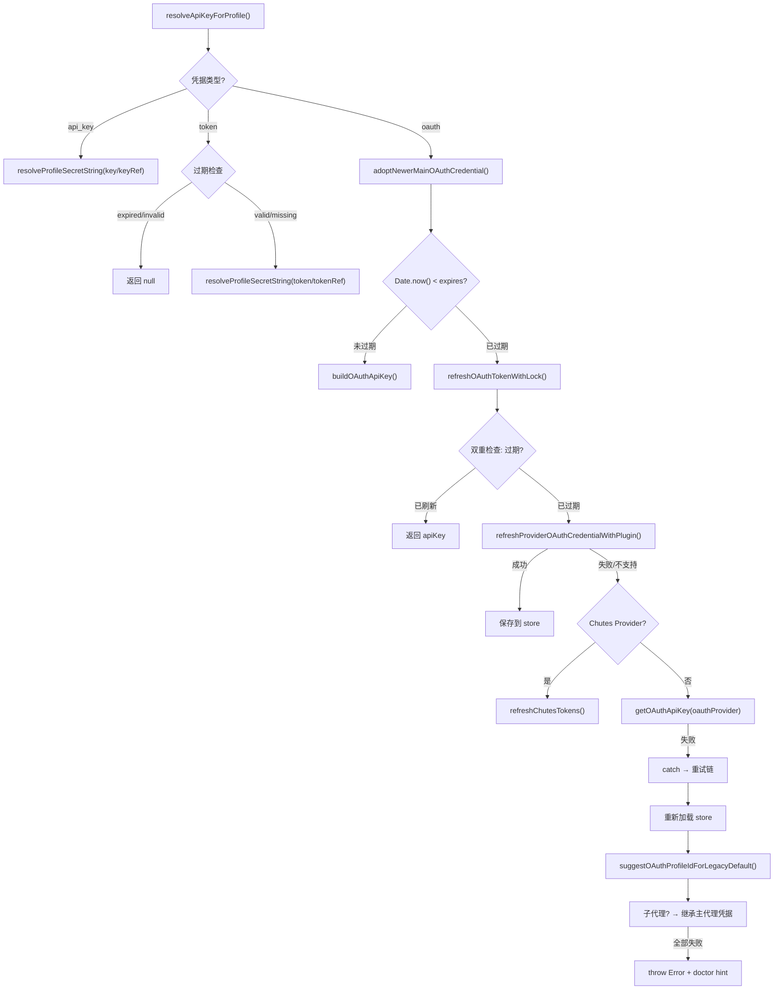
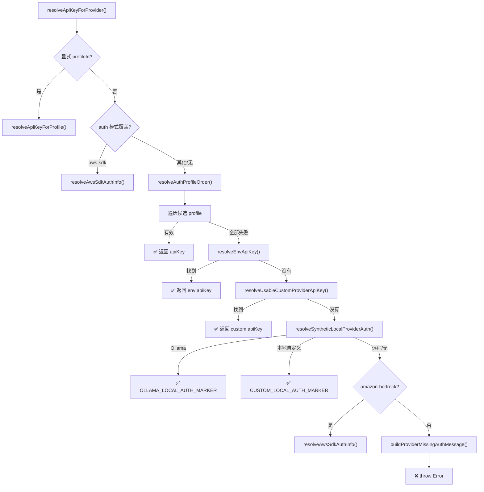

# Auth Profiles 认证配置文件系统

> 深度剖析 `src/agents/auth-profiles/` 子目录的业务逻辑：凭据存储、轮换调度、冷却退避、OAuth 刷新。

## 1. 凭据类型与数据模型

### 1.1 三种凭据类型

```typescript
type AuthProfileCredential =
  | { type: "api_key"; provider: string; key: string; keyRef?: unknown; email?: string }
  | { type: "token";   provider: string; token: string; tokenRef?: unknown; expires?: number; email?: string }
  | { type: "oauth";   provider: string; access: string; refresh: string; expires: number;
      enterpriseUrl?: string; projectId?: string; accountId?: string; email?: string };
```

### 1.2 存储结构

```typescript
type AuthProfileStore = {
  version: number;                                    // 当前为 1
  profiles: Record<string, AuthProfileCredential>;    // profileId → 凭据
  order?: Record<string, string[]>;                   // provider → profileId 排序
  lastGood?: Record<string, string>;                  // provider → 最后成功的 profileId
  usageStats?: Record<string, ProfileUsageStats>;     // profileId → 使用统计
};
```

### 1.3 文件路径

- 主存储: `~/.openclaw/agents/<agentId>/auth-profiles.json`
- 旧版: `~/.openclaw/agents/<agentId>/auth.json` (自动迁移后删除)
- OAuth: `~/.openclaw/oauth.json` (合并到 auth-profiles)
- 运行时锁: 文件锁 (`withFileLock`)

---

## 2. Profile 轮换调度算法（`order.ts`）

### 2.1 排序优先级

```
1. 显式顺序 (store.order[provider] 或 config.auth.order[provider])
   → 冷却分区: 可用优先, 冷却中按过期时间升序
   
2. 无显式顺序时 → Round-Robin:
   → 类型分数: oauth=0 > token=1 > api_key=2
   → 同类型内: 按 lastUsed 升序 (最久未用优先)
   → 冷却中: 追加到末尾, 按过期时间升序

3. preferredProfile 始终提升到首位
```

### 2.2 资格检查



### 2.3 Config/Store Profile-ID 漂移修复

当配置的 profile ID 在 auth-profiles.json 中不存在时，扫描同 provider 下的其他有效凭据作为后备。

---

## 3. 冷却退避系统（`usage.ts`）

### 3.1 两种退避模式

| 失败类型 | 退避类型 | 计算公式 | 最大值 |
|----------|---------|---------|--------|
| rate_limit, overloaded, timeout, model_not_found, format, unknown | **cooldown** | `60s × 5^(errorCount-1)` | 1 小时 |
| billing, auth_permanent | **disabled** | `baseHours × 2^(errorCount-1)` | 24 小时 |

### 3.2 冷却时间表

| 连续失败次数 | Cooldown (普通) | Disabled (billing) |
|-------------|-----------------|-------------------|
| 1 | 1 分钟 | 5 小时 |
| 2 | 5 分钟 | 10 小时 |
| 3 | 25 分钟 | 20 小时 |
| 4+ | 60 分钟 (上限) | 24 小时 (上限) |

### 3.3 Circuit Breaker 模式



### 3.4 可配置参数

```yaml
# openclaw.json
auth:
  cooldowns:
    billingBackoffHours: 5       # billing 退避基数（默认 5h）
    billingMaxHours: 24          # billing 退避上限（默认 24h）
    failureWindowHours: 24       # 错误窗口衰减时间（默认 24h）
    billingBackoffHoursByProvider:
      anthropic: 8               # 按 provider 自定义
```

### 3.5 特殊规则

- **OpenRouter / Kilocode**: 跳过所有冷却（`isAuthCooldownBypassedForProvider`）
- **活跃窗口不可变**: 重试不会延长已有的冷却窗口（`keepActiveWindowOrRecompute`）
- **失败原因优先级**: `auth_permanent > auth > billing > format > model_not_found > overloaded > timeout > rate_limit > unknown`

---

## 4. OAuth 刷新流程（`oauth.ts`）

### 4.1 刷新决策链



### 4.2 子代理 OAuth 继承

```
子代理启动时:
1. 尝试加载自身 auth-profiles.json
2. 无文件 → 复制主代理的 auth-profiles.json
3. OAuth 过期 → adoptNewerMainOAuthCredential() 
   检查主代理是否有更新的 expires, 若有则复制
4. 刷新全部失败 → 再次检查主代理是否有新鲜凭据
```

### 4.3 Bearer Token 兼容性

`oauth` 和 `token` 模式互相兼容（`BEARER_AUTH_MODES`），配置文件中 `mode: "oauth"` 可以匹配存储中 `type: "token"` 的凭据。

---

## 5. 7 层认证解析链（`model-auth.ts`）



### 5.1 环境变量候选表

| Provider | 候选环境变量 |
|----------|-------------|
| anthropic | `ANTHROPIC_API_KEY` |
| openai | `OPENAI_API_KEY` |
| google | `GOOGLE_API_KEY`, `GEMINI_API_KEY` |
| google-vertex | gcloud ADC |
| amazon-bedrock | `AWS_BEARER_TOKEN_BEDROCK`, `AWS_ACCESS_KEY_ID`+`AWS_SECRET_ACCESS_KEY`, `AWS_PROFILE` |

### 5.2 本地 Provider 合成密钥

- **Ollama**: 自动生成 `OLLAMA_LOCAL_AUTH_MARKER`，无需配置 API Key
- **自定义本地 Provider**: 当 `baseUrl` 指向 `localhost/127.0.0.1/[::1]` 且无显式 `apiKey` 配置时，生成 `CUSTOM_LOCAL_AUTH_MARKER` 并清除 Authorization 头

---

## 6. 存储迁移与同步（`store.ts`）

### 6.1 迁移路径

```
auth.json (旧版) → auth-profiles.json (新版)
  ↓ applyLegacyStore(): 按 provider 创建 "{provider}:default" profile
  ↓ mergeOAuthFileIntoStore(): 合并 oauth.json
  ↓ syncExternalCliCredentials(): 同步 Claude CLI 等外部工具凭据
  ↓ 迁移成功后删除 auth.json (delete-after-write, #363/#368)
```

### 6.2 运行时快照

```typescript
const runtimeAuthStoreSnapshots = new Map<string, AuthProfileStore>();
// 用于 Gateway 运行时的内存缓存
// replaceRuntimeAuthProfileStoreSnapshots(): 批量替换
// clearRuntimeAuthProfileStoreSnapshots(): 清空
// resolveRuntimeAuthProfileStore(): 查询 (合并主 + agent 特定)
```

### 6.3 凭据序列化安全

保存时自动清除已引用的明文值：
```typescript
// 有 keyRef 时，不持久化 key 明文
if (credential.type === "api_key" && credential.keyRef && credential.key !== undefined) {
  delete sanitized.key;  // 只保留 keyRef 引用
}
```
