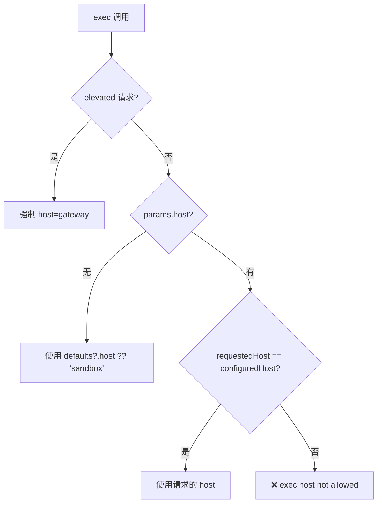
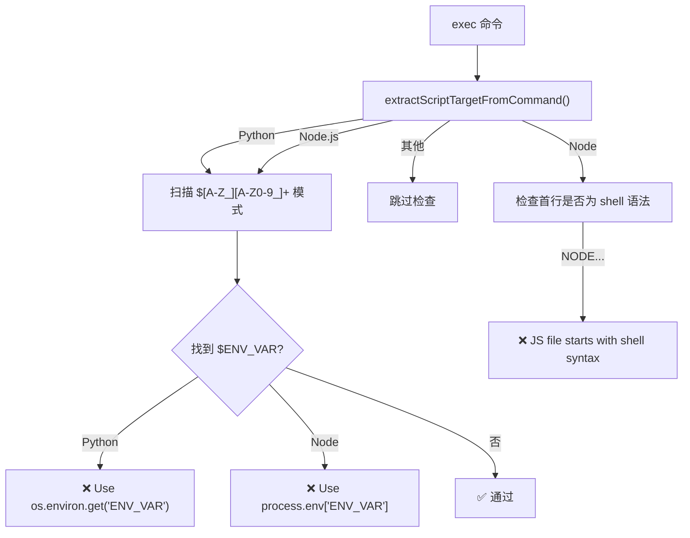
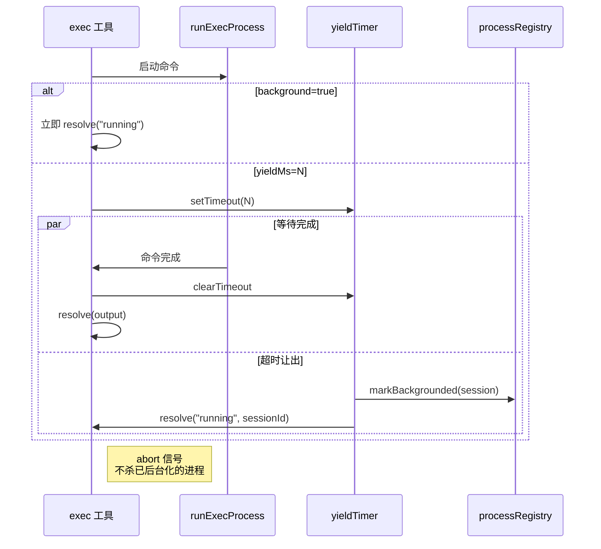
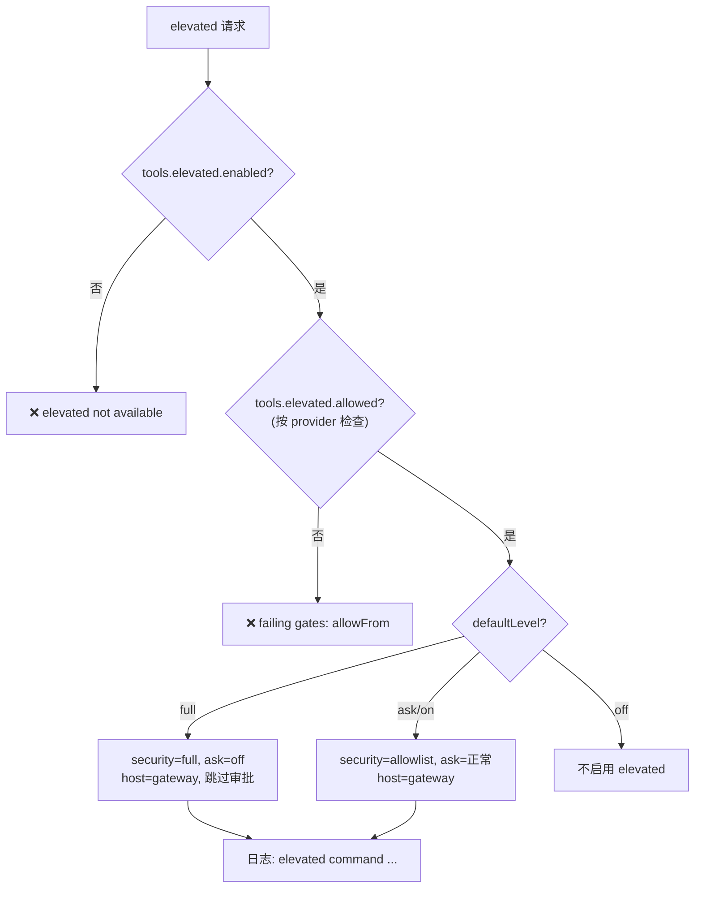

# Bash 执行引擎

> 深度剖析 `bash-tools.exec.ts` (600L) 的完整命令执行业务逻辑：多主机、安全层级、沙箱、后台执行。

## 1. 多主机执行架构

### 1.1 三种执行主机

| 主机 | 代码路径 | 适用场景 |
|------|---------|---------|
| `sandbox` | Sandbox 容器 (隔离) | 默认, 沙箱运行时 |
| `gateway` | 本地 Gateway 进程 | 标准本地执行 |
| `node` | 远程 Node 服务 | 分布式执行节点 |

### 1.2 主机选择逻辑



---

## 2. 安全层级体系

### 2.1 安全级别

```
"deny"      → 拒绝所有非白名单命令 (沙箱默认)
"allowlist"  → 需要在 safeBins + exec-approvals.json 中
"full"       → 允许所有命令 (仅 elevated=full)
```

### 2.2 审批级别

```
"off"       → 不需要审批 (elevated=full)
"auto"      → 自动通过 safeBins 匹配
"on-miss"   → 未匹配 safeBins 时请求审批 (默认)
"on"        → 始终请求审批
```

### 2.3 安全计算规则

```typescript
security = minSecurity(configuredSecurity, requestedSecurity);
// 取一低安全级别
ask = maxAsk(configuredAsk, requestedAsk);
// 取更严格的审批级别

// elevated=full 时覆盖:
security = "full";
ask = "off";
```

### 2.4 SafeBins 策略

```typescript
resolveExecSafeBinRuntimePolicy({
  local: {
    safeBins: ["git", "npm", "python3"],     // 允许的二进制
    safeBinTrustedDirs: ["/usr/bin"],         // 受信目录
    safeBinProfiles: {                       // 二进制执行配置
      "git": { allowArgs: true },
      "python3": { allowArgs: true, isInterpreter: true },
    }
  }
});

// 无 profile 的 safeBins → 忽略 + 警告
// 解释器类(python/node) 无 profile → 安全警告
```

---

## 3. Shell 注入预防

### 3.1 Shell 变量泄漏检测



### 3.2 沙箱路径断言

```typescript
assertSandboxPath({
  filePath: absPath,
  cwd: params.workdir,
  root: params.workdir,
});
// 确保脚本文件在工作目录范围内
```

---

## 4. 后台执行与让出

### 4.1 关键参数

| 参数 | 默认值 | 范围 | 说明 |
|------|--------|------|------|
| `yieldMs` | 10,000ms | 10-120,000ms | 让出窗口 |
| `background` | false | - | 立即后台化 (yieldMs=0) |
| `timeout` | 1800s | >=0 | 超时时间 |
| `pty` | false | - | 需要 TTY (沙箱中忽略) |

### 4.2 执行流程



### 4.3 后台超时旁路

```typescript
// 当请求后台且未显式设置超时 → 无限运行
const backgroundTimeoutBypass =
  allowBackground && explicitTimeoutSec === null && (backgroundRequested || yieldRequested);
const effectiveTimeout = backgroundTimeoutBypass ? null : (explicitTimeoutSec ?? defaultTimeoutSec);
```

---

## 5. 环境变量处理

### 5.1 三种环境配置

| 主机 | 来源 | 处理 |
|------|------|------|
| sandbox | 原始 process.env | `buildSandboxEnv()` 构建隔离环境 |
| gateway | 清理后的 process.env | `sanitizeHostBaseEnv()` 去除危险变量 |
| node | 清理后 + 验证 | `validateHostEnv()` 禁止注入 |

### 5.2 PATH 构建

```
1. 沙箱: 使用 sandbox.env 中的 PATH
2. Gateway: getShellPathFromLoginShell() + applyShellPath()
3. Node: 忽略 pathPrepend (发出警告)
4. 全部: applyPathPrepend(env, defaults.pathPrepend) 预置路径
```

---

## 6. 退出通知

```typescript
notifyOnExit: true          // 默认开启
notifyOnExitEmptySuccess: false  // 成功且无输出时不通知

// 后台进程退出时:
// → 通过 session 通知系统向 agent 推送完成事件
// → agent 可通过 process list/poll/log 跟踪
```

---

## 7. elevated 完整决策树


