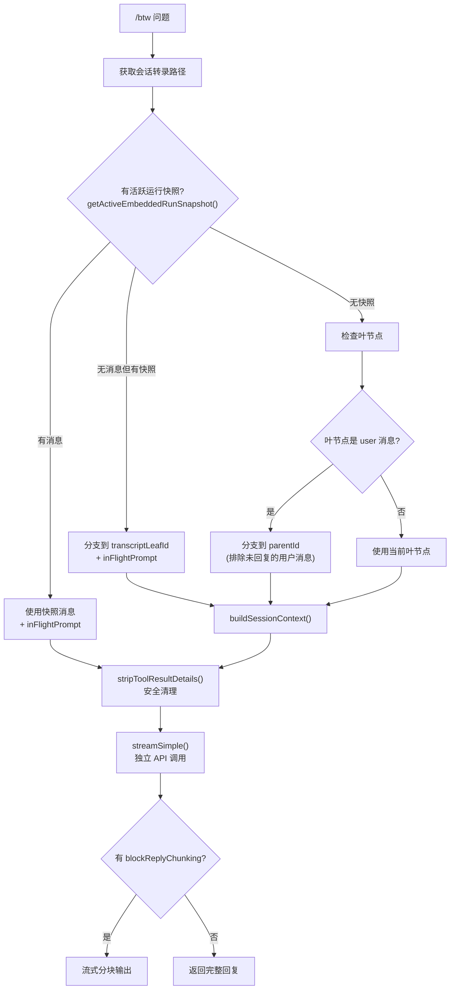

# BTW 临时侧问系统

> 深度剖析 `btw.ts` (392L) 的完整 /btw 临时侧问业务逻辑。

## 1. 功能概述

`/btw` 允许在主任务运行期间提出快速侧问，不干扰主任务的执行上下文。

---

## 2. 执行流程



---

## 3. 系统提示词

```
"You are answering an ephemeral /btw side question about the current conversation.
 Use the conversation only as background context.
 Answer only the side question in the last user message.
 Do not continue, resume, or complete any unfinished task from the conversation.
 Do not emit tool calls, pseudo-tool calls, shell commands, file writes, patches, or code
   unless the side question explicitly asks for them.
 Do not say you will continue the main task after answering.
 If the question can be answered briefly, answer briefly."
```

---

## 4. 用户消息构建

```typescript
buildBtwQuestionPrompt(question, inFlightPrompt):
  → "Answer this side question only."
  → "Ignore any unfinished task in the conversation while answering it."

  // 如有进行中的主任务:
  → "<in_flight_main_task>"
  → inFlightPrompt
  → "</in_flight_main_task>"
  → "Do not continue or complete that task while answering the side question."

  → "<btw_side_question>"
  → question
  → "</btw_side_question>"
```

---

## 5. 上下文准备

### 5.1 消息过滤

```typescript
toSimpleContextMessages(messages):
  → 仅保留 user/assistant 角色
  → stripToolResultDetails() 清理工具结果详情
  // 减少 token 消耗, 侧问不需要完整工具输出
```

### 5.2 活跃运行快照

```typescript
getActiveEmbeddedRunSnapshot(sessionId):
  → messages: 当前运行中的消息列表
  → inFlightPrompt: 当前正在处理的用户提示
  → transcriptLeafId: 转录树叶节点 ID

// 快照优先级:
// 1. 快照中的消息 (最新, 包含工具调用中间结果)
// 2. 快照仅有 leafId → 从转录中分支
// 3. 无快照 → 使用当前会话转录
```

---

## 6. 流式输出

```typescript
// 事件类型处理:
"text_delta"    → 追加到 answerText + chunker
"text_end"      → chunker.drain(force: true)
"thinking_delta" → 追加到 reasoningText + onReasoningStream
"thinking_end"  → onReasoningEnd()
"done"          → 最终消息提取
"error"         → throw Error(errorMessage)

// BlockChunker:
// - 根据 blockReplyChunking 配置分块
// - text_end 模式: text_end 时强制刷新
// - message_end 模式: 消息结束时刷新
// - 已发送分块 → 返回 undefined (避免重复)
```

---

## 7. 独立认证

```typescript
resolveRuntimeModel({cfg, provider, model, agentDir, ...}):
  → ensureOpenClawModelsJson()
  → discoverAuthStorage() / discoverModels()
  → resolveModelWithRegistry()
  → resolveSessionAuthProfileOverride()

// BTW 使用主会话的认证配置
// 独立 API key 解析: getApiKeyForModel() + requireApiKey()
```
