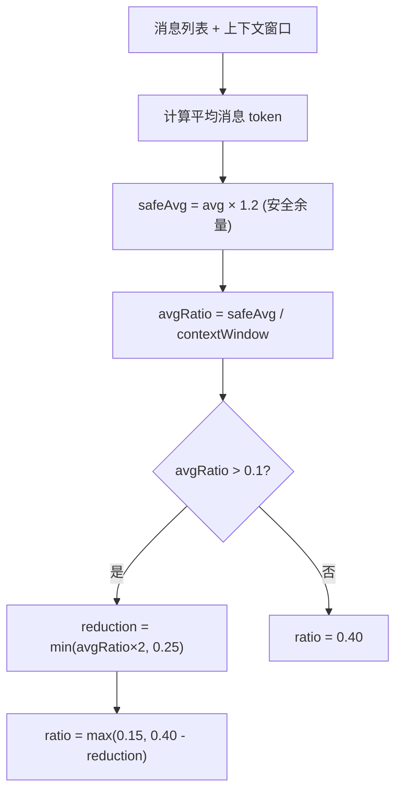
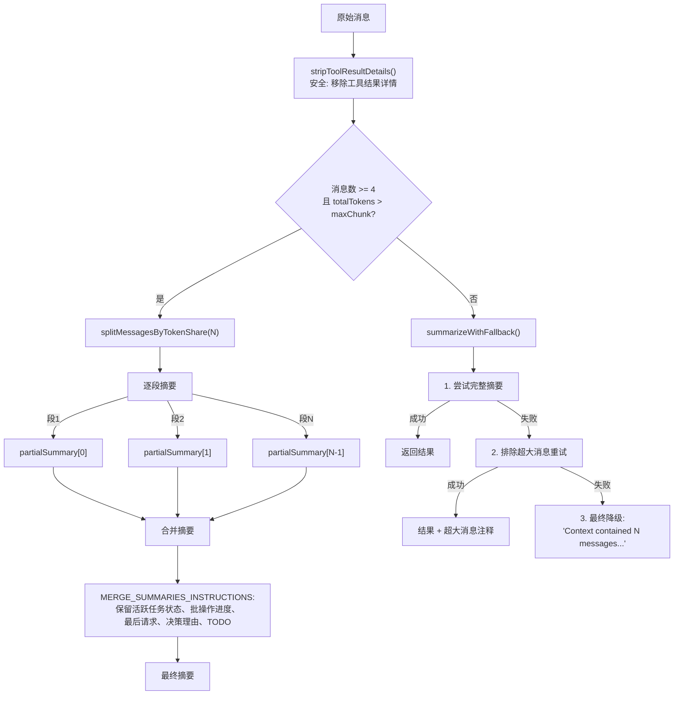
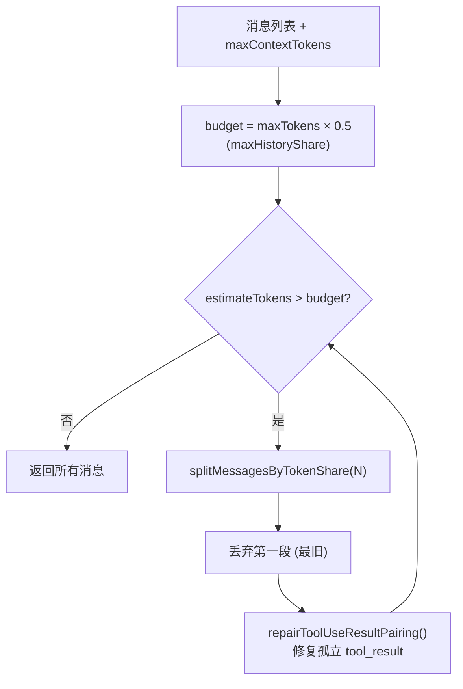
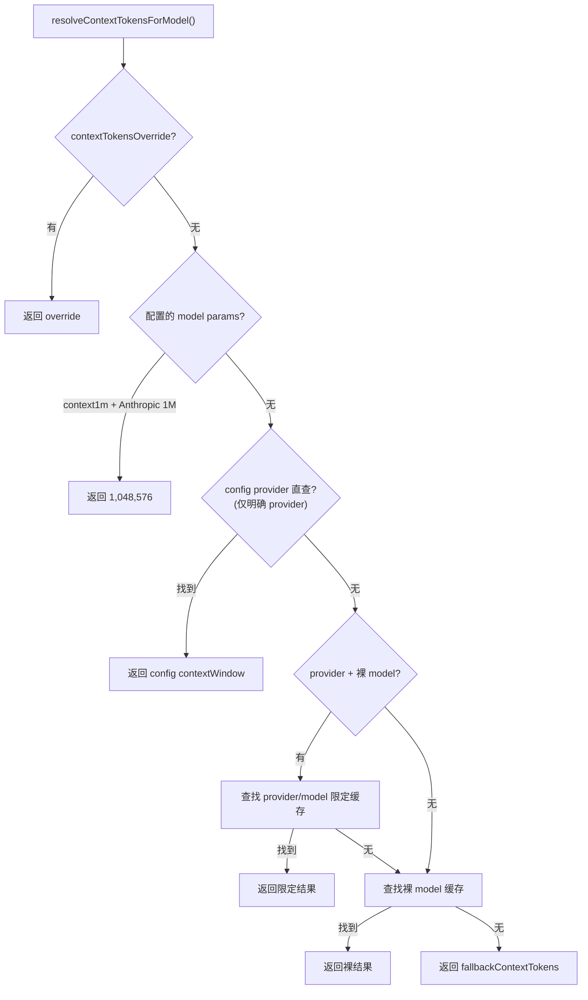

# 上下文压缩与窗口管理

> 深度剖析 `compaction.ts` (465L) + `context.ts` (442L) + `context-window-guard.ts` + `bootstrap-budget.ts` (376L) 的完整业务逻辑。

## 1. 上下文压缩（Compaction）

### 1.1 核心常量

| 常量 | 值 | 说明 |
|------|-----|------|
| BASE_CHUNK_RATIO | 0.40 | 基础分块比例 |
| MIN_CHUNK_RATIO | 0.15 | 最小分块比例 |
| SAFETY_MARGIN | 1.20 | Token 估算安全余量 (20%) |
| SUMMARIZATION_OVERHEAD_TOKENS | 4,096 | 摘要指令保留 token |
| DEFAULT_PARTS | 2 | 默认分段数 |
| DEFAULT_CONTEXT_TOKENS | (配置) | 默认上下文窗口大小 |

### 1.2 自适应分块比例



### 1.3 两种分块策略

| 策略 | 函数 | 逻辑 |
|------|------|------|
| Token 平分 | `splitMessagesByTokenShare()` | 按 token 总量均分 N 段 |
| 最大 token | `chunkMessagesByMaxTokens()` | 每段不超过 maxTokens/1.2 |

### 1.4 多阶段摘要引擎



### 1.5 标识符保留策略

| 策略 | 行为 |
|------|------|
| `strict` (默认) | 保留所有不透明标识符 (UUID, hash, 文件名等) |
| `custom` | 使用自定义指令 |
| `off` | 不强制保留 |

### 1.6 重试配置

```typescript
retryAsync(generateSummary, {
  attempts: 3,          // 最多 3 次
  minDelayMs: 500,      // 最小延迟
  maxDelayMs: 5000,     // 最大延迟
  jitter: 0.2,          // 20% 抖动
  shouldRetry: (err) => err.name !== "AbortError",
});
```

---

## 2. 历史修剪（History Pruning）

### 2.1 修剪算法



### 2.2 Tool Use/Result 修复

```
丢弃旧消息段时:
  tool_use 在丢弃段, tool_result 在保留段
  → repairToolUseResultPairing() 移除孤立的 tool_result
  → 防止 Anthropic API "unexpected tool_use_id" 错误
  → 孤立计数加入 droppedMessages (不加入 droppedMessagesList)
```

---

## 3. 上下文窗口管理（`context.ts`）

### 3.1 窗口解析优先级



### 3.2 缓存预热策略

```typescript
// CLI 入口: 立即预热
if (shouldEagerWarmContextWindowCache()) {
  void ensureContextWindowCacheLoaded();
}

// 跳过预热的命令:
// backup, completion, config, directory, doctor,
// gateway, health, hooks, logs, plugins,
// secrets, status, update, webhooks

// 非 CLI 进程: 不预热 (避免 plugin-sdk 导入副作用)
```

### 3.3 缓存构建源

```
1. 运行时模型发现 → discoverModels().getAvailable()
   → 同 model ID 取最小窗口 (保守策略)

2. 配置文件覆盖 → models.providers.*.models[].contextWindow
   → 最后应用, 优先级最高

3. Config 加载失败 → 指数退避重试 (1s→2s→4s...→60s)
```

### 3.4 Anthropic 1M 模型检测

```typescript
ANTHROPIC_1M_MODEL_PREFIXES = ["claude-opus-4", "claude-sonnet-4"]

isAnthropic1MModel("anthropic", "claude-opus-4-5") → true
// 仅当 agents.defaults.models["anthropic/model"].params.context1m = true
```

---

## 4. Bootstrap 预算管理（`bootstrap-budget.ts`）

### 4.1 截断分析

```typescript
analyzeBootstrapBudget({
  files: BootstrapInjectionStat[],    // 每个文件的 rawChars vs injectedChars
  bootstrapMaxChars: number,          // 单文件上限
  bootstrapTotalMaxChars: number,     // 总上限
  nearLimitRatio: 0.85,               // 接近上限阈值 (85%)
});
```

### 4.2 截断原因

| 原因 | 触发条件 |
|------|---------|
| `per-file-limit` | 单文件 rawChars > bootstrapMaxChars |
| `total-limit` | 总 injectedChars >= bootstrapTotalMaxChars |

### 4.3 警告模式

| 模式 | 行为 |
|------|------|
| `off` | 不显示警告 |
| `once` | 同一截断签名仅警告一次 |
| `always` | 每次截断都警告 |

### 4.4 签名去重机制

```typescript
// 签名 = JSON({bootstrapMaxChars, bootstrapTotalMaxChars, files:[{path, rawChars, injectedChars, causes}]})
// 历史签名最多保留 32 个 (DEFAULT_BOOTSTRAP_PROMPT_WARNING_SIGNATURE_HISTORY_MAX)
// "once" 模式: 检查签名是否在历史中
```

### 4.5 警告注入

```
截断时追加到系统提示词末尾:
  "[Bootstrap truncation warning]
   Some workspace bootstrap files were truncated before injection.
   Treat Project Context as partial and read the relevant files directly if details seem missing.
   - AGENTS.md: 45000 raw -> 20000 injected (~56% removed; max/file).
   - SOUL.md: 12000 raw -> 10000 injected (~17% removed; max/total).
   If unintentional, raise agents.defaults.bootstrapMaxChars and/or agents.defaults.bootstrapTotalMaxChars."
```
