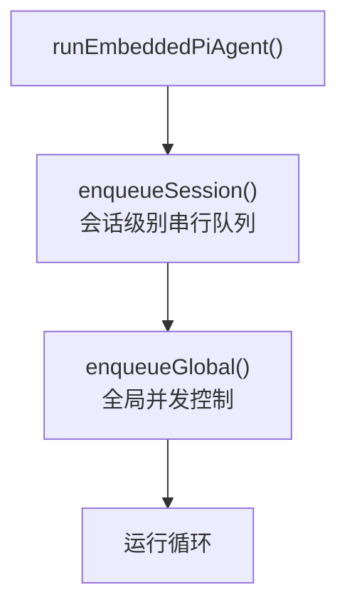
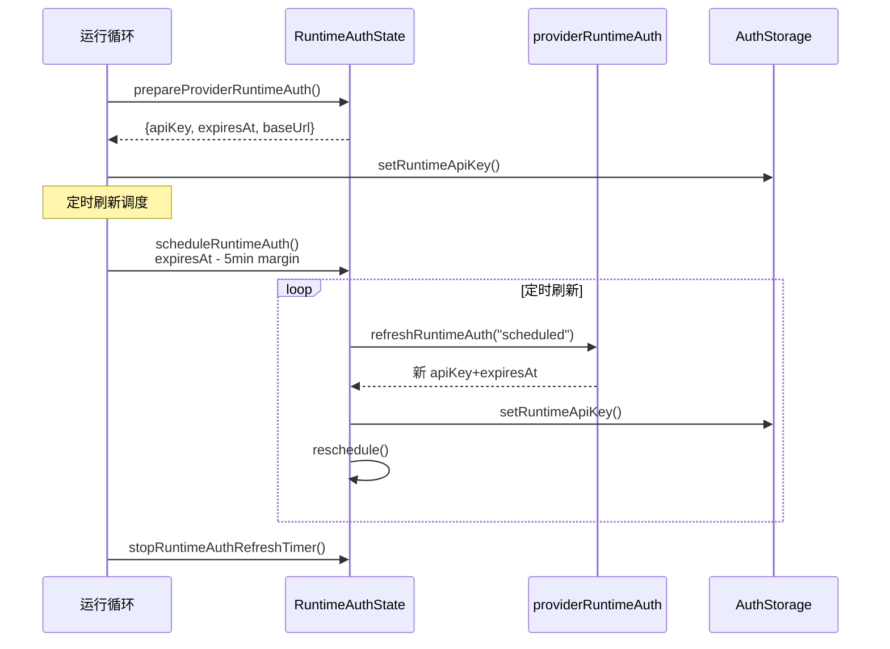
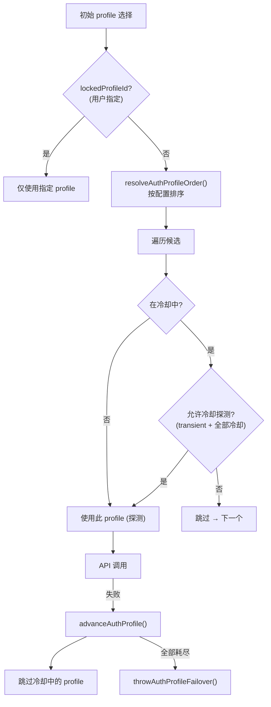
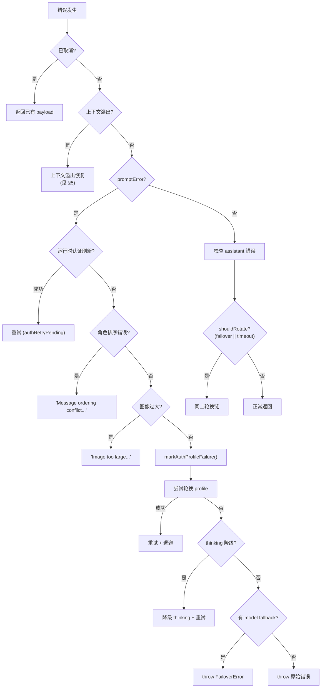
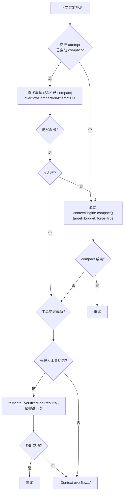

# 嵌入式运行器核心

> 深度剖析 `pi-embedded-runner/run.ts` (1708L, 71KB) 的完整运行循环业务逻辑。

## 1. 双通道队列架构



- **Session Lane**: 基于 sessionKey/sessionId 的串行队列，防止同一会话并发执行
- **Global Lane**: 全局并发控制，限制同时活跃的运行数

---

## 2. 运行时认证生命周期

### 2.1 认证定时刷新



### 2.2 认证刷新常量

| 常量                 | 值     | 说明                 |
| -------------------- | ------ | -------------------- |
| REFRESH_MARGIN_MS    | 5 分钟 | 提前于过期的刷新窗口 |
| REFRESH_RETRY_MS     | 1 分钟 | 刷新失败后重试间隔   |
| REFRESH_MIN_DELAY_MS | 5 秒   | 最小刷新延迟         |

---

## 3. Profile 轮换链



### 3.1 Profile 轮换重置

轮换 profile 时重置:

- `thinkLevel` → 初始值
- `attemptedThinking` → 清空
- **不重置**: `overflowCompactionAttempts`, `toolResultTruncationAttempted`

---

## 4. 运行循环重试机制

### 4.1 重试上限

```typescript
BASE_RUN_RETRY_ITERATIONS = 24;
RUN_RETRY_ITERATIONS_PER_PROFILE = 8;
MIN_RUN_RETRY_ITERATIONS = 32;
MAX_RUN_RETRY_ITERATIONS = 160;

// 公式: max(32, min(160, 24 + profileCount × 8))
// 1 profile → 32, 5 profiles → 64, 17 profiles → 160
```

### 4.2 完整错误决策树



### 4.3 Overload 退避

```typescript
OVERLOAD_FAILOVER_BACKOFF_POLICY = {
  initialMs: 250,
  maxMs: 1500,
  factor: 2,
  jitter: 0.2,
};
// 250ms → 500ms → 1000ms → 1500ms (上限)
```

---

## 5. 上下文溢出三阶段恢复



### 5.1 Compaction 钩子

```
overflow 恢复时的 hook 生命周期:
  1. before_compaction (仅 engineOwnsCompaction=true)
  2. contextEngine.compact()
  3. after_compaction (仅成功时)
```

---

## 6. 使用量累计器

### 6.1 Last-Call 修正

```typescript
// 问题: 多次 API 调用 (tool-use loop) 时
//   累计 cacheRead = N × context_size → 膨胀
//
// 修正: 仅使用最后一次 API 调用的 cache 字段
//   lastCacheRead, lastCacheWrite, lastInput
//   total = lastPromptTokens + accumulated output
```

### 6.2 错误路径使用量保留

```
即使运行失败, agentMeta 也包含使用量数据:
  → session totalTokens 反映实际上下文大小
  → 不因错误而丢失使用量追踪
```

---

## 7. 安全措施

### 7.1 Anthropic 魔术字符串清理

```typescript
// "ANTHROPIC_MAGIC_STRING_TRIGGER_REFUSAL"
// → 被替换为 "ANTHROPIC MAGIC STRING TRIGGER REFUSAL (redacted)"
// 防止拒绝测试 token 污染会话转录
```

### 7.2 Timeout vs Profile 冷却

```
Timeout 不标记 profile 冷却:
  → timeout 是模型/网络问题, 不是认证问题
  → 标记 profile 会毒化同 provider 其他模型的 fallback
  → 例: gpt-5.3 超时 → 不应阻止 gpt-5.2
```

### 7.3 Probe Session 检测

```typescript
isProbeSession = sessionId?.startsWith("probe-") ?? false;
// 探测 session 的 timeout 不产生 warn 日志
```
