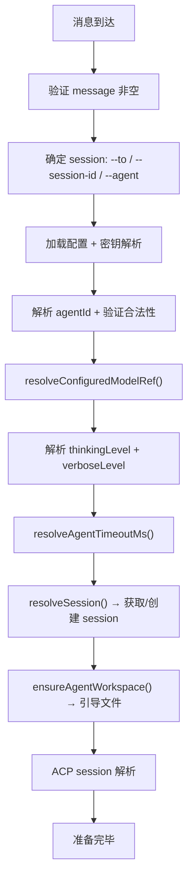
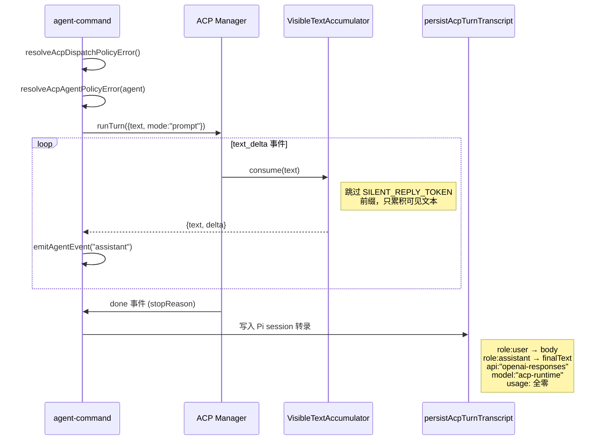
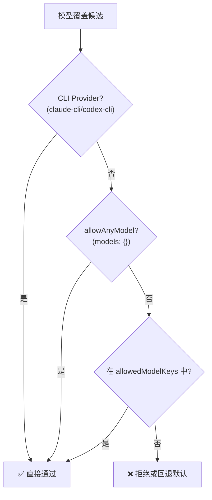
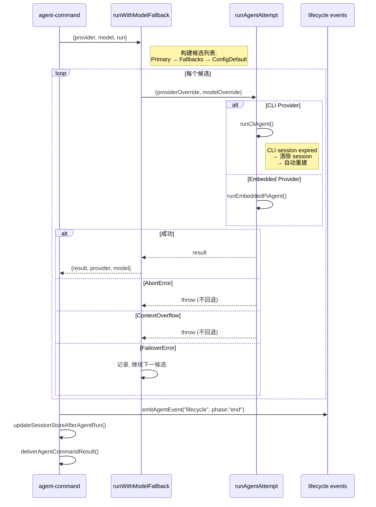

# 执行管线详解

> 深度剖析 `agent-command.ts` 的完整执行管线：从消息接收到结果交付的全链路业务逻辑。

## 1. 双入口点设计

```typescript
// CLI/本地调用 — 可信操作者
agentCommand(opts):
  senderIsOwner = opts.senderIsOwner ?? true     // 默认信任
  allowModelOverride = opts.allowModelOverride ?? true  // 默认允许

// HTTP/WebSocket 入口 — 网络调用者
agentCommandFromIngress(opts):
  // 必须显式声明: senderIsOwner + allowModelOverride
  if (typeof opts.senderIsOwner !== "boolean") throw Error
  if (typeof opts.allowModelOverride !== "boolean") throw Error
```

**安全设计**: 网络调用者不能继承本地信任默认值，防止权限提升。

---

## 2. 准备阶段（`prepareAgentCommandExecution`）



### 2.1 配置加载双通道

```typescript
// 通道 1: 运行时配置（已合并环境变量）
const loadedRaw = loadConfig();

// 通道 2: 源配置文件快照（用于写回诊断）
const sourceConfig = await readConfigFileSnapshotForWrite();

// 最终: 通过 Gateway 解析密钥引用
const { resolvedConfig } = await resolveCommandSecretRefsViaGateway({...});
```

### 2.2 输入校验

| 检查 | 失败条件 | 错误信息 |
|------|---------|---------|
| 消息体 | 空/空白 | "Message (--message) is required" |
| 目标选择 | 无 --to/--session-id/--agent | "Pass --to, --session-id, or --agent" |
| Agent ID | 不在 knownAgents 中 | "Unknown agent id" |
| Agent ID 一致性 | agentId 与 sessionKey 不匹配 | "does not match session key agent" |
| Override 权限 | allowModelOverride=false 但有 override | "Model override is not authorized" |
| Override 长度 | > 256 字符 | "exceeds 256 characters" |
| Override 字符 | 包含控制字符 (U+0000-U+001F) | "contains invalid control characters" |
| Thinking Level | 无效值 | "Use one of: off, minimal, low, ..." |
| Timeout | 非正整数 | "--timeout must be a non-negative integer" |

---

## 3. ACP 路由分支

当 `acpResolution.kind === "ready"` 时，走 ACP 路径而不是内嵌 Pi Agent:



### 3.1 可见文本累积器

```
输入流: [SILENT_TOKEN]...[SILENT_TOKEN]...Hello World
         ↓                                    ↓
    pendingSilentPrefix 累积           检测到非 silent 前缀
                                     → 丢弃 silent 前缀
                                     → 输出 "Hello World"
                                     
后续输入: "Hello World" + " more text"
         → 增量合并 (chunk.startsWith(base))
         → 或简单拼接
```

---

## 4. 模型选择与白名单执行

### 4.1 模型覆盖优先级

```
1. 显式运行时 Override (--provider/--model)
2. Session 存储的 Override (sessionEntry.providerOverride/modelOverride)
3. Agent 特定配置 (agents.list[agentId].model)
4. 全局默认 (agents.defaults.model)
5. 硬编码默认 (DEFAULT_PROVIDER/DEFAULT_MODEL)
```

### 4.2 白名单验证



### 4.3 Thinking Level 自动降级

```
xhigh 请求 + 模型不支持 xhigh
  → 显式请求: throw Error("xhigh only supported for ...")
  → 存储覆盖: 自动降级到 "high" + 更新 session
```

---

## 5. 回退执行循环



### 5.1 回退重试提示替换

```typescript
// 首次尝试: 使用原始消息
if (!isFallbackRetry) return body;

// 后续尝试: 替换为通用继续提示, 避免重复注入用户消息
return "Continue where you left off. The previous model attempt failed or timed out.";
```

---

## 6. 会话更新与结果交付

### 6.1 Session Store 更新内容

```typescript
updateSessionStoreAfterAgentRun({
  // 写入字段:
  contextTokensOverride,  // 上下文窗口大小
  fallbackProvider,       // 实际使用的 provider
  fallbackModel,         // 实际使用的 model
  result,                // 包含 compactionCount, usage 等
});
```

### 6.2 结果交付

```typescript
deliverAgentCommandResult({
  payloads,              // 调用 normalizeReplyPayload() 标准化
  outboundSession,       // 出站 session 上下文
  result,                // 原始结果
});
// → 通过 outboundSession 路由到正确的消息渠道
```

---

## 7. 技能快照持久化

```
新 Session 或 无快照 → buildWorkspaceSkillSnapshot():
  1. 扫描工作区目录
  2. 应用技能过滤器 (resolveAgentSkillsFilter)
  3. 检查远程技能资格 (getRemoteSkillEligibility)  
  4. 持久化到 sessionEntry.skillsSnapshot
```

---

## 8. 内部事件注入

```typescript
// 将内部事件（如子代理完成通知）注入到消息前缀
prependInternalEventContext(body, internalEvents):
  // 防护: 去重 "OpenClaw runtime context (internal):"
  // 格式: formatAgentInternalEventsForPrompt(events)
  // 拼接: [renderedEvents, body].join("\n\n")
```
