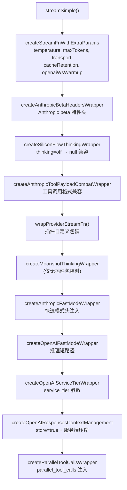
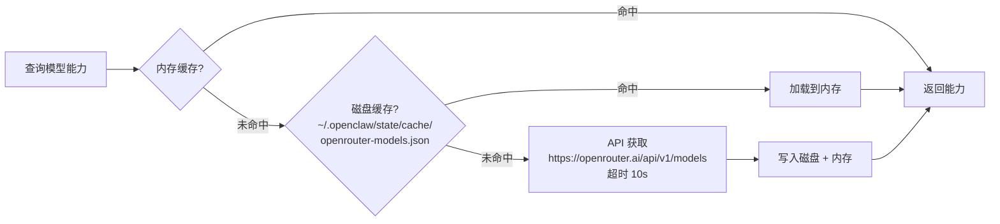

# Provider 参数注入与 OpenRouter 能力发现

> 深度剖析 `extra-params.ts` (317L) + `openrouter-model-capabilities.ts` (302L) 的完整业务逻辑。

## 1. Stream 包装器链

`applyExtraParamsToAgent()` 按以下顺序堆叠 streamFn 包装器：



---

## 2. 参数来源与合并

### 2.1 三级参数合并

```
1. agents.defaults.models["provider/model"].params   (全局模型参数)
2. agents.list[agentId].params                        (agent 级参数)
3. extraParamsOverride                                 (运行时覆盖)

合并顺序: Object.assign({}, global, agent, override)
```

### 2.2 支持的参数

| 参数 | 类型 | 说明 |
|------|------|------|
| `temperature` | number | 温度 |
| `maxTokens` | number | 最大输出 tokens |
| `transport` | "sse"\|"websocket"\|"auto" | 传输协议 |
| `openaiWsWarmup` | boolean | OpenAI WebSocket 预热 |
| `cacheRetention` | "none"\|"short"\|"long" | 缓存保留策略 |
| `parallel_tool_calls` | boolean\|null | 并行工具调用 (null=禁用注入) |

### 2.3 Parallel Tool Calls 注入

```typescript
// 仅对 OpenAI Completions/Responses API 生效
// 通过 onPayload 回调注入:
payload.parallel_tool_calls = enabled;

// null 值: 显式禁用注入 (不设置任何值)
// 非 boolean 非 null: 警告并忽略
```

---

## 3. Provider 特殊处理

### 3.1 Anthropic

| 包装器 | 触发条件 | 行为 |
|--------|---------|------|
| Beta Headers | extraParams 中有 beta 列表 | 注入 `anthropic-beta` 头 |
| Fast Mode | extraParams.anthropicFastMode | 注入快速推理头 |
| Tool Compat | 始终 | 工具调用格式兼容处理 |

### 3.2 OpenAI

| 包装器 | 触发条件 | 行为 |
|--------|---------|------|
| Fast Mode | extraParams.openAiFastMode | 启用推理短路径 |
| Service Tier | extraParams 中有 tier | 注入 `service_tier` 参数 |
| Responses Context | 始终 | 强制 `store=true` + 服务端压缩 |

### 3.3 Moonshot / SiliconFlow

| 包装器 | 触发条件 | 行为 |
|--------|---------|------|
| Moonshot Thinking | provider=moonshot/ollama-kimi, 无插件包装 | thinking 类型转换 |
| SiliconFlow Compat | provider=siliconflow, thinking=off | thinking=off → null |

---

## 4. OpenRouter 模型能力发现

### 4.1 三级缓存



### 4.2 能力解析

```typescript
parseModel(model):
  input: ["text"] + (modality 包含 "image" → ["image"])
  reasoning: supported_parameters.includes("reasoning")
  contextWindow: context_length || 128_000
  maxTokens: top_provider.max_completion_tokens
           ?? max_completion_tokens
           ?? max_output_tokens
           ?? 8192
  cost: {  // 单位: 每百万 token
    input:      parseFloat(pricing.prompt) × 1_000_000
    output:     parseFloat(pricing.completion) × 1_000_000
    cacheRead:  parseFloat(pricing.input_cache_read) × 1_000_000
    cacheWrite: parseFloat(pricing.input_cache_write) × 1_000_000
  }
```

### 4.3 缓存策略

```
- 无 TTL 过期: 模型能力假定稳定
- 缓存未命中时触发后台刷新 (非阻塞)
- skipNextMissRefresh: 刚刷新完仍未找到时, 跳过下次后台刷新
- 并发去重: fetchInFlight Promise 防止重复请求
- 代理支持: resolveProxyFetchFromEnv() 自动检测
```
