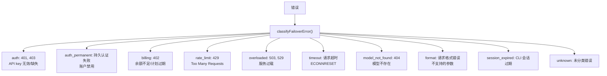

# 模型兼容性与 Provider 能力

> 深度剖析 `model-compat.ts`, `provider-capabilities.ts`, `provider-attribution.ts`, `failover-error.ts` 的业务逻辑。

## 1. 模型兼容性（`model-compat.ts`）

### 1.1 兼容性检查矩阵

| 检查项 | 函数 | 影响 |
|--------|------|------|
| 工具支持 | `isToolSupportedForModel()` | 是否启用工具调用 |
| 系统提示词 | `isSystemPromptSupported()` | 是否注入系统提示词 |
| 推理级别 | `resolveThinkingDefaultForModel()` | 默认推理级别 |
| 上下文窗口 | `resolveContextTokensForModel()` | 上下文大小限制 |
| 图像支持 | `supportsImages()` | 是否处理图像 |
| Streaming | `supportsStreaming()` | 是否流式输出 |

### 1.2 Provider 特殊处理

| Provider | 特殊行为 |
|----------|---------|
| Ollama | 本地合成密钥, 自动模型发现, 无需 API key |
| Google Vertex | gcloud ADC 身份验证, RESOURCE_EXHAUSTED → FailoverError |
| Amazon Bedrock | AWS SDK 认证链, Bearer Token + IAM 双模式 |
| Chutes | 特殊 OAuth 刷新, 冷却跳过 |
| OpenRouter | 冷却跳过, slash 模型 ID (openrouter/model) |
| Claude CLI / Codex CLI | 外部 CLI runner, 白名单跳过 |

---

## 2. 失败转移分类（`failover-error.ts`）

### 2.1 失败原因分类



### 2.2 Abort 错误强制转换

```typescript
coerceToFailoverError(err, {provider, model}):
  // AbortError 包装的限流错误 (如 Google Vertex RESOURCE_EXHAUSTED)
  // → 提取内部 cause
  // → 检测 HTTP 状态码 429/503
  // → 转换为 FailoverError
  // → 允许进入回退循环
```

### 2.3 错误描述

```typescript
describeFailoverError(err):
  → { message, reason, status, code }
  
  // 从 Error.message 提取 HTTP 状态码
  // 从 cause 链中查找 reason
  // 标准化错误描述
```

---

## 3. Provider 归属（`provider-attribution.ts`）

### 3.1 归属模型

```typescript
type ProviderAttribution = {
  provider: string;          // 规范化 provider ID
  model: string;             // 规范化 model ID
  effectiveProvider: string; // 实际 API 调用的 provider
  displayName: string;       // 用户友好名称
  isPassthrough: boolean;    // 是否透传到上游 provider
};
```

### 3.2 透传 Provider

透传 provider 将请求转发给上游:
- **OpenRouter** → anthropic/openai/google 等
- **Vercel AI Gateway** → 上游 provider
- **Cloudflare AI Gateway** → 上游 provider

---

## 4. Provider 能力（`provider-capabilities.ts`）

### 4.1 能力矩阵

| 能力 | 说明 |
|------|------|
| `toolCalling` | 支持工具调用 |
| `streaming` | 支持流式输出 |
| `systemPrompt` | 支持系统提示词 |
| `images` | 支持图像输入 |
| `reasoning` | 支持推理模式 |
| `caching` | 支持 prompt 缓存 |

### 4.2 能力解析

```typescript
resolveProviderCapabilities(provider, model):
  → 合并 provider 默认能力 + model 特定覆盖
  → 返回启用的能力集合
```

---

## 5. API Key 轮换（`api-key-rotation.ts`）

### 5.1 轮换触发

```typescript
// 当 profile 失败时:
// 1. markAuthProfileFailure() → 冷却/禁用
// 2. 下次请求 → resolveAuthProfileOrder() → 跳过冷却中的 profile
// 3. 自动选择下一个可用 profile → 轮换完成
```

### 5.2 Auth 健康检查（`auth-health.ts`）

```typescript
checkAuthHealth({provider, agentDir}):
  → 加载 auth store
  → 检查所有 profile 状态
  → 返回: { healthy, unhealthyProfiles, reason }
```

---

## 6. 工具循环检测（`tool-loop-detection.ts`）

### 6.1 检测逻辑

```
监控连续工具调用模式:
  - 相同工具 + 相同参数 → 循环计数递增
  - 不同工具/参数 → 重置计数
  
  阈值:
  - 3 次相同调用 → 警告
  - 5 次相同调用 → 中断 + 通知用户
```

---

## 7. 命令轮询退避（`command-poll-backoff.ts`）

### 7.1 退避策略

```typescript
computeCommandPollBackoff(attempt):
  // 指数退避: 500ms → 1s → 2s → 4s → 8s (上限)
  // 用于: process(action=poll) 的重试间隔
```

### 7.2 缓存追踪（`cache-trace.ts`）

```typescript
// 追踪 prompt 缓存命中情况
// provider 支持: anthropic (prompt caching)
// 记录: cache_creation_input_tokens, cache_read_input_tokens
```
