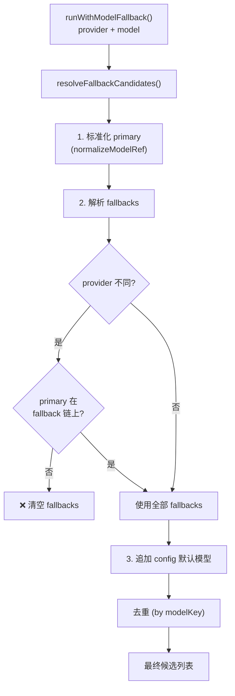
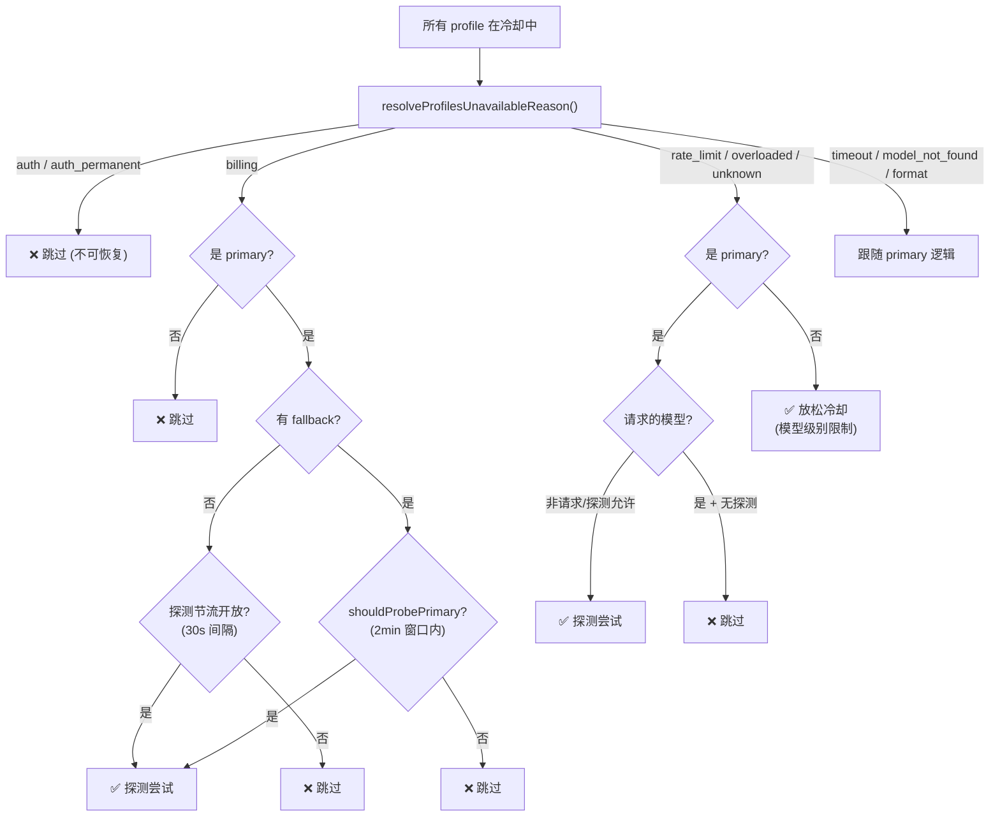
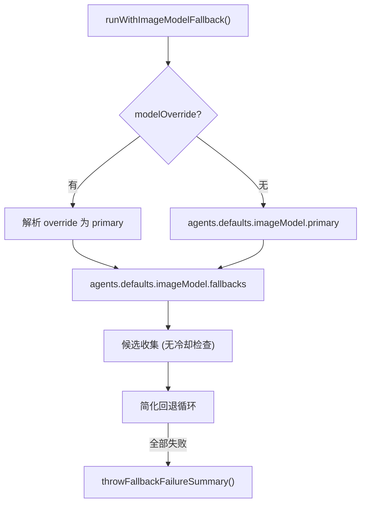

# 模型回退引擎

> 深度剖析 `model-fallback.ts` (829L) + `model-selection.ts` (676L) + `model-catalog.ts` 的完整模型回退业务逻辑。

## 1. 候选收集器

### 1.1 候选构建流程



### 1.2 白名单强制执行

| 候选来源 | 白名单检查 |
|----------|-----------|
| primary (请求的模型) | **跳过** — 显式意图 |
| fallback (配置的回退) | **跳过** — 用户明确配置 |
| allowlisted (发现的模型) | **强制** — 必须在 `agents.defaults.models` 中 |

### 1.3 模型引用解析

```
"sonnet" 
  → alias 查找 → {provider: "anthropic", model: "claude-sonnet-4-5"}
  
"anthropic/claude-sonnet-4-5"
  → 直接解析 → {provider: "anthropic", model: "claude-sonnet-4-5"}
  
"opus-4.5"
  → normalizeAnthropicModelId → "claude-opus-4-5"
  
"google/gemini-2.5-pro"
  → normalizeGoogleModelId → 处理 preview/exp 后缀
  
"openrouter/aurora-alpha"
  → normalizeProviderModelId → "openrouter/aurora-alpha" (保留前缀)
```

---

## 2. 冷却探测决策引擎

### 2.1 完整决策树



### 2.2 探测节流参数

| 参数 | 值 | 说明 |
|------|-----|------|
| MIN_PROBE_INTERVAL_MS | 30,000 | 同一 provider 最小探测间隔 |
| PROBE_MARGIN_MS | 120,000 | 冷却到期前窗口 (2分钟) |
| PROBE_STATE_TTL_MS | 86,400,000 | 探测状态过期时间 (24小时) |
| MAX_PROBE_KEYS | 256 | 最大探测键数量 |

### 2.3 每次运行单次探测守卫

```typescript
const cooldownProbeUsedProviders = new Set<string>();

// 仅在首次遇到冷却中的 provider 时探测
// rate_limit / overloaded / unknown → 标记 provider
// model_not_found / format / auth → 不消耗探测配额 (shouldPreserveTransientProbeSlot)
```

---

## 3. 回退循环核心逻辑

```mermaid
sequenceDiagram
    participant Loop as 回退循环
    participant Auth as AuthStore
    participant Run as runFallbackCandidate
    participant Error as 错误处理
    
    loop 每个候选 (0..N)
        Loop->>Auth: 检查 profile 可用性
        
        alt 全部冷却
            Auth->>Loop: CooldownDecision
            alt skip
                Loop->>Loop: 记录 attempt + 跳过
            else attempt + probe
                Loop->>Run: 带 allowTransientCooldownProbe
            end
        else 有可用 profile
            Loop->>Run: 正常执行
        end
        
        alt 成功
            Run-->>Loop: result
            Loop-->>Loop: 返回 success
        else AbortError (非 timeout)
            Run-->>Loop: throw (终止回退)
        else ContextOverflow
            Run-->>Loop: throw (不回退 — 更小窗口更糟)
        else FailoverError
            Error->>Loop: 记录 attempt
            Error->>Error: 通知 onError
            Note right of Error: 继续下一候选
        else 未知错误 + 最后一个候选
            Error->>Loop: throw (无更多候选)
        else 未知错误 + 非最后
            Error->>Loop: 记录 + 继续
        end
    end
    
    Loop->>Loop: throwFallbackFailureSummary()
```

### 3.1 非重试错误

| 错误类型 | 行为 | 原因 |
|----------|------|------|
| AbortError (非 timeout) | 直接抛出 | 用户主动取消 |
| ContextOverflow | 直接抛出 | 更小模型窗口会更糟 |
| 单一候选的任何错误 | 直接抛出 | 无回退选项 |
| 最后一个候选的未知错误 | 直接抛出 | 已耗尽候选 |

### 3.2 Abort 包装的限流错误

```typescript
// Google Vertex RESOURCE_EXHAUSTED 被包装为 AbortError
// coerceToFailoverError() 识别并转换为 FailoverError
// 确保限流错误进入回退循环而非终止
```

---

## 4. 图像模型回退



**与文本模型回退的差异**：图像模型回退不进行冷却检查、探测节流或 provider 级别跳过。

---

## 5. 模型选择系统（`model-selection.ts`）

### 5.1 别名索引

```typescript
ModelAliasIndex = {
  byAlias: Map<key, {alias, ref}>,  // "sonnet" → {provider, model}
  byKey: Map<key, aliases[]>,        // "anthropic/model" → ["sonnet", "s"]
}

// 来源: agents.defaults.models.*.alias
```

### 5.2 配置模型解析优先级

```
1. agents.defaults.model.primary (别名 → 解析 → 直接解析)
2. 无 provider 的裸模型名 → 默认 "anthropic" (已废弃, 带警告)
3. 配置中第一个有模型的 provider (当默认 provider 不可用时)
4. 硬编码默认: anthropic/claude-sonnet-4-5
```

### 5.3 Agent 特定模型覆盖

```typescript
resolveDefaultModelForAgent({cfg, agentId}):
  1. agents.list[agentId].model → primary override
  2. 合并到 cfg.agents.defaults.model.primary
  3. resolveConfiguredModelRef() 解析

resolveSubagentSpawnModelSelection({cfg, agentId, modelOverride}):
  1. 运行时 modelOverride (请求参数)
  2. agents.list[agentId].subagents.model
  3. agents.defaults.subagents.model
  4. agents.list[agentId].model
  5. resolveDefaultModelForAgent()
```

### 5.4 Provider ID 标准化

```typescript
normalizeProviderId(raw):
  "Google"     → "google"
  "ANTHROPIC"  → "anthropic"
  "OpenAI"     → "openai"
  "qwen"       → "qwen-portal"     // 别名映射
  "BytePlus"   → "volcengine-byteplus"

normalizeProviderModelId(provider, model):
  anthropic + "opus-4.5"  → "claude-opus-4-5"
  google + "model"        → normalizeGoogleModelId()
  openrouter + "aurora"   → "openrouter/aurora"
```
