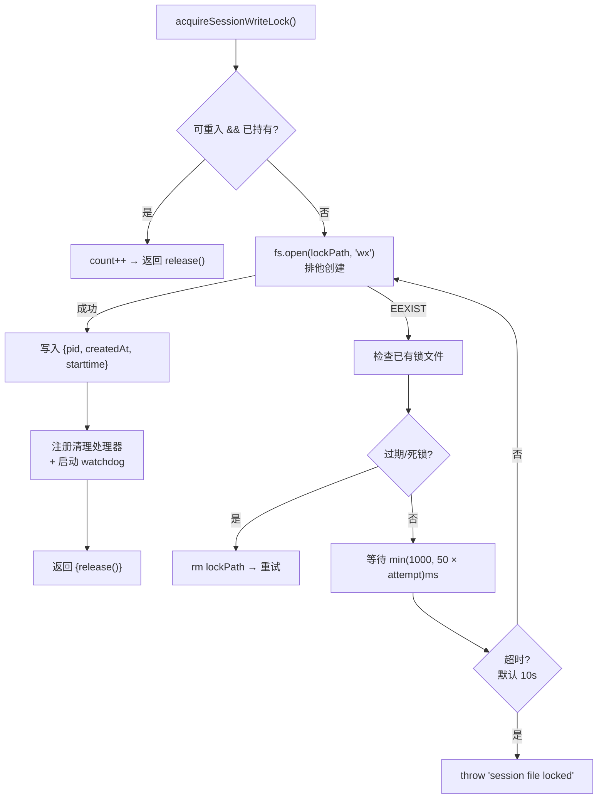
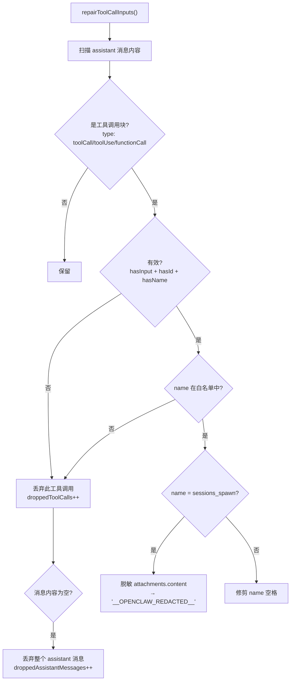
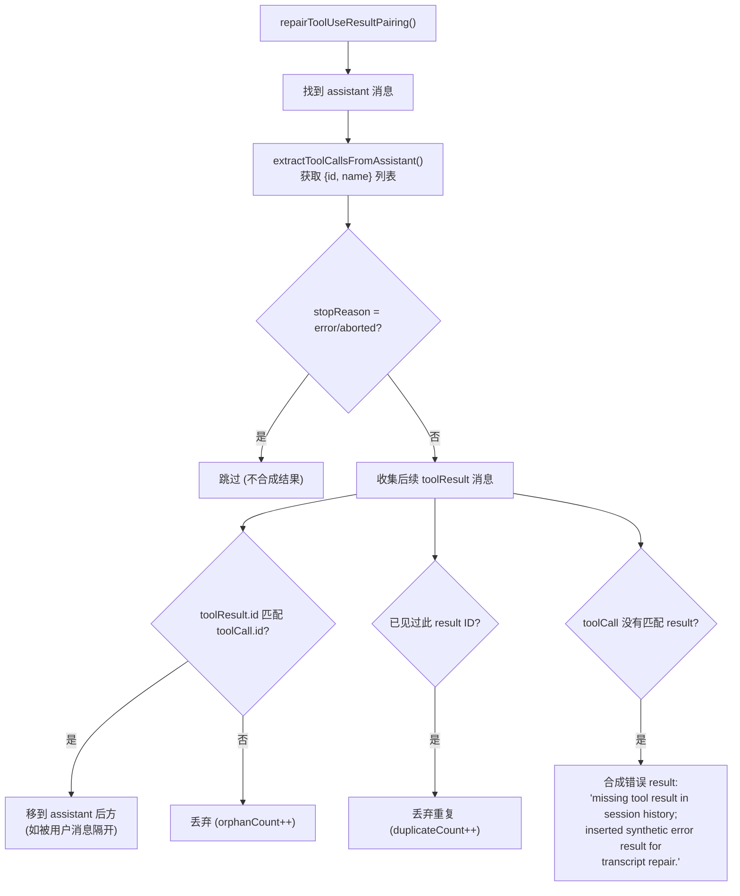

# 会话锁定与转录修复

> 深度剖析 `session-write-lock.ts` (561L) + `session-transcript-repair.ts` (503L) 的完整业务逻辑。

## 1. 会话写锁 (`session-write-lock.ts`)

### 1.1 锁机制



### 1.2 锁文件内容

```json
{
  "pid": 12345,
  "createdAt": "2024-03-15T10:30:00.000Z",
  "starttime": 1234567890
}
```

### 1.3 过期检测 (5 种原因)

| 原因 | 条件 | 说明 |
|------|------|------|
| `missing-pid` | pid 不存在或无效 | 锁文件损坏 |
| `dead-pid` | isPidAlive(pid) = false | 进程已退出 |
| `recycled-pid` | PID 存活但 starttime 不同 | OS 复用了 PID |
| `invalid-createdAt` | 解析失败 | 时间戳损坏 |
| `too-old` | ageMs > staleMs (默认 30 分钟) | 超时持有 |

### 1.4 PID 复用检测

```typescript
// 通过 /proc/pid/stat field 22 (进程启动时间) 检测:
//   锁文件记录的 starttime ≠ 当前进程的 starttime
//   → 说明原始持有进程已死, OS 分配了相同 PID 给新进程
```

### 1.5 孤儿自锁检测

```typescript
shouldTreatAsOrphanSelfLock({payload, normalizedSessionFile}):
  → pid === process.pid   (同进程)
  → 无有效 starttime       (旧格式锁)
  → 内存中未持有此会话的锁  (非重入)
  // 典型场景: 进程崩溃后重启, 发现自己的旧锁
```

---

## 2. 安全保障

### 2.1 Watchdog 定时器

```typescript
DEFAULT_WATCHDOG_INTERVAL_MS = 60_000  // 每分钟检查
DEFAULT_MAX_HOLD_MS = 5 * 60 * 1000   // 默认最大持有 5 分钟
MAX_LOCK_HOLD_MS = 2_147_000_000      // ~24.8 天 (setTimeout 上限)

watchdog 检查:
  遍历所有持有锁:
    if (heldForMs > maxHoldMs):
      强制释放 (force: true)
      console.warn(...)
```

### 2.2 信号清理

```typescript
// 监听: SIGINT, SIGTERM, SIGQUIT, SIGABRT
// + process.on("exit")
//
// 清理流程:
// 1. releaseAllLocksSync() — 同步关闭所有文件句柄 + 删除锁文件
// 2. 如果是唯一监听器 → 重新发送信号 (process.kill)
```

### 2.3 Timeout Grace 机制

```typescript
resolveSessionLockMaxHoldFromTimeout({timeoutMs, graceMs, minMs}):
  // maxHoldMs = max(minMs, timeoutMs + graceMs)
  // 默认: max(5min, timeout + 2min)
  // Infinity timeout → MAX_LOCK_HOLD_MS (24.8 天)
```

---

## 3. 转录修复 (`session-transcript-repair.ts`)

### 3.1 工具调用输入修复



### 3.2 工具名称验证

```typescript
hasToolCallName(block, allowedToolNames):
  → name 必须是字符串
  → 长度 ≤ 64 字符
  → 匹配 /^[A-Za-z0-9_-]+$/
  → 如有白名单: name.toLowerCase() 须在白名单中
```

### 3.3 工具调用/结果配对修复



### 3.4 工具结果详情清理

```typescript
stripToolResultDetails(messages):
  → 移除 toolResult 消息中的 details 字段
  → 减少 token 消耗 (details 通常包含大量调试信息)
  → 用于 /btw 侧问等低上下文场景
```
