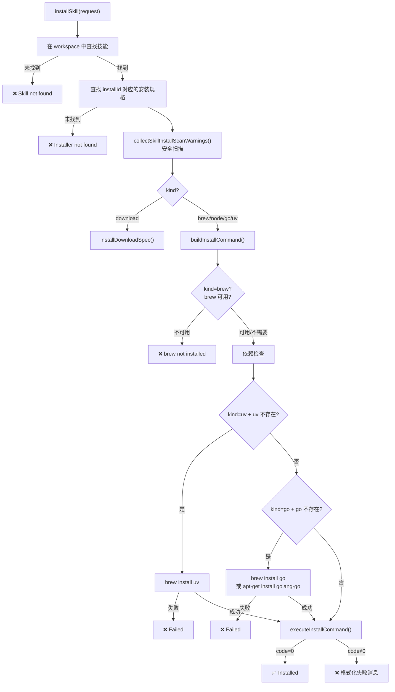
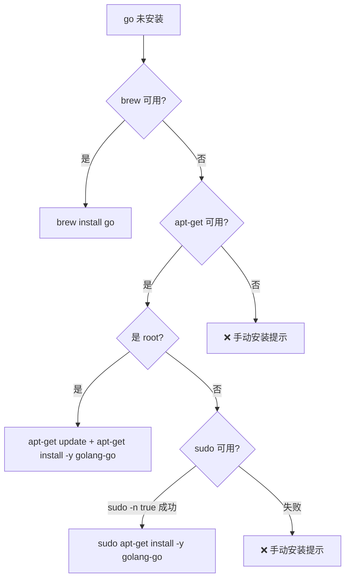

# 技能安装系统

> 深度剖析 `skills-install.ts` (471L) 的完整技能安装业务逻辑。

## 1. 安装器类型

### 1.1 五种安装器

| Kind | 目标 | 命令模板 | 依赖自动安装 |
|------|------|---------|-------------|
| `brew` | Homebrew formula | `brew install <formula>` | 否 (需已安装 brew) |
| `node` | npm 包 | `npm install -g --ignore-scripts <pkg>` | 否 |
| `go` | Go module | `go install <module>` | brew/apt 自动安装 |
| `uv` | Python (uv) | `uv tool install <pkg>` | brew 自动安装 |
| `download` | 直接下载 | `installDownloadSpec()` | N/A |

### 1.2 Node 包管理器适配

```typescript
// 根据 skillsInstallPreferences.nodeManager 选择:
switch (prefs.nodeManager) {
  case "pnpm":  → ["pnpm", "add", "-g", "--ignore-scripts", pkg]
  case "yarn":  → ["yarn", "global", "add", "--ignore-scripts", pkg]
  case "bun":   → ["bun", "add", "-g", "--ignore-scripts", pkg]
  default:      → ["npm", "install", "-g", "--ignore-scripts", pkg]
}
// 注意: 所有管理器均使用 --ignore-scripts 防止安装时执行脚本
```

---

## 2. 安装流程

### 2.1 完整序列



### 2.2 超时控制

```typescript
const timeoutMs = Math.min(Math.max(params.timeoutMs ?? 300_000, 1_000), 900_000);
// 默认: 5 分钟
// 范围: 1 秒 ~ 15 分钟
```

---

## 3. 安全扫描

### 3.1 安装前扫描

```typescript
collectSkillInstallScanWarnings(entry):
  → scanDirectoryWithSummary(skillDir)
  
  if (summary.critical > 0):
    WARNING: "contains dangerous code patterns: <details>"
  else if (summary.warn > 0):
    WARNING: "has N suspicious code pattern(s)"
```

### 3.2 扫描级别

| 级别 | 含义 | 处理 |
|------|------|------|
| critical | 危险代码模式 | WARNING 附详情 (文件:行号) |
| warn | 可疑模式 | WARNING + 建议审计 |
| (扫描失败) | 无法扫描 | WARNING + 继续安装 |

---

## 4. 自动依赖安装

### 4.1 Go 安装路径



### 4.2 Brew 路径解析

```typescript
resolveBrewBinDir():
  1. brew --prefix → <prefix>/bin
  2. HOMEBREW_PREFIX 环境变量
  3. 候选路径: /opt/homebrew/bin, /usr/local/bin

// 用于: Go 安装时将 GOBIN 设为 brew bin 目录
```

---

## 5. 安装 ID 体系

### 5.1 ID 解析

```typescript
// 技能元数据中:
metadata.install: [
  { kind: "brew", formula: "ripgrep", id: "brew-ripgrep" },   // 显式 ID
  { kind: "node", package: "@foo/bar" },                       // 自动 ID: "node-1"
]

resolveInstallId(spec, index):
  → spec.id ?? `${spec.kind}-${index}`
```

### 5.2 查找逻辑

```typescript
findInstallSpec(entry, installId):
  → 遍历 entry.metadata.install
  → 按 resolveInstallId 匹配
```

---

## 6. Homebrew 可执行文件发现

```typescript
// 查找 brew 路径优先级:
1. hasBinary("brew") → 直接使用 "brew"
2. resolveBrewExecutable() → 特定平台路径检测
   - macOS arm64: /opt/homebrew/bin/brew
   - macOS x64: /usr/local/bin/brew
   - Linux: /home/linuxbrew/.linuxbrew/bin/brew
```

---

## 7. 错误处理

### 7.1 失败消息格式化

```typescript
formatInstallFailureMessage(result):
  // 将 stdout + stderr 合并为可读的安装失败消息
  // 截断过长输出
```

### 7.2 安全命令执行

```typescript
runCommandSafely(argv, options):
  // 封装 runCommandWithTimeout
  // 捕获所有异常 → 返回 {code: null, stderr: error.message}
  // 绝不 throw

runBestEffortCommand(argv, options):
  // 静默执行, 忽略结果/错误
  // 用于: apt-get update 等可选步骤
```
