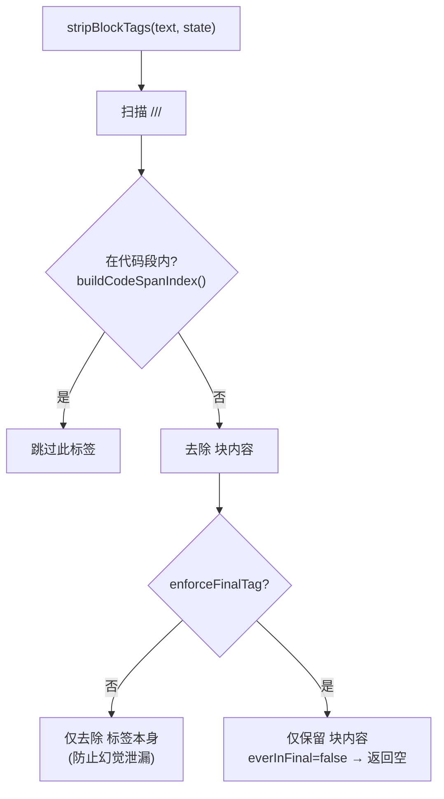
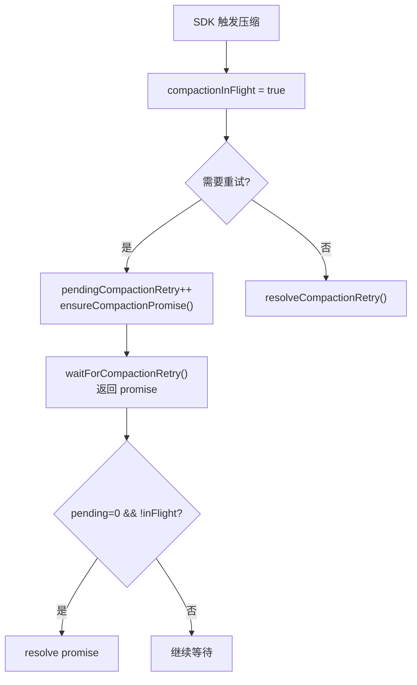
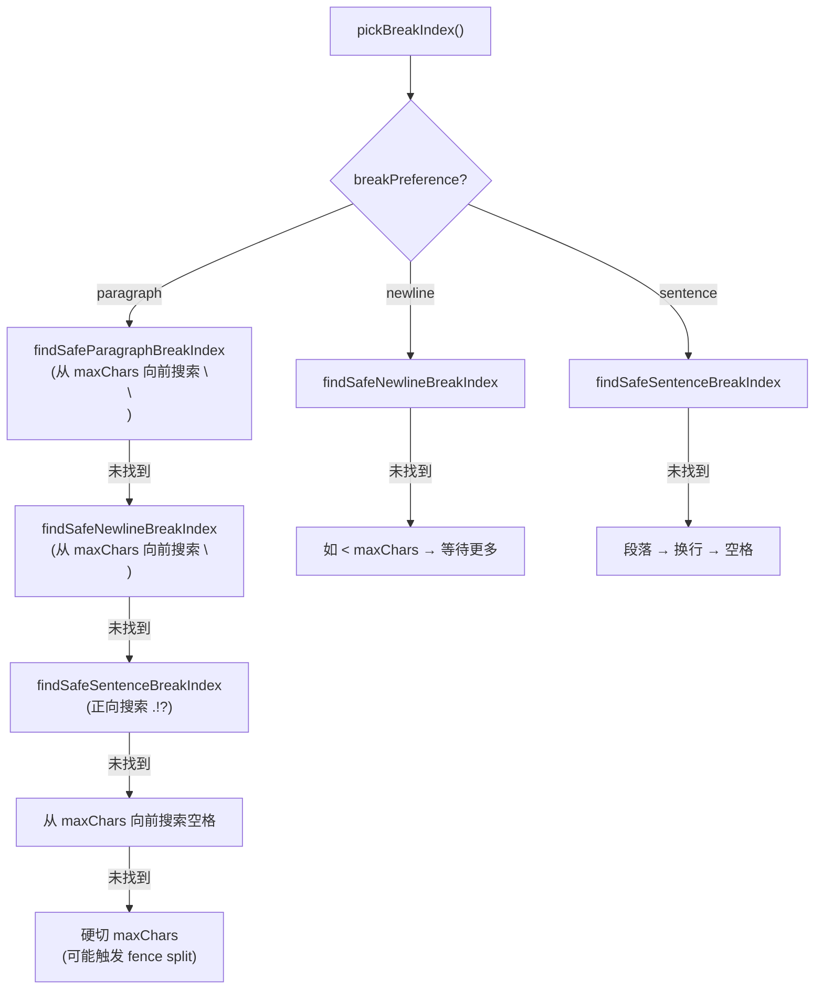

# 流式订阅与分块传输

> 深度剖析 `pi-embedded-subscribe.ts` (727L) + `pi-embedded-block-chunker.ts` (422L) 的完整业务逻辑。

## 1. 流式事件订阅 (`pi-embedded-subscribe.ts`)

### 1.1 状态机

```typescript
EmbeddedPiSubscribeState = {
  // 文本累积
  assistantTexts: string[],        // 助手回复片段
  deltaBuffer: "",                 // 流式 delta 缓冲
  blockBuffer: "",                 // 块回复缓冲

  // 思考/最终标签状态 (跨 chunk 有状态)
  blockState: { thinking: false, final: false, inlineCode },
  partialBlockState: { thinking, final, inlineCode },

  // 推理流
  reasoningMode: "off" | "on" | "stream",
  streamReasoning: boolean,        // mode=stream + 有回调
  reasoningStreamOpen: boolean,
  lastStreamedReasoning: string,

  // 消息工具去重
  messagingToolSentTexts: string[],     // 已提交的发送文本
  messagingToolSentTextsNormalized: [], // 标准化文本
  pendingMessagingTexts: Map,           // 待确认的文本 (工具执行中)

  // 压缩协调
  compactionInFlight: boolean,
  pendingCompactionRetry: number,
  compactionRetryPromise: Promise | null,
}
```

### 1.2 `<think>` / `<final>` 标签处理



### 1.3 消息工具去重

```typescript
// 问题: 当 agent 通过消息工具发送回复后,
//        又在 assistant 回复中重复相同内容

emitBlockChunk(text):
  1. stripDowngradedToolCallText()    // 去除降级工具调用文本
  2. stripBlockTags(text, state)       // 去除 think/final 标签
  3. normalizeTextForComparison()      // 标准化: 去空格+标点
  4. isMessagingToolDuplicateNormalized()  // 检查已发送文本
  5. shouldSkipAssistantText()         // 检查重复 assistant 文本
  → 全部通过后才发出块回复

// 限制: MAX_MESSAGING_SENT_TEXTS = 200
//        超出后 FIFO 清理
```

### 1.4 压缩重试协调



### 1.5 退订 (Unsubscribe)

```typescript
unsubscribe():
  1. state.unsubscribed = true   // 先标记, 防止新 promise
  2. reject compactionRetryPromise  // AbortError (非 resolve!)
  3. if (session.isCompacting):
       session.abortCompaction()    // 取消进行中的压缩
  4. sessionUnsubscribe()           // 取消 SDK 事件订阅
```

### 1.6 使用量追踪

```typescript
recordAssistantUsage(usage):
  usageTotals.input += usage.input
  usageTotals.output += usage.output
  usageTotals.cacheRead += usage.cacheRead
  usageTotals.cacheWrite += usage.cacheWrite
  usageTotals.total += usage.total ?? derived

// 每次 assistant 消息的 usage 字段都会累计
// run.ts 使用 getUsageTotals() 读取总量
```

---

## 2. 块回复分块器 (`pi-embedded-block-chunker.ts`)

### 2.1 分块参数

```typescript
BlockReplyChunking = {
  minChars: number,                    // 最小字符数 (≥1)
  maxChars: number,                    // 最大字符数 (≥minChars)
  breakPreference?: "paragraph"        // 段落边界 (默认)
                  | "newline"          // 换行边界
                  | "sentence",        // 句子边界
  flushOnParagraph?: boolean,          // 满足 min 后在段落边界刷新
}
```

### 2.2 分割点优先级



### 2.3 代码围栏安全

```
所有分割点必须通过 isSafeFenceBreak() 检查:
  → 不在 ``` 围栏内分割

当 maxChars 强制分割在围栏内时:
  1. 找到当前围栏的 openLine
  2. 在分割点插入 closeFenceLine (关闭围栏)
  3. 在下一块开头插入 reopenFenceLine (重新打开)
  → 保持 Markdown 有效性
```

### 2.4 段落偏好刷新

```typescript
// flushOnParagraph = true 时:
// 满足 minChars 后, 在第一个段落边界 (\\n\\n) 处立即刷新
// 不等待到达 maxChars
// 用于: 聊天场景, 尽快发出内容
```

### 2.5 drain() 循环

```
drain({force, emit}):
  while (buffer中仍有内容):
    if (!force && remaining < minChars): break
    if (force && remaining ≤ maxChars): emit全部 + break
    
    if (flushOnParagraph && !force):
      找段落边界 → emit + continue
    
    pickBreakIndex() → 找最佳分割点
    emit(chunk) → start += consumed
    
    if (remaining < minChars && !force): break
    
  buffer = reopenPrefix + remaining
```
