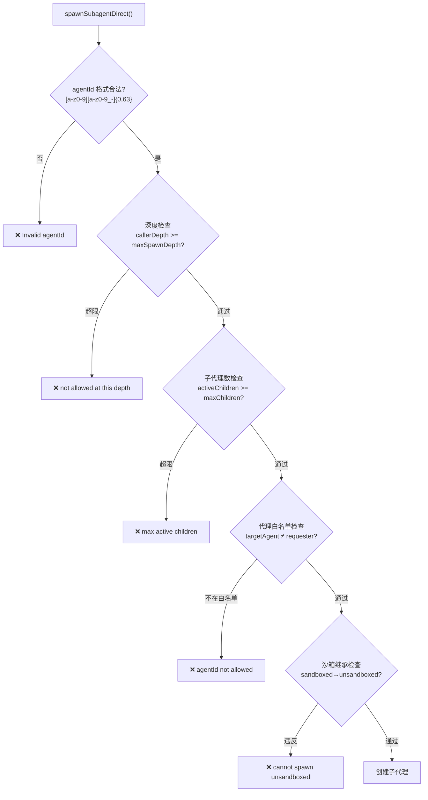
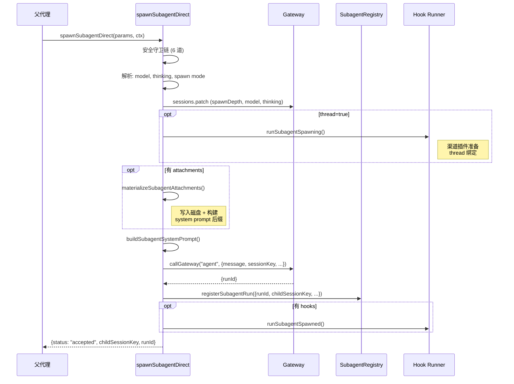
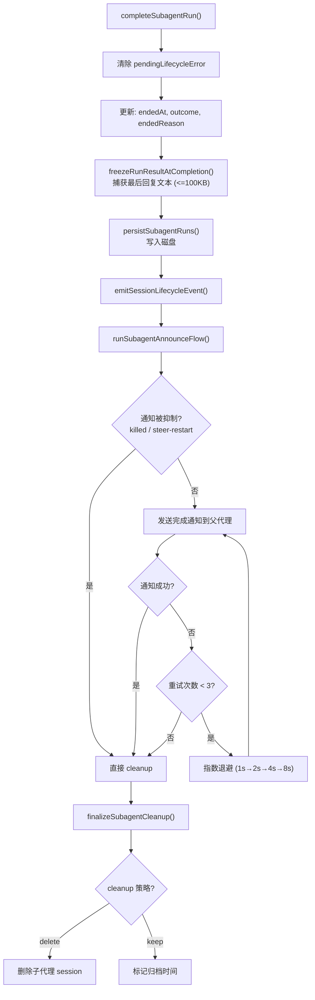

# 子代理生命周期

> 深度剖析 `subagent-spawn.ts` (842L), `subagent-registry.ts` (1706L), `subagent-announce.ts` 的完整子代理生命周期。

## 1. 创建流程（`subagent-spawn.ts`）

### 1.1 安全守卫链（6 道）



### 1.2 默认限制参数

| 参数 | 默认值 | 配置键 |
|------|--------|--------|
| maxSpawnDepth | 5 | `agents.defaults.subagents.maxSpawnDepth` |
| maxChildren | 5 | `agents.defaults.subagents.maxChildrenPerAgent` |
| runTimeoutSeconds | 0 (无超时) | `agents.defaults.subagents.runTimeoutSeconds` |

### 1.3 创建序列



### 1.4 两种发射模式

| 模式 | 触发条件 | 行为 | cleanup |
|------|---------|------|---------|
| `run` | 默认/thread=false | 一次性任务, 完成后通知 | keep 或 delete |
| `session` | thread=true | 持久会话, 线程绑定 | 始终 keep |

---

## 2. 注册表管理（`subagent-registry.ts`）

### 2.1 运行记录数据结构

```typescript
const subagentRuns = new Map<string, SubagentRunRecord>();

// SubagentRunRecord 核心字段:
{
  runId: string;                    // 唯一标识
  childSessionKey: string;          // 子代理会话键
  requesterSessionKey: string;      // 请求者会话键
  startedAt: number;                // 启动时间
  endedAt?: number;                 // 结束时间
  endedReason?: string;             // 结束原因
  outcome?: { status: "ok" | "error" };
  task: string;                     // 任务描述
  label?: string;                   // 可读标签
  spawnMode: "run" | "session";     // 发射模式
  frozenResultText?: string;        // 冻结结果 (最大 100KB)
  announceRetryCount: number;       // 通知重试计数
  lastAnnounceRetryAt?: number;     // 上次重试时间
  cleanup: "delete" | "keep";       // 清理策略
  suppressAnnounceReason?: "killed" | "steer-restart";
}
```

### 2.2 生命周期常量

| 常量 | 值 | 用途 |
|------|-----|------|
| 通知超时 | 120s | `SUBAGENT_ANNOUNCE_TIMEOUT_MS` |
| 最小重试延迟 | 1s | `MIN_ANNOUNCE_RETRY_DELAY_MS` |
| 最大重试延迟 | 8s | `MAX_ANNOUNCE_RETRY_DELAY_MS` |
| 最大重试次数 | 3 | `MAX_ANNOUNCE_RETRY_COUNT` |
| 一般通知过期 | 5min | `ANNOUNCE_EXPIRY_MS` |
| 完成通知硬过期 | 30min | `ANNOUNCE_COMPLETION_HARD_EXPIRY_MS` |
| 错误宽限期 | 15s | `LIFECYCLE_ERROR_RETRY_GRACE_MS` |
| 结果冻结上限 | 100KB | `FROZEN_RESULT_TEXT_MAX_BYTES` |

### 2.3 完成流程



---

## 3. 孤儿恢复机制

### 3.1 孤儿产生场景

- Gateway 重启时子代理仍在运行
- Session entry 被清除但运行记录仍存在
- 竞争条件导致注册和完成不一致

### 3.2 恢复流程

```
1. scheduleOrphanRecovery():
   - 延迟加载 subagent-orphan-recovery.js
   - 等待 Gateway 完全启动
   
2. reconcileOrphanedRestoredRuns():
   - 遍历所有恢复的运行记录
   - 检查 session entry 是否存在
   - 修复缺失的 session 元数据
   
3. reconcileOrphanedRun():
   - 修复缺失 session entry
   - 修复缺失 session ID
   - 重新注册到 subagentRuns Map
```

---

## 4. 通知与附件

### 4.1 子代理系统提示

```typescript
buildSubagentSystemPrompt({
  requesterSessionKey,
  requesterOrigin,
  childSessionKey,
  label,
  task,
  acpEnabled,
  childDepth,
  maxSpawnDepth,
});
// 包含: 请求者上下文, 深度信息, ACP 状态
```

### 4.2 附件系统

```typescript
materializeSubagentAttachments({
  config,
  targetAgentId,
  attachments: [
    { name: "data.json", content: "...", encoding: "utf8" },
    { name: "image.png", content: "...", encoding: "base64" },
  ],
  mountPathHint,  // 安全校验: 仅 [A-Za-z0-9._\-/:]+, 无换行/控制字符
});
// 写入: workspace/attachments/<childSessionKey>/
// 安全: decodeStrictBase64() 验证纯 base64
```

### 4.3 失败清理管线

```
cleanupFailedSpawnBeforeAgentStart():
  1. 删除附件目录 (recursive: true, force: true)
  2. 清除临时 session (cleanupProvisionalSession)
  3. 触发 subagent_ended hook (如有 thread binding)
  4. 删除 session (emitLifecycleHooks: !endedHookEmitted)
  
所有步骤均为 best-effort, 不抛出的异常会被静默忽略
```
