# 系统提示词合成

> 深度剖析 `system-prompt.ts` (720L) 的完整系统提示词构建业务逻辑。

## 1. 提示词模式

| 模式 | 适用场景 | 包含段落 |
|------|---------|---------|
| `full` | 主代理 (默认) | 全部 20+ 段落 |
| `minimal` | 子代理 | Tooling, Workspace, Runtime, Safety (跳过大部分) |
| `none` | 极简代理 | 仅 "You are a personal assistant running inside OpenClaw." |

---

## 2. 段落构建顺序

```mermaid
flowchart TD
    START["buildAgentSystemPrompt()"] --> IDENTITY["身份声明<br/>'You are a personal assistant...'"]
    IDENTITY --> TOOLING["## Tooling<br/>工具可用性 + 策略"]
    TOOLING --> TOOL_STYLE["## Tool Call Style<br/>调用风格指南"]
    TOOL_STYLE --> SAFETY["## Safety<br/>安全宪法"]
    SAFETY --> CLI_REF["## OpenClaw CLI Quick Reference"]
    CLI_REF --> SKILLS["## Skills (mandatory)<br/>技能段落"]
    SKILLS --> MEMORY["## Memory Recall<br/>记忆搜索"]
    MEMORY --> SELF_UPDATE["## OpenClaw Self-Update<br/>(仅 full + gateway)"]
    SELF_UPDATE --> MODEL_ALIAS["## Model Aliases<br/>(仅 full)"]
    MODEL_ALIAS --> WORKSPACE["## Workspace<br/>工作目录"]
    WORKSPACE --> DOCS["## Documentation<br/>(仅 full)"]
    DOCS --> SANDBOX["## Sandbox<br/>(按需)"]
    SANDBOX --> USER_IDENTITY["## Authorized Senders<br/>(仅 full)"]
    USER_IDENTITY --> TIME["## Current Date & Time"]
    TIME --> WS_FILES["## Workspace Files (injected)"]
    WS_FILES --> REPLY_TAGS["## Reply Tags<br/>(仅 full)"]
    REPLY_TAGS --> MESSAGING["## Messaging<br/>(仅 full)"]
    MESSAGING --> VOICE["## Voice (TTS)<br/>(按需)"]
    VOICE --> EXTRA["## Group Chat / Subagent Context<br/>(按需)"]
    EXTRA --> REACTIONS["## Reactions<br/>(按需)"]
    REACTIONS --> REASONING["## Reasoning Format<br/>(按需)"]
    REASONING --> CONTEXT["# Project Context<br/>上下文文件注入"]
    CONTEXT --> SILENT["## Silent Replies<br/>(仅 full)"]
    SILENT --> HEARTBEAT["## Heartbeats<br/>(仅 full)"]
    HEARTBEAT --> RUNTIME["## Runtime<br/>运行时信息行"]
```



---

## 3. 核心段落详解

### 3.1 工具摘要表（25 个核心工具）

| 工具名 | 摘要 |
|--------|------|
| read | 读取文件内容 |
| write | 创建或覆盖文件 |
| edit | 精确编辑文件 |
| apply_patch | 应用多文件补丁 |
| grep | 搜索文件内容 |
| find | 按 glob 查找文件 |
| ls | 列出目录 |
| exec | 运行 shell 命令 (支持 PTY) |
| process | 管理后台 exec 会话 |
| web_search | Brave API 搜索 |
| web_fetch | URL 内容提取 |
| browser | 控制浏览器 |
| canvas | Canvas 呈现/评估/快照 |
| nodes | 配对节点操作 |
| cron | 定时任务/提醒 |
| message | 消息发送 + 频道动作 |
| gateway | 重启/配置/更新 |
| agents_list | 列出可用代理 |
| sessions_list | 列出会话 |
| sessions_history | 获取会话历史 |
| sessions_send | 跨会话消息 |
| sessions_spawn | 生成子代理/ACP 会话 |
| subagents | 子代理管理 (list/steer/kill) |
| session_status | 使用状况/model 状态 |
| image / image_generate | 图像分析/生成 |

### 3.2 安全宪法段落

```
Safety 段落包含 3 条核心原则:
1. 无独立目标: 不追求自我保护、复制、资源获取
2. 安全优先于完成: 指令冲突时暂停并询问
3. 不操纵: 不扩展访问、禁用安全措施
(灵感来自 Anthropic 宪法)
```

### 3.3 Owner 身份控制

```typescript
buildOwnerIdentityLine(ownerNumbers, ownerDisplay, ownerDisplaySecret):
  
  ownerDisplay = "raw":
    → "Authorized senders: +1234567890, +0987654321. ..."
    
  ownerDisplay = "hash":
    → HMAC-SHA256(ownerDisplaySecret, ownerId).hex().slice(0, 12)
    → "Authorized senders: a1b2c3d4e5f6, ..."
    
  // 关键: "do not assume they are the owner"
```

### 3.4 SOUL.md 人格体现

```typescript
if (hasSoulFile) {
  lines.push(
    "If SOUL.md is present, embody its persona and tone. " +
    "Avoid stiff, generic replies; follow its guidance " +
    "unless higher-priority instructions override it."
  );
}
```

### 3.5 SILENT_REPLY_TOKEN 协议

```
当无内容可回复时:
  ✅ 正确: 整个消息仅为 SILENT_REPLY_TOKEN
  ❌ 错误: "Here's help... SILENT_REPLY_TOKEN"
  ❌ 错误: 用引号包裹 "SILENT_REPLY_TOKEN"
  ❌ 错误: 用 markdown 包裹

使用 message(action=send) 发送后:
  → 回复 SILENT_REPLY_TOKEN (避免重复)
```

### 3.6 Heartbeat 协议

```
收到心跳轮询 (匹配 heartbeatPrompt):
  无需关注 → 回复 "HEARTBEAT_OK"
  需要关注 → 不含 "HEARTBEAT_OK", 用告警文本回复
  
OpenClaw 将前导/尾随 "HEARTBEAT_OK" 视为心跳确认 (可能丢弃)
```

---

## 4. 沙箱信息段落

```typescript
sandboxInfo 可用时注入:
  - 容器工作目录 (containerWorkspaceDir)
  - 主机挂载源 (workspaceDir, 仅文件工具桥接)
  - 工作区访问模式 (workspaceAccess)
  - 浏览器桥接 URL (browserBridgeUrl)
  - noVNC 观察器 URL (browserNoVncUrl)
  - 主机浏览器控制 (allowed/blocked)
  - Elevated 执行状态 (level: ask/full/off)
  - ACP 限制 (沙箱中阻止 runtime:"acp")
```

---

## 5. Runtime 信息行

```typescript
buildRuntimeLine(runtimeInfo, channel, capabilities, thinkLevel):
  → "Runtime: agent=bot | host=mac-studio | repo=/workspace | 
     os=darwin (arm64) | node=22.1.0 | model=anthropic/claude-sonnet-4-5 |
     shell=zsh | channel=telegram | capabilities=inlineButtons |
     thinking=medium"
```

### 5.1 ACP Spawn 引导

```
acpEnabled=true + 非沙箱:
  → "do this in codex/claude code/gemini" → sessions_spawn(runtime:"acp")
  → Discord: 默认 thread-bound session
  → 不通过 subagents/agents_list 路由
  → 不通过 message(action=thread-create) 创建线程
```

---

## 6. 反应引导

| 模式 | 频率 | 适用 |
|------|------|------|
| `minimal` | 每 5-10 次交流最多 1 次反应 | 确认重要请求、真实情感 |
| `extensive` | 自然频率 | 确认理解、表达个性、回应有趣内容 |

---

## 7. 推理格式

```
reasoningTagHint=true 时注入:
  "ALL internal reasoning MUST be inside <think>...</think>."
  "Format every reply as <think>...</think> then <final>...</final>."
  "Only text inside <final> is shown to the user."
```
