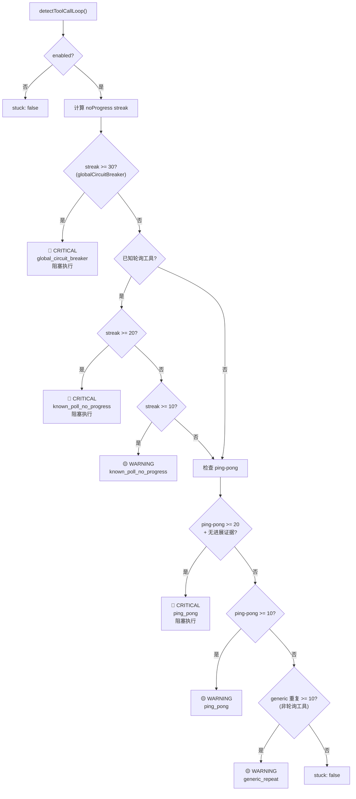

# 工具循环检测系统

> 深度剖析 `tool-loop-detection.ts` (624L) 的完整循环检测业务逻辑。

## 1. 检测器类型

| 检测器         | Kind                     | 检测目标                                      |
| -------------- | ------------------------ | --------------------------------------------- |
| 泛型重复       | `generic_repeat`         | 相同工具 + 相同参数的重复调用                 |
| 已知轮询无进展 | `known_poll_no_progress` | command_status/process(poll/log) 的无结果变化 |
| 全局断路器     | `global_circuit_breaker` | 任何工具的无进展重复达到最高阈值              |
| 乒乓模式       | `ping_pong`              | 两组工具调用交替执行无进展                    |

---

## 2. 阈值配置

| 参数                            | 默认值 | 说明         |
| ------------------------------- | ------ | ------------ |
| `historySize`                   | 30     | 滑动窗口大小 |
| `warningThreshold`              | 10     | 警告级别触发 |
| `criticalThreshold`             | 20     | 严重级别触发 |
| `globalCircuitBreakerThreshold` | 30     | 断路器触发   |

### 安全保证

```typescript
// 自动修正: critical > warning, circuitBreaker > critical
if (criticalThreshold <= warningThreshold) {
  criticalThreshold = warningThreshold + 1;
}
if (globalCircuitBreakerThreshold <= criticalThreshold) {
  globalCircuitBreakerThreshold = criticalThreshold + 1;
}
```

---

## 3. 哈希机制

### 3.1 调用签名哈希

```typescript
hashToolCall(toolName, params):
  → "toolName:" + SHA256(stableStringify(params))

stableStringify(value):
  → 对象键排序: Object.keys(obj).toSorted()
  → 递归序列化
  → 特殊类型降级: Error → name:message
```

### 3.2 结果哈希（无进展检测）

```typescript
hashToolOutcome(toolName, params, result, error):
  → error 时: "error:" + SHA256(errorMessage)
  → result 时: SHA256({details, text})

// 特殊: process(poll/log) 工具
//   → 提取 status, exitCode, exitSignal, aggregated, text
//   → 忽略时间戳等变化字段
```

---

## 4. 检测优先级链



---

## 5. 乒乓检测算法

### 5.1 核心逻辑

```
历史: [A, B, A, B, A, B, A]  → ping-pong count = 7

检测条件:
  1. 尾部至少 2 个交替签名
  2. 当前签名 = 尾部期望的下一个签名
  3. 无进展证据: A 的所有 resultHash 相同 AND B 的所有 resultHash 相同
```

### 5.2 使用去重键

```typescript
canonicalPairKey(signatureA, signatureB):
  → [A, B].toSorted().join("|")
// 确保 A→B 和 B→A 使用相同的 warningKey
```

---

## 6. 已知轮询工具

| 工具名           | 条件        | 说明         |
| ---------------- | ----------- | ------------ |
| `command_status` | 始终        | 命令状态查询 |
| `process`        | action=poll | 进程轮询     |
| `process`        | action=log  | 进程日志查询 |

轮询工具使用更严格的**无进展**检测：不仅检查参数相同，还检查返回结果的关键字段（status, exitCode, totalLines）是否变化。

---

## 7. 历史记录管理

```typescript
recordToolCall(state, toolName, params, toolCallId):
  → 记录: {toolName, argsHash, toolCallId, timestamp}
  → 超过 historySize 时 shift()

recordToolCallOutcome(state, {toolName, params, result, error}):
  → 计算 resultHash
  → 匹配最后未完成的同签名记录
  → 附加 resultHash
  → 未匹配时追加新记录
```

---

## 8. Warning Key 去重

```
每个检测结果携带 warningKey:
  - global: "global:{toolName}:{argsHash}:{resultHash}"
  - poll:   "poll:{toolName}:{argsHash}:{resultHash}"
  - pingpong: "pingpong:{canonicalPairKey}"
  - generic: "generic:{toolName}:{argsHash}"

调用方使用 warningKey 避免对同一循环重复警告。
```
