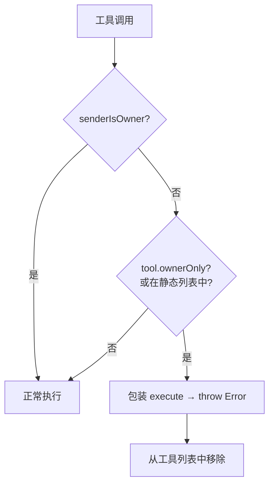
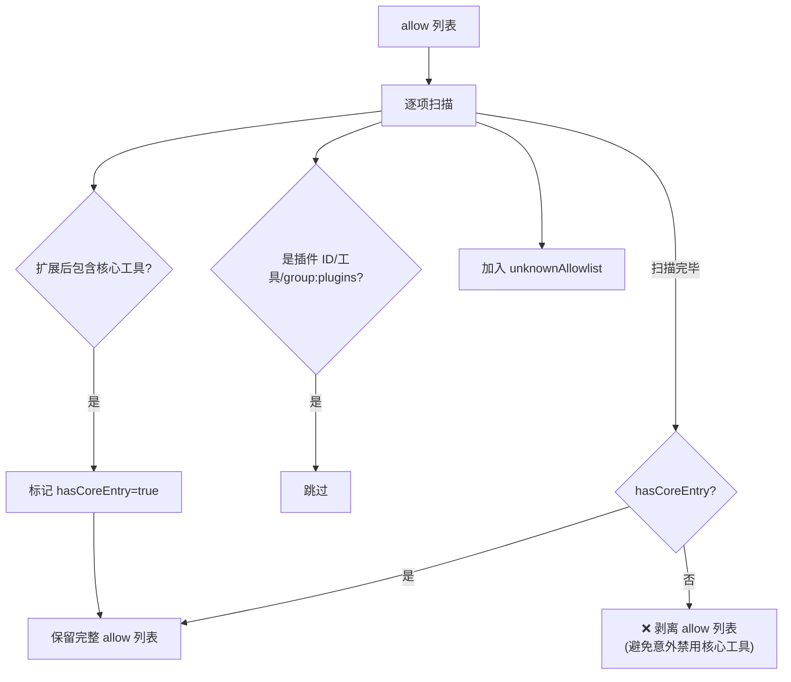
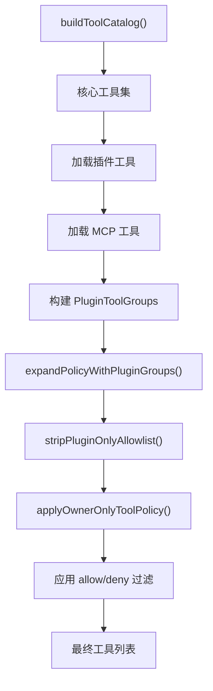

# 工具策略与权限控制

> 深度剖析 `tool-policy.ts` (211L), `tool-policy-shared.ts`, `tool-catalog.ts` (343L) 的业务逻辑。

## 1. 工具分类体系

### 1.1 核心工具组（`TOOL_GROUPS`）

```typescript
const TOOL_GROUPS = {
  "group:all":         ["*"],
  "group:bash":        ["exec", "process", "text_editor", "text_editor_batch"],
  "group:browser":     ["browser"],
  "group:files":       ["read_file", "write_file", "tree", "exec", "text_editor", "text_editor_batch"],
  "group:comms":       ["send_message", "reply", "react"],
  "group:sessions":    ["sessions_*"],
  "group:plugins":     [], // 动态(所有插件工具)
  "group:mcp":         [], // 动态(所有 MCP 工具)
};
```

### 1.2 插件工具组发现

```typescript
buildPluginToolGroups({ tools, toolMeta }):
  → all: ["plugin_a_search", "plugin_a_write", "plugin_b_query"]
  → byPlugin: Map {
       "plugin_a" → ["plugin_a_search", "plugin_a_write"],
       "plugin_b" → ["plugin_b_query"]
     }
```

---

## 2. 权限控制模型

### 2.1 Owner-Only 工具

**硬编码 owner-only 工具名:**

| 工具名 | 说明 |
|--------|-----|
| `whatsapp_login` | WhatsApp 登录 |
| `cron` | 定时任务 |
| `gateway` | 网关管理 |
| `nodes` | 节点管理 |

**运行时保护:**



### 2.2 Allow/Deny 策略

```typescript
type ToolPolicyLike = {
  allow?: string[];  // 白名单 (空 = 允许所有)
  deny?: string[];   // 黑名单 (优先于 allow)
};
```

**策略来源层级:**

```
1. 运行时工具配列 Profile (tools.profiles.xxx)
2. Agent 特定覆盖 (agents.list[].tools.allow/deny)
3. Session 级别覆盖 (session.toolPolicy)
4. Global 默认 (tools.allow/tools.deny)
```

### 2.3 Plugin-Only 白名单剥离



**设计原理:** 当用户仅在 allow 中列了插件工具，实际会禁用所有核心工具（如 exec, read_file）。系统自动检测这种情况并剥离 allow 列表，改用 `tools.alsoAllow` 语义。

### 2.4 Also-Allow 合并

```typescript
mergeAlsoAllowPolicy(policy, alsoAllow):
  // 将 alsoAllow 条目追加到 policy.allow (去重)
  // 用于: 在保持核心 allow/deny 的基础上额外放行特定工具
```

---

## 3. 工具目录构建（`tool-catalog.ts`）

### 3.1 目录构建流程



### 3.2 工具名标准化

```typescript
normalizeToolName(name):
  → 小写化
  → 去除前后空白
  → 替换 "-" 为 "_"
  → "group:xxx" 保留原样
```

---

## 4. 高级特性

### 4.1 Elevated 执行模式

```typescript
// 3 种 elevated 级别:
"off"  → 普通执行
"ask"  → 进入审批流
"full" → 跳过审批 + security="full" + host="gateway"

// 启用条件:
tools.elevated.enabled=true
+ tools.elevated.allowFrom.<provider>=true
+ agents.list[].tools.elevated.enabled=true
```

### 4.2 Tool Profile 系统

```typescript
type ToolProfileId = "default" | "restricted" | "sandbox" | string;

resolveToolProfilePolicy(cfg, profileId):
  → 查找 tools.profiles.<profileId>
  → 返回 { allow, deny } 策略
```
