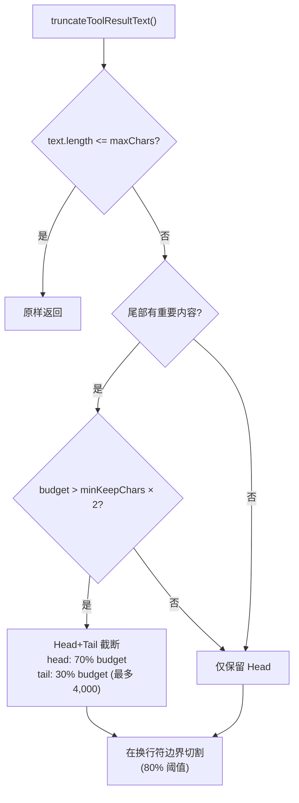
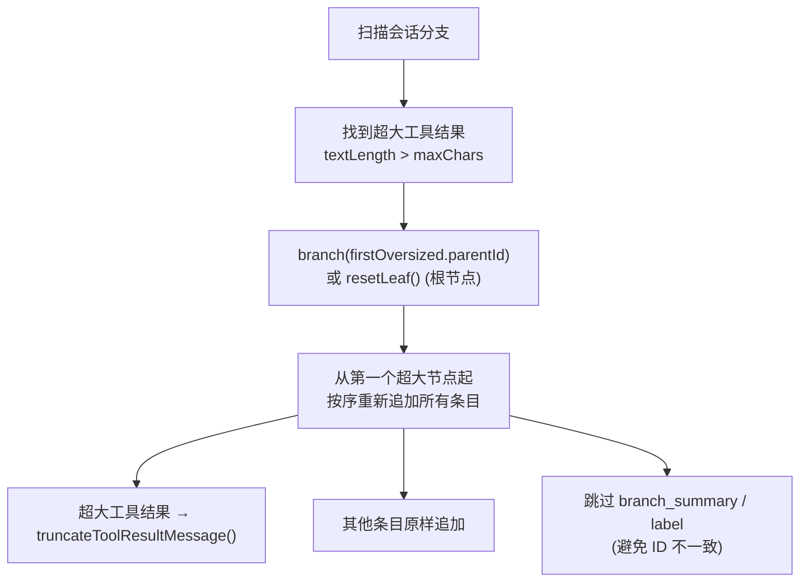
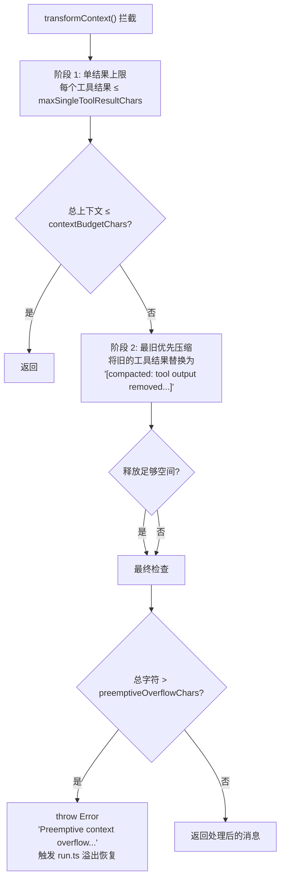

# 工具结果管理系统

> 深度剖析 `tool-result-truncation.ts` (397L) + `tool-result-context-guard.ts` (246L) 的完整业务逻辑。

## 1. 工具结果截断引擎

### 1.1 截断阈值

| 常量 | 值 | 说明 |
|------|-----|------|
| MAX\_TOOL\_RESULT\_CONTEXT\_SHARE | 0.3 (30%) | 单个工具结果最大上下文占比 |
| HARD\_MAX\_TOOL\_RESULT\_CHARS | 400,000 | 硬上限字符数 (~100K tokens) |
| MIN\_KEEP\_CHARS | 2,000 | 截断后最少保留字符 |

### 1.2 字符预算计算

```typescript
calculateMaxToolResultChars(contextWindowTokens):
  maxTokens = contextWindowTokens × 0.3
  maxChars = maxTokens × 4     // 4 chars ≈ 1 token
  return min(maxChars, 400_000)

// 示例:
// 128K context → 38,400 tokens → 153,600 chars (< 400K, 使用 153,600)
// 2M context   → 600,000 tokens → 2,400,000 chars (> 400K, 使用 400,000)
```

### 1.3 Head+Tail 智能截断



### 1.4 重要尾部检测

```typescript
hasImportantTail(text):
  检查最后 2000 字符是否包含:
  - 错误关键词: error, exception, failed, fatal, traceback, panic, errno
  - JSON 闭合: } 结尾
  - 摘要关键词: total, summary, result, complete, finished, done
```

### 1.5 多块按比例分配

```typescript
truncateToolResultMessage(msg, maxChars):
  总字符 = 所有 text 块字符总和
  对每个 text 块:
    blockShare = block.text.length / totalTextChars
    blockBudget = max(minKeep + suffix, maxChars × blockShare)
  // 非 text 块 (如图像) 保持不变
```

---

## 2. 会话级别截断

### 2.1 分支 + 重建策略



### 2.2 支持的条目类型

```
message (toolResult 时截断) → appendMessage()
compaction                  → appendCompaction()
thinking_level_change       → appendThinkingLevelChange()
model_change                → appendModelChange()
custom                      → appendCustomEntry()
custom_message              → appendCustomMessageEntry()
session_info                → appendSessionInfo()
branch_summary              → 跳过
label                       → 跳过
```

---

## 3. 上下文守卫 (Context Guard)

### 3.1 安装机制

```typescript
installToolResultContextGuard({agent, contextWindowTokens}):
  → 猴子补丁 agent.transformContext()
  → 在每次 API 调用前拦截消息列表
  → 返回 uninstall 回调
```

### 3.2 预算常量

| 常量 | 值 | 说明 |
|------|-----|------|
| CONTEXT\_INPUT\_HEADROOM\_RATIO | 0.75 | 输入预算 = 上下文 × 75% |
| SINGLE\_TOOL\_RESULT\_CONTEXT\_SHARE | 0.5 | 单个结果 = 上下文 × 50% |
| PREEMPTIVE\_OVERFLOW\_RATIO | 0.9 | 预防性溢出阈值 = 上下文 × 90% |

### 3.3 两阶段执行



### 3.4 最旧优先压缩

```typescript
compactExistingToolResultsInPlace({messages, charsNeeded, cache}):
  遍历消息 (从最旧到最新):
    if (isToolResult && 字符数 > placeholder长度):
      replace content → "[compacted: tool output removed to free context]"
      reduced += before - after
      if (reduced >= charsNeeded): break
```

### 3.5 Token 到字符估算

```typescript
// 通用估算: CHARS_PER_TOKEN_ESTIMATE (约 3.5-4)
// 工具结果: TOOL_RESULT_CHARS_PER_TOKEN_ESTIMATE (约 4)
//
// 计算:
// contextBudgetChars = max(1024, tokens × charsPerToken × 0.75)
// maxSingleToolResultChars = max(1024, tokens × toolCharsPerToken × 0.5)
// preemptiveOverflowChars = max(contextBudget, tokens × charsPerToken × 0.9)
```
