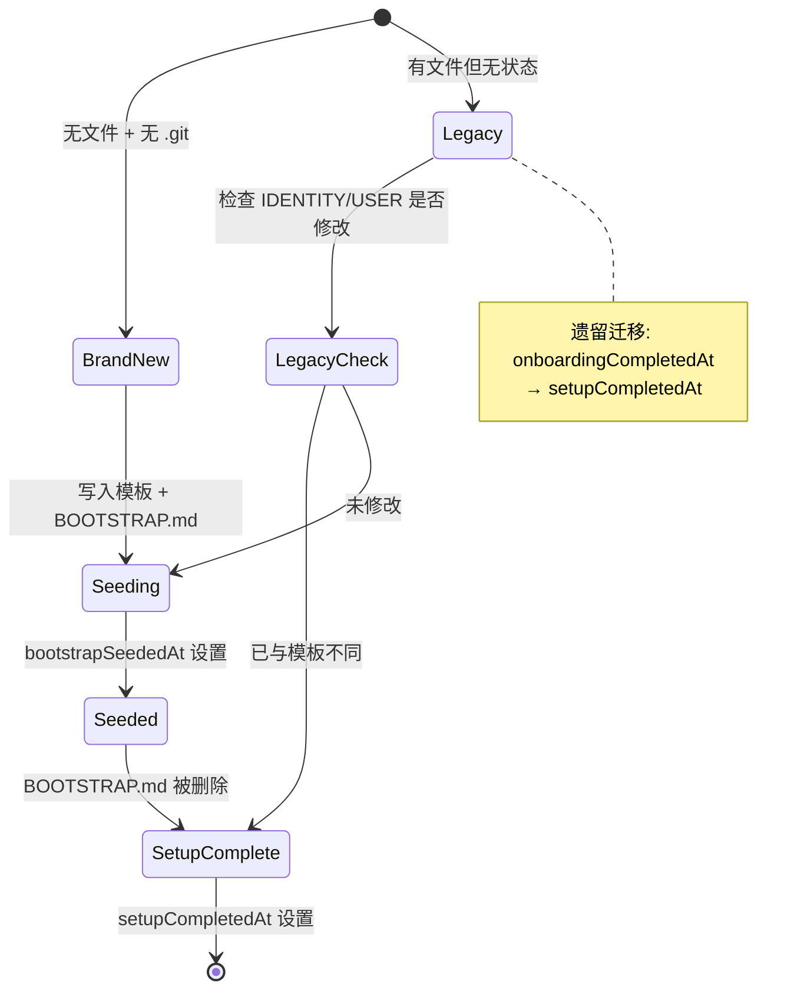
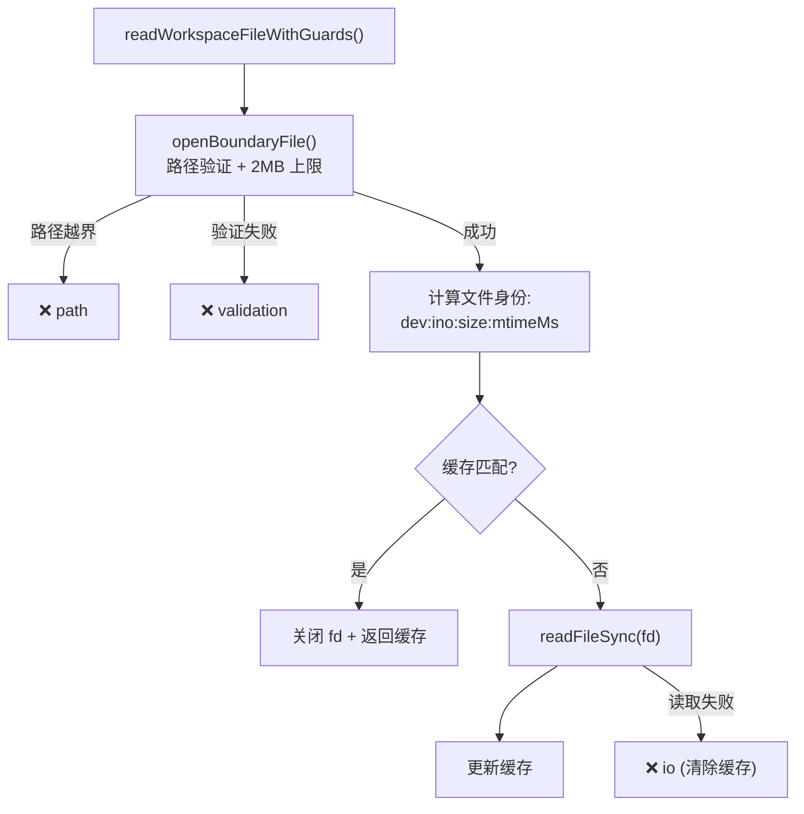

# 工作区引导系统

> 深度剖析 `workspace.ts` (648L) + `bootstrap-files.ts` + `bootstrap-hooks.ts` 的完整工作区业务逻辑。

## 1. 工作区结构

### 1.1 Bootstrap 文件体系

| 文件名 | 用途 | 注入范围 |
|--------|------|---------|
| `AGENTS.md` | 代理行为指南 | full + minimal |
| `SOUL.md` | 人格/语气定义 | full + minimal |
| `TOOLS.md` | 外部工具使用指南 | full + minimal |
| `IDENTITY.md` | 身份信息 | full + minimal |
| `USER.md` | 用户偏好/上下文 | full + minimal |
| `HEARTBEAT.md` | 心跳提示词 | full only |
| `BOOTSTRAP.md` | 首次设置引导 | full only |
| `MEMORY.md` / `memory.md` | 持久记忆 | full only |

### 1.2 子代理文件过滤

```typescript
MINIMAL_BOOTSTRAP_ALLOWLIST = {
  "AGENTS.md", "TOOLS.md", "SOUL.md", "IDENTITY.md", "USER.md"
}

// 子代理 + cron session → 仅加载白名单文件
// 主代理 → 加载全部文件
```

### 1.3 目录布局

```
~/.openclaw/workspace/          # 默认工作区
~/.openclaw/workspace-<profile>/  # 多 profile 支持
├── AGENTS.md
├── SOUL.md
├── TOOLS.md
├── IDENTITY.md
├── USER.md
├── HEARTBEAT.md
├── BOOTSTRAP.md
├── MEMORY.md (或 memory.md)
├── memory/                     # 记忆目录
├── .git/                       # 自动初始化
└── .openclaw/
    └── workspace-state.json    # 设置状态
```

---

## 2. 工作区初始化状态机

### 2.1 状态机



### 2.2 `workspace-state.json`

```json
{
  "version": 1,
  "bootstrapSeededAt": "2024-01-01T00:00:00.000Z",
  "setupCompletedAt": "2024-01-02T00:00:00.000Z"
}
```

### 2.3 全新工作区检测

```typescript
isBrandNewWorkspace = 
  !exists(AGENTS.md) && !exists(SOUL.md) && !exists(TOOLS.md) &&
  !exists(IDENTITY.md) && !exists(USER.md) && !exists(HEARTBEAT.md) &&
  !exists(memory/) && !exists(MEMORY.md) && !exists(.git)
```

---

## 3. 安全文件读取

### 3.1 边界安全读取



### 3.2 文件大小限制

```typescript
MAX_WORKSPACE_BOOTSTRAP_FILE_BYTES = 2 * 1024 * 1024  // 2MB
```

---

## 4. 模板系统

### 4.1 模板加载

```typescript
loadTemplate(name):
  1. 查找缓存 → 有则返回
  2. resolveWorkspaceTemplateDir() → 获取模板目录
  3. fs.readFile(templatePath) → 读取模板
  4. stripFrontMatter() → 去除 YAML frontmatter
  5. 缓存结果 (失败时清除缓存)
```

### 4.2 写入策略

```typescript
writeFileIfMissing(filePath, content):
  → fs.writeFile(path, content, { flag: "wx" })
  // "wx" = 仅在不存在时创建, EEXIST 时静默跳过
  // 不覆盖用户已有文件
```

---

## 5. 额外 Bootstrap 文件

### 5.1 Glob 模式支持

```typescript
loadExtraBootstrapFiles(dir, ["subdir/AGENTS.md", "**/*.md"]):
  → 支持 glob 通配符 (*, ?, {})
  → 仅加载 VALID_BOOTSTRAP_NAMES 中的文件名
  → 未匹配的文件名 → diagnostic: "invalid-bootstrap-filename"
```

### 5.2 诊断码

| 代码 | 含义 |
|------|------|
| `invalid-bootstrap-filename` | 文件名不在 9 个有效名中 |
| `missing` | 文件不存在 |
| `security` | 路径验证失败 (越界) |
| `io` | 读取 I/O 错误 |

---

## 6. MEMORY.md 优先级

```
1. 优先 MEMORY.md (大写)
2. 回退 memory.md (小写)
3. 仅注入一个 (避免大小写不敏感 FS 上重复)
4. Docker macOS 挂载: realpath 不规范化大小写
   → 不能依赖 realpath 去重
```

---

## 7. Git 初始化

```typescript
ensureGitRepo(dir, isBrandNewWorkspace):
  → 仅全新工作区时
  → 检查 .git 是否存在
  → 检查 git 命令是否可用 (2s 超时)
  → git init (10s 超时)
  → 失败静默忽略 (不阻塞工作区创建)
```
