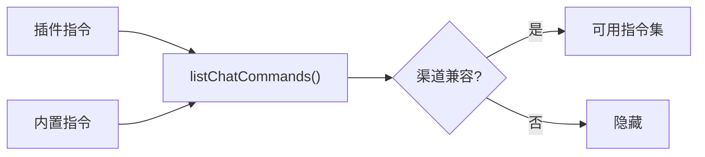

# 模块深度分析：自动回复引擎

> 基于 `src/auto-reply/status.ts`（901 行）及相关源码分析，覆盖状态生成、指令系统、回复调度。

## 1. 状态消息构建

`buildStatusMessage()` （L412-L689）是系统状态的完整快照生成器，输出格式化的多行状态报告：

```
🦞 OpenClaw 2026.3.14 (abc1234)
⏱ 1.2s
🧠 Model: anthropic/claude-sonnet-4-5 · 🔑 api-key
↪️ Fallback: openai/gpt-4o (rate limit)
🧮 Tokens: 12.3K in / 3.2K out · 💵 Cost: $0.08
🗄️ Cache: 85% hit · 10.2K cached, 1.5K new
📚 Context: 15.7K/200K (8%) · 🧹 Compactions: 2
📎 Media: vision x2 ok (anthropic/claude-sonnet-4-5) · audio off
🧵 Session: agent:default · updated 3m ago
⚙️ Runtime: direct · Think: medium · Fast: on
🔊 Voice: auto · provider=elevenlabs · limit=4096 · summary=on
👥 Activation: mention · 🪢 Queue: fifo (depth 3 · debounce 2s · cap 10)
```

### 1.1 模型认证模式解析

```typescript
// L97-L121 — 5 种认证模式
type NormalizedAuthMode = "api-key" | "oauth" | "token" | "aws-sdk" | "mixed" | "unknown";
// 用于决定是否显示费用估算（仅 api-key 和 mixed 模式显示）
const showCost = effectiveCostAuthMode === "api-key" || effectiveCostAuthMode === "mixed";
```

### 1.2 使用量统计来源

**双数据源策略**（L211-L305）：
```typescript
// 优先使用 session entry 中的 token 统计
let totalTokens = entry?.totalTokens;
// 但如果 session 日志中有更准确的数据则使用日志
if (args.includeTranscriptUsage) {
  const logUsage = readUsageFromSessionLog(sessionId, entry, agentId);
  // 日志中的 tokens 更大 → 使用日志值
  if (candidate > totalTokens) totalTokens = candidate;
}
```

**日志尾部读取优化**：仅读取最后 8KB（`TAIL_BYTES = 8192`），解析最新的 usage 记录。

### 1.3 上下文窗口计算

```typescript
const formatTokens = (total, contextTokens) => {
  const pct = ctx ? Math.round((total / ctx) * 100) : null;
  return `${totalLabel}/${ctxLabel}${pct !== null ? ` (${pct}%)` : ""}`;
};
// 输出如: "15.7K/200K (8%)"
```

### 1.4 运行时标签

```typescript
// L123-L165 — 沙箱模式检测
function resolveRuntimeLabel(args) {
  // sandbox.mode: "off" → "direct"
  // sandbox.mode: "all" → "docker/all"
  // sandbox.mode: "untrusted" + 非主会话 → "docker/untrusted"
  // sandbox.mode: "untrusted" + 主会话 → "direct/untrusted"
}
```

---

## 2. 指令系统（Chat Commands）

### 2.1 指令分类

```typescript
const CATEGORY_ORDER: CommandCategory[] = [
  "session",    // /new, /reset, /compact, /stop
  "options",    // /think, /model, /fast, /verbose
  "status",     // /status, /whoami, /context
  "management", // /config, /debug
  "media",      // 媒体相关指令
  "tools",      // /skill, 工具指令
  "docks",      // Dock 相关
];
```

### 2.2 指令注册（`commands-registry.ts`）



### 2.3 Help 消息生成

```typescript
// L727-L756 — 精简帮助输出
buildHelpMessage(cfg):
  Session: /new | /reset | /compact | /stop
  Options: /think <level> | /model <id> | /fast on|off | /verbose on|off
  Status: /status | /whoami | /context
  Skills: /skill <name> [input]
  More: /commands for full list
```

分页显示：`COMMANDS_PER_PAGE = 8`，支持 `/commands 2` 查看第二页。

---

## 3. 回复调度

### 3.1 发送策略（Send Policy）

`sessions/send-policy.ts` 实现消息发送的权限控制：
- `deny`：发送被会话策略阻止
- `allow`：允许发送
- 根据渠道类型（private/group/channel）和会话配置决定

### 3.2 Fallback 状态追踪

```typescript
// fallback-state.ts
resolveActiveFallbackState({
  selectedModelRef: "anthropic/claude-sonnet-4-5",
  activeModelRef: "openai/gpt-4o",
  state: sessionEntry,
}) → { active: true, reason: "rate limit" }
```

### 3.3 费用估算

```typescript
// 仅在 api-key 或 mixed 认证模式下显示
const cost = estimateUsageCost({
  usage: { input: inputTokens, output: outputTokens },
  cost: resolveModelCostConfig({ provider, model, config }),
});
// 格式化: "$0.08"
```

---

## 4. 媒体理解决策

```typescript
// L346-L387 — 媒体处理结果展示
formatMediaUnderstandingLine(decisions):
  // 成功: "vision x2 ok (anthropic/claude-sonnet-4-5)"
  // 禁用: "audio off"
  // 跳过: "vision skipped (no-model)"
  // 拒绝: "vision denied"
  // 无附件: "vision none"
```

---

## 5. 语音模式

```typescript
// L389-L410 — TTS 自动模式检测
formatVoiceModeLine(config, sessionEntry):
  // autoMode: "off" → 不显示
  // autoMode: "auto"/"on" → "🔊 Voice: auto · provider=elevenlabs · limit=4096 · summary=on"
```
