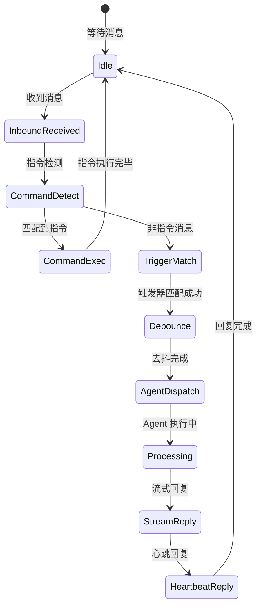
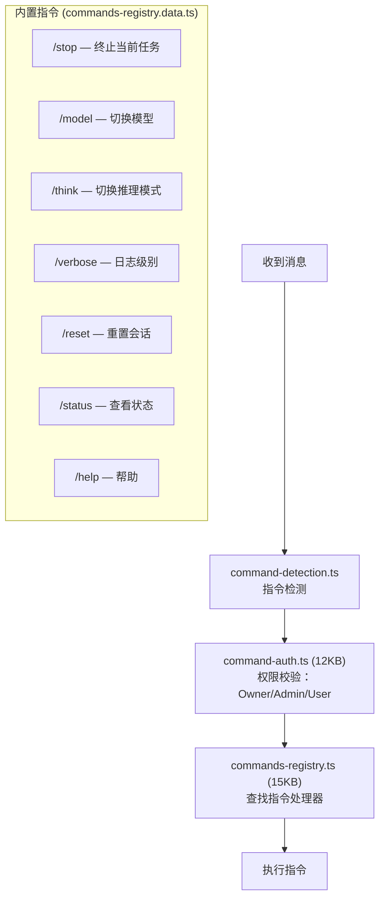
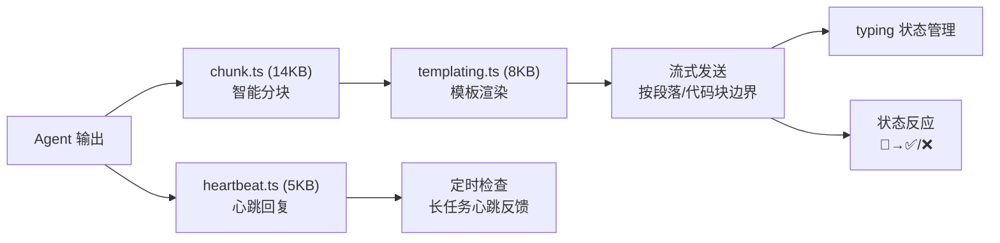

# 模块分析：Auto-Reply & Dispatch

## 自动回复引擎 — `src/auto-reply/` (67 文件)

自动回复是消息从渠道进入到 Agent 执行的核心调度层，实现了状态机驱动的消息分发。

### 核心组件

| 文件                        | 大小 | 功能                                      |
| --------------------------- | ---- | ----------------------------------------- |
| `status.ts`                 | 28KB | 状态机总控，管理全局回复状态              |
| `reply.ts`                  | 入口 | 回复分发路由                              |
| `chunk.ts`                  | 14KB | 回复文本智能分块（按段落/代码块边界切分） |
| `command-auth.ts`           | 12KB | 指令权限校验                              |
| `commands-registry.ts`      | 15KB | 指令注册中心                              |
| `commands-registry.data.ts` | 23KB | 内置指令定义数据                          |
| `envelope.ts`               | 8KB  | 消息信封解析/构造                         |
| `dispatch.ts`               | 3KB  | 消息分发路由                              |
| `inbound-debounce.ts`       | 3KB  | 入站消息去抖                              |
| `templating.ts`             | 8KB  | 回复模板引擎                              |
| `thinking.ts`               | 3KB  | 推理展示控制                              |
| `skill-commands.ts`         | 6KB  | 技能指令处理                              |

### 指令系统

### 回复分发流

### 消息去抖

`inbound-debounce.ts` 实现入站消息去抖，防止用户快速连发多条消息触发多次 Agent 执行。策略包括：

- 时间窗口合并
- 相同会话键去重
- 配置化去抖间隔

### 回复智能分块

`chunk.ts`（14KB）实现了基于语义边界的文本分块：

- 优先在段落分隔处切分
- 尊重 Markdown 代码块边界（不在代码块中间切断）
- 缩进级别保持
- 列表项不拆分
- 长单行代码块特殊处理
