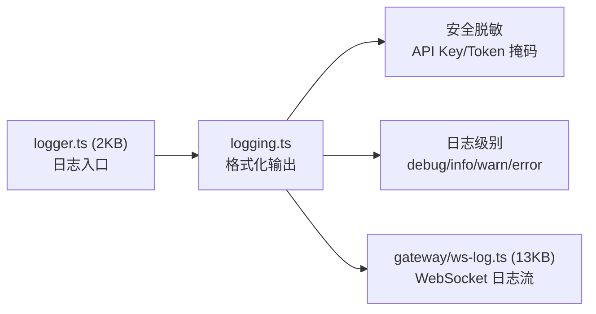

# 模块分析：辅助系统 (Auxiliary Systems)

## 日志系统 — `src/logging/`, `src/logger.ts`

### 安全脱敏

- 自动检测并掩码 API Key、Token、密码
- 配置快照脱敏（`config/redact-snapshot.ts` 22KB）
- WebSocket 日志流传输时实时脱敏

---

## TTS 语音合成 — `src/tts/`

文字转语音管线：

- 多供应商支持
- 流式合成与分段下发
- 音频格式自适应
- 配置化声音选择

---

## 测试工具库 — `src/test-helpers/`, `src/test-utils/`

为系统级测试提供基础设施：

- Mock 工厂
- 测试用配置生成
- 临时目录管理
- 断言辅助

---

## 国际化 — `src/i18n/`

多语言支持框架，用于 CLI 输出和用户面向的消息。

---

## 兼容层 — `src/compat/`

处理跨版本和跨平台兼容性，确保在不同运行时（Node/Bun）和操作系统间的行为一致。

---

## 配对系统 — `src/pairing/`

设备配对机制，支持移动端（iOS/Android）节点与 Gateway 的安全配对和认证。

---

## Web 搜索 — `src/web-search/`

Agent 可使用的 Web 搜索能力，支持多搜索引擎后端。

---

## 终端处理 — `src/terminal/`

终端相关的底层操作：光标控制、颜色渲染、终端尺寸检测等。
