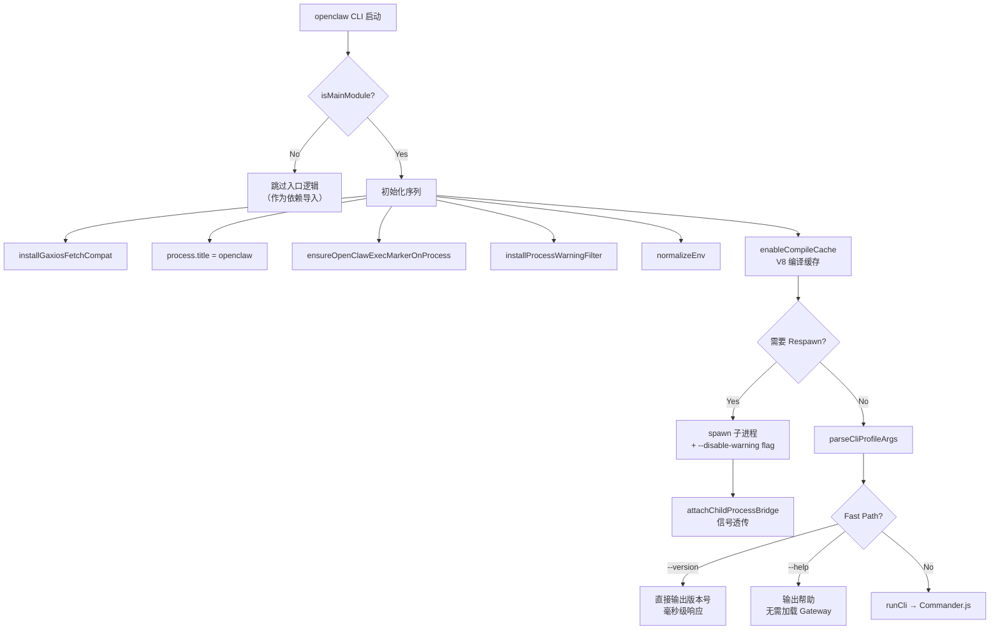

# 模块分析：启动引导与运行时核心 (Bootstrap & Runtime)

## 启动引导 — `src/entry.ts` (222 行)

作为整个应用的物理入口，`entry.ts` 负责 Node.js 环境准备、跨平台差异抹平及进程安全衍生。

### 核心机制

- **防依赖复用**：`isMainModule()` 校验，防止 bundler 重入导致端口冲突和数据库锁竞争
- **Respawn 隔离**：Node.js 不允许 `NODE_OPTIONS` 传递 `--disable-warning`，系统自派生子进程并附带该参数，通过 `attachChildProcessBridge` 建立 SIGTERM/SIGINT 透传通道
- **Fast Path**：`--version` 和 `--help` 走极速路径，不加载 Gateway 架构
- **Profile 支持**：通过 `--profile` 参数切换配置环境

### 文件清单

| 文件         | 用途                                                     |
| ------------ | -------------------------------------------------------- |
| `entry.ts`   | 物理入口，Respawn + Fast Path                            |
| `index.ts`   | Library 模式导出（`createDefaultDeps`, `loadConfig` 等） |
| `library.ts` | 内部 re-export barrel                                    |
| `globals.ts` | 全局状态：`verbose`, `yes`, `theme`                      |
| `runtime.ts` | 运行时环境抽象：拦截 `console.log/error`, `process.exit` |
| `version.ts` | 版本号管理                                               |

## Library 导出 — `src/index.ts`

当 OpenClaw 被其他项目作为库引入时，通过 `index.ts` 导出的 API 提供编程接口：

- `createDefaultDeps` — 依赖注入工厂
- `loadConfig` / `loadSessionStore` / `saveSessionStore` — 配置与会话操作
- `deriveSessionKey` / `resolveSessionKey` — 会话键计算
- `runExec` / `runCommandWithTimeout` — 安全命令执行

## 全局上下文 — `src/globals.ts`, `src/runtime.ts`

- **Globals**：安全存储 `verbose`（日志级别）、`yes`（跳过确认）、`theme`（终端色彩主题）
- **RuntimeEnv**：抽象拦截 `console.log/error` 和 `process.exit`，确保 TUI 退出时终端游标恢复，同时支持测试沙箱中安全验证退出码

## IPC 通讯

- 高级：WebSocket + HTTP RPC（Gateway 层）
- 底层：Node `EventEmitter` + 二进制 IPC
  - Agent ↔ 嵌套子代理的内存级状态反馈
  - 看门狗（Supervisor）监控及进程回收
