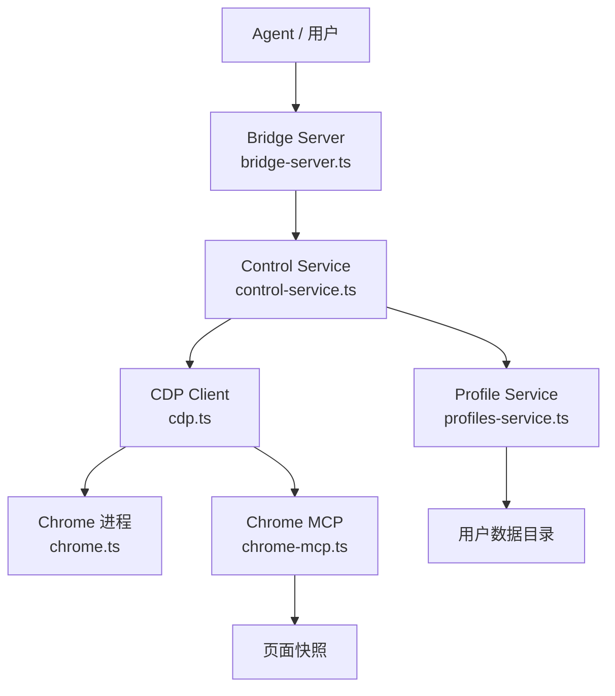

# 模块深度分析：浏览器控制系统

> 基于 `src/browser/`（132 个文件）源码分析，覆盖 CDP 协议、Profile 管理、SSRF 安全。

## 1. 架构概览



## 2. 配置解析（`config.ts` — 366L）

### ResolvedBrowserConfig 结构

```typescript
type ResolvedBrowserConfig = {
  enabled: boolean;              // 是否启用
  evaluateEnabled: boolean;      // JS 执行是否启用
  controlPort: number;           // HTTP 控制端口
  cdpPortRangeStart: number;     // CDP 端口范围起始
  cdpPortRangeEnd: number;       // CDP 端口范围结束
  cdpProtocol: "http" | "https"; // CDP 协议
  cdpHost: string;               // CDP 主机
  cdpIsLoopback: boolean;        // 是否回环
  remoteCdpTimeoutMs: number;    // 远程 CDP 超时
  remoteCdpHandshakeTimeoutMs: number;
  color: string;                 // 浏览器标识颜色（#HexColor）
  executablePath?: string;       // Chrome 可执行路径
  headless: boolean;             // 无头模式
  noSandbox: boolean;            // 禁用沙箱
  attachOnly: boolean;           // 仅附加模式
  defaultProfile: string;        // 默认 Profile 名
  profiles: Record<string, BrowserProfileConfig>;
  ssrfPolicy?: SsrFPolicy;      // SSRF 防护策略
  extraArgs: string[];           // Chrome 额外启动参数
};
```

### Profile 系统

两种内置 Profile：
- **openclaw**：OpenClaw 专用 Profile（独立 CDP 端口）
- **user**：用户现有 Chrome 会话（`existing-session` driver，`attachOnly: true`）

### Profile 解析优先级

```
defaultProfile 配置 > "default" Profile > "openclaw" Profile > "user" Profile
```

## 3. SSRF 防护

```typescript
// config.ts L102-L129
function resolveBrowserSsrFPolicy(cfg) {
  // 浏览器默认信任私有网络（trusted-network模式）
  // 除非显式设置 ssrfPolicy.allowPrivateNetwork = false
  // 可配置: allowedHostnames / hostnameAllowlist
}
```

## 4. CDP 代理旁路

`cdp-proxy-bypass.ts` — 检测和绕过 CDP 代理限制。

## 5. Chrome 发现

`chrome.executables.ts` — 按平台查找 Chrome 可执行文件：
- macOS：`/Applications/Google Chrome.app/...`
- Linux：`google-chrome`, `chromium-browser`
- Windows：注册表 + Program Files

## 6. 客户端操作

`client-actions-*.ts` — 浏览器自动化操作：
- **Core**：导航、点击、输入
- **Observe**：DOM 观察、元素定位
- **State**：页面状态管理
- **URL**：URL 导航与验证

## 7. 关键文件清单

| 文件 | 行数 | 职责 |
|------|------|------|
| `config.ts` | 366 | 配置解析、Profile、SSRF |
| `cdp.ts` | ~800 | CDP 协议连接与命令 |
| `chrome.ts` | ~600 | Chrome 进程管理 |
| `bridge-server.ts` | ~400 | HTTP Bridge 服务器 |
| `control-service.ts` | ~500 | 控制面板服务 |
| `client.ts` | ~700 | 浏览器客户端 API |
| `chrome-mcp.ts` | ~600 | MCP 集成 |
