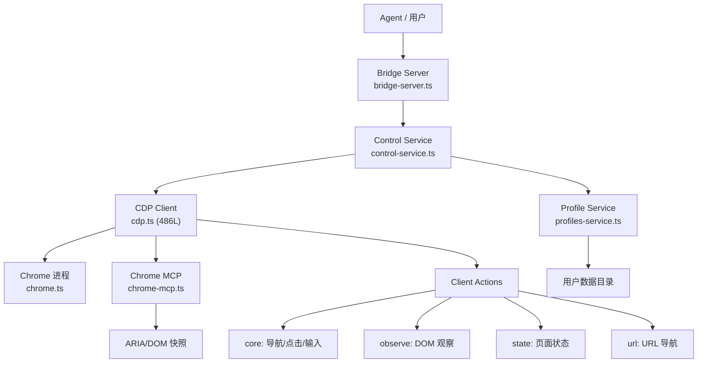

# 模块深度分析：浏览器控制系统

> 基于 `src/browser/`（132 个文件）源码逐行分析，覆盖 CDP 协议、Profile 管理、SSRF 安全、页面操作。

## 1. 架构概览



## 2. 配置解析（`config.ts` — 366L）

### ResolvedBrowserConfig 结构

```typescript
type ResolvedBrowserConfig = {
  enabled: boolean;              // 是否启用
  evaluateEnabled: boolean;      // JS 执行是否启用
  controlPort: number;           // HTTP 控制端口
  cdpPortRangeStart: number;     // CDP 端口范围起始
  cdpPortRangeEnd: number;       // CDP 端口范围结束
  cdpProtocol: "http" | "https"; // CDP 协议
  cdpHost: string;               // CDP 主机
  cdpIsLoopback: boolean;        // 是否回环
  remoteCdpTimeoutMs: number;    // 远程 CDP 超时（默认 1500ms）
  remoteCdpHandshakeTimeoutMs: number; // 握手超时（默认 2×超时）
  color: string;                 // 浏览器标识颜色（#HexColor）
  headless: boolean;             // 无头模式
  noSandbox: boolean;            // 禁用沙箱
  attachOnly: boolean;           // 仅附加模式
  defaultProfile: string;        // 默认 Profile
  profiles: Record<string, BrowserProfileConfig>;
  ssrfPolicy?: SsrFPolicy;      // SSRF 防护策略
  extraArgs: string[];           // Chrome 额外参数
};
```

### Profile 系统

两种内置 Profile：
- **openclaw**：独立 CDP 端口，由 OpenClaw 管理的 Chrome 实例
- **user**：用户现有 Chrome 会话（`driver: "existing-session"`, `attachOnly: true`）

Profile 解析优先级：`defaultProfile 配置 > "default" > "openclaw" > "user"`

### SSRF 防护策略

```typescript
// 浏览器默认信任私有网络，除非显式禁用
type SsrFPolicy = {
  dangerouslyAllowPrivateNetwork?: boolean; // 默认 true
  allowedHostnames?: string[];              // 白名单
  hostnameAllowlist?: string[];             // 别名白名单
};
```

---

## 3. CDP 协议层（`cdp.ts` — 486L）

### 3.1 WebSocket URL 归一化

```typescript
// normalizeCdpWsUrl() — 处理容器/远程场景
// 1. 0.0.0.0 / [::] → 重写为 cdpUrl 主机
// 2. http → https 时自动升级 ws → wss
// 3. 传播 auth 凭据（username/password）
// 4. 合并 query 参数（API Key 等）
```

### 3.2 页面快照

**ARIA 快照**（`snapshotAria()`）：
```typescript
// 获取完整无障碍树
await send("Accessibility.getFullAXTree");
// → 格式化为 AriaSnapshotNode[]（最多 2000 节点）
// 每个节点: ref("ax1"), role, name, value, description, depth
```

**DOM 快照**（`snapshotDom()`）：
```typescript
// 注入 JS 遍历 DOM（DFS，最多 5000 节点）
// 每个节点: ref("n1"), tag, id, className, role, name, text, href
// 文本截断: 默认最多 220 字符/节点
```

### 3.3 截图

```typescript
captureScreenshot({ wsUrl, fullPage?, format?: "png"|"jpeg", quality? });
// 全页: Page.getLayoutMetrics → clip 区域
// 输出: Buffer（base64 解码）
```

### 3.4 JavaScript 执行

```typescript
evaluateJavaScript({ wsUrl, expression, awaitPromise?, returnByValue? });
// 返回: CdpRemoteObject + 可选异常详情
```

### 3.5 CSS 选择器查询

```typescript
querySelector({ wsUrl, selector, limit?, maxTextChars?, maxHtmlChars? });
// 注入 JS: document.querySelectorAll(selector)
// 返回: QueryMatch[]（最多 200 个，含 tag/id/text/html）
```

### 3.6 导航安全

```typescript
// navigation-guard.ts
assertBrowserNavigationAllowed({ url, ssrfPolicy });
// 检查 URL 是否违反 SSRF 策略
```

---

## 4. Chrome 发现与管理

### `chrome.executables.ts`
按平台查找：
- macOS: `/Applications/Google Chrome.app/...`
- Linux: `google-chrome`, `chromium-browser`
- Windows: 注册表 + Program Files

### `chrome.ts`
Chrome 进程生命周期管理：启动/停止/附加

### `chrome-mcp.ts`
MCP（Model Context Protocol）集成，将 CDP 能力暴露为 MCP 工具。

---

## 5. 客户端操作系统

| 文件 | 职责 |
|------|------|
| `client-actions-core.ts` | 导航、点击、输入、元素交互 |
| `client-actions-observe.ts` | DOM 观察、元素定位、ARIA 查询 |
| `client-actions-state.ts` | 页面状态管理、Cookie、存储 |
| `client-actions-url.ts` | URL 导航与验证 |
| `client-actions-types.ts` | 操作类型定义 |
| `client-fetch.ts` | 页面内容抓取 |
| `form-fields.ts` | 表单字段操作 |
| `output-atomic.ts` | 原子化输出 |

---

## 6. Bridge 服务器与认证

| 文件 | 职责 |
|------|------|
| `bridge-server.ts` | HTTP Bridge（REST→CDP 代理） |
| `bridge-auth-registry.ts` | Bridge 认证令牌注册表 |
| `control-auth.ts` | 控制端口认证 |
| `http-auth.ts` | HTTP 基础认证 |
| `csrf.ts` | CSRF 防护 |

## 7. 关键文件清单

| 文件 | 行数 | 职责 |
|------|------|------|
| `config.ts` | 366 | 配置解析、Profile、SSRF |
| `cdp.ts` | 486 | CDP 协议：截图/快照/执行/查询 |
| `chrome.ts` | ~600 | Chrome 进程管理 |
| `bridge-server.ts` | ~400 | HTTP Bridge 服务器 |
| `control-service.ts` | ~500 | 控制面板服务 |
| `client.ts` | ~700 | 浏览器客户端 API |
| `chrome-mcp.ts` | ~600 | MCP 集成 |
| `cdp-proxy-bypass.ts` | ~200 | CDP 代理旁路 |
| `cdp-timeouts.ts` | ~100 | CDP 超时管理 |
| `navigation-guard.ts` | ~150 | URL 导航安全 |
| `profiles-service.ts` | ~300 | Profile 管理服务 |
