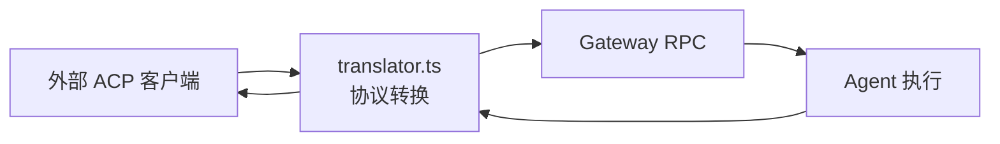
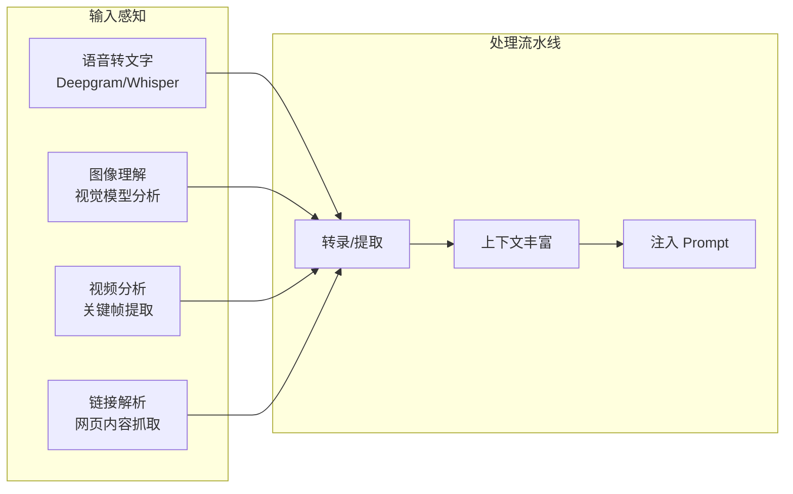

# 模块分析：高级能力 (Capabilities)

## ACP 协议 — `src/acp/`

实现标准化 [Agent Client Protocol](https://github.com/agentclientprotocol/sdk)，允许外部客户端统一接入。

### 核心设计

- **协议转换器**：将 ACP 标准请求翻译为 Gateway 内部调用
- **会话映射**：外部 ACP 会话 ↔ 内部 Gateway 会话
- **安全保障**：分级频率限制 + 输入长度校验

---

## 终端 UI (TUI) — `src/tui/`

完整的命令行聊天界面：

- 流式输出渲染
- OSC8 超链接支持
- 丰富的交互指令
- 自适应终端宽度
- 颜色主题支持

---

## Canvas Host — `src/canvas-host/`

本地服务，渲染 Agent 生成的富文本 UI：

- A2UI (Agent-to-UI) 协议支持
- 实时预览
- 安全隔离

---

## 多模态感知 — `src/media-understanding/`, `src/link-understanding/`

### 语音转文字

- 集成 Deepgram 等 ASR 提供商
- 实时流式转录
- 多语言支持

### 视觉分析

- 图片自动缩放与优化
- 视频关键帧提取
- 多模态 Prompt 构造

### 链接解析

- 智能识别消息中的 URL
- 网页内容抓取与提取
- 转化为 Agent 可读的上下文

---

## 浏览器自动化 — `src/browser/`

Agent 可控制的无头浏览器：

- 页面导航与操作
- 截图与内容提取
- Cookie/Storage 管理
- 调试模式支持
