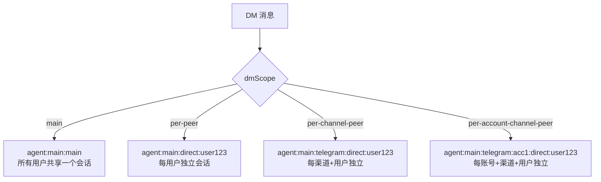
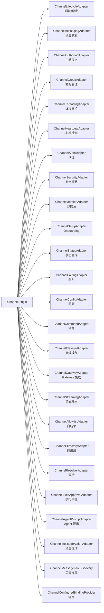
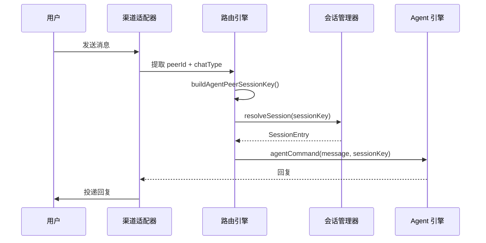

# 模块深度分析：渠道与路由

> 基于 `src/routing/session-key.ts`（254 行）及 `src/channels/plugins/types.ts` 源码分析。

## 1. 会话键（Session Key）系统

Session Key 是 OpenClaw 路由系统的核心标识符，决定消息如何路由到正确的 Agent 会话。

### 1.1 Session Key 格式

```
agent:<agentId>:<scope>
```

支持的形态（`SessionKeyShape`）：
- `agent`：标准格式（`agent:main:main`）
- `legacy_or_alias`：遗留格式（无 `agent:` 前缀）
- `malformed_agent`：以 `agent:` 开头但解析失败
- `missing`：空值

### 1.2 Agent ID 标准化

```typescript
// session-key.ts L89-L107
function normalizeAgentId(value: string): string {
  // 正则: /^[a-z0-9][a-z0-9_-]{0,63}$/i
  // 合法: 字母数字开头，最长 64 字符
  // 非法字符: 替换为 "-"，去除首尾 "-"，转小写
  // 空值: 回退到 DEFAULT_AGENT_ID = "main"
}
```

### 1.3 四种 DM 会话作用域

`buildAgentPeerSessionKey()` 支持 4 种 DM 隔离策略（L127-L174）：



| 作用域 | Session Key 格式 | 隔离级别 |
|--------|-----------------|---------|
| `main` | `agent:{id}:{mainKey}` | 无隔离 |
| `per-peer` | `agent:{id}:direct:{peerId}` | 按对端用户 |
| `per-channel-peer` | `agent:{id}:{channel}:direct:{peerId}` | 按渠道+用户 |
| `per-account-channel-peer` | `agent:{id}:{channel}:{accountId}:direct:{peerId}` | 按账号+渠道+用户 |

### 1.4 群组/频道会话键

```typescript
// 非 DM 消息: peerKind = "group" | "channel"
return `agent:${agentId}:${channel}:${peerKind}:${peerId}`;
// 例: agent:main:telegram:group:chat_12345
```

### 1.5 身份链接（Identity Links）

```typescript
// L176-L220 — 跨渠道用户身份关联
function resolveLinkedPeerId(params) {
  // identityLinks 配置：
  // { "canonical_user": ["telegram:user123", "whatsapp:user456"] }
  // 
  // 当 telegram:user123 发消息时 → 解析为 "canonical_user"
  // 当 whatsapp:user456 发消息时 → 也解析为 "canonical_user"
  // 效果：跨渠道的同一用户共享会话
}
```

### 1.6 线程会话键

```typescript
// L234-L253 — 线程消息路由
resolveThreadSessionKeys({ baseSessionKey, threadId }):
  // 有 threadId → `${baseKey}:thread:${threadId}`
  // 无 threadId → 使用 baseSessionKey
```

---

## 2. 渠道插件类型系统

`channels/plugins/types.ts` 导出了 50+ 类型，定义了渠道插件的完整适配器接口：

### 2.1 适配器体系



### 2.2 核心渠道

| 渠道 | 源码路径 | 类型 |
|------|---------|------|
| Telegram | `src/telegram/` | 内置 |
| Discord | `src/discord/` | 内置 |
| Slack | `src/slack/` | 内置 |
| Signal | `src/signal/` | 内置 |
| iMessage | `src/imessage/` | 内置 |
| WhatsApp Web | `src/web/` | 内置 |
| MS Teams | `extensions/msteams/` | 插件 |
| Matrix | `extensions/matrix/` | 插件 |
| Zalo | `extensions/zalo/` | 插件 |
| Voice Call | `extensions/voice-call/` | 插件 |

---

## 3. 路由消息流


