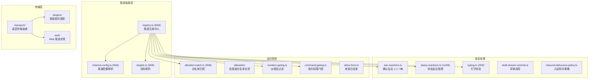
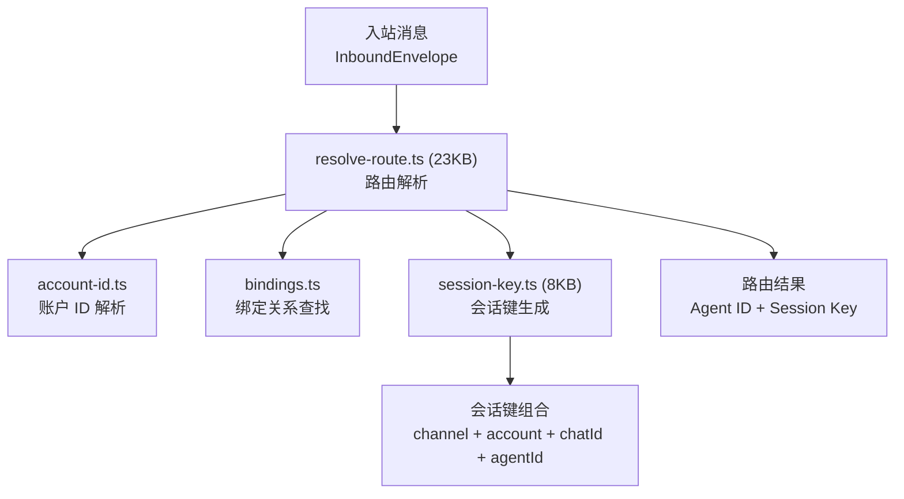

# 模块分析：Channels & Routing

## 渠道抽象 — `src/channels/` (67 文件)

渠道层负责将各平台消息统一为内部格式，并将回复分发到对应平台。



### 核心设计

- **统一注册**：`registry.ts` 注册所有渠道（内置 + 插件），对外暴露标准化接口
- **消息信封**：`session-envelope.ts` 封装跨渠道的会话元数据
- **状态反应**：通过 emoji 反应（👀 处理中 → ✅ 完成 / ❌ 失败）向用户反馈状态
- **白名单机制**：多级访问控制（渠道级 → 群组级 → 用户级）
- **@提及过滤**：群组中仅响应 @机器人名 的消息

### 线程绑定

`thread-bindings-policy.ts`（6KB）实现渠道线程与 Agent 会话的绑定策略，支持 Discord threads、Telegram topics 等平台特有的线程模型。

---

## 路由引擎 — `src/routing/` (11 文件)

负责将入站消息精准路由到目标 Agent。



### Session Key 生成

`session-key.ts`（8KB）实现了稳定的会话键生成算法：

```
sessionKey = hash(channelType, accountId, chatId, agentId)
```

确保：

- 同一用户在同一渠道与同一 Agent 的对话始终映射到同一会话
- 不同渠道的对话隔离
- 跨设备的同一用户共享会话

### 路由解析 (`resolve-route.ts` 23KB)

路由解析的完整流程：

1. 从消息中提取渠道类型和账户信息
2. 查找 `openclaw.json` 中的绑定关系
3. 处理默认账户警告（`default-account-warnings.ts`）
4. 生成稳定的 session-key
5. 返回目标 Agent + Session 组合
