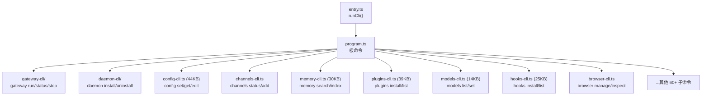
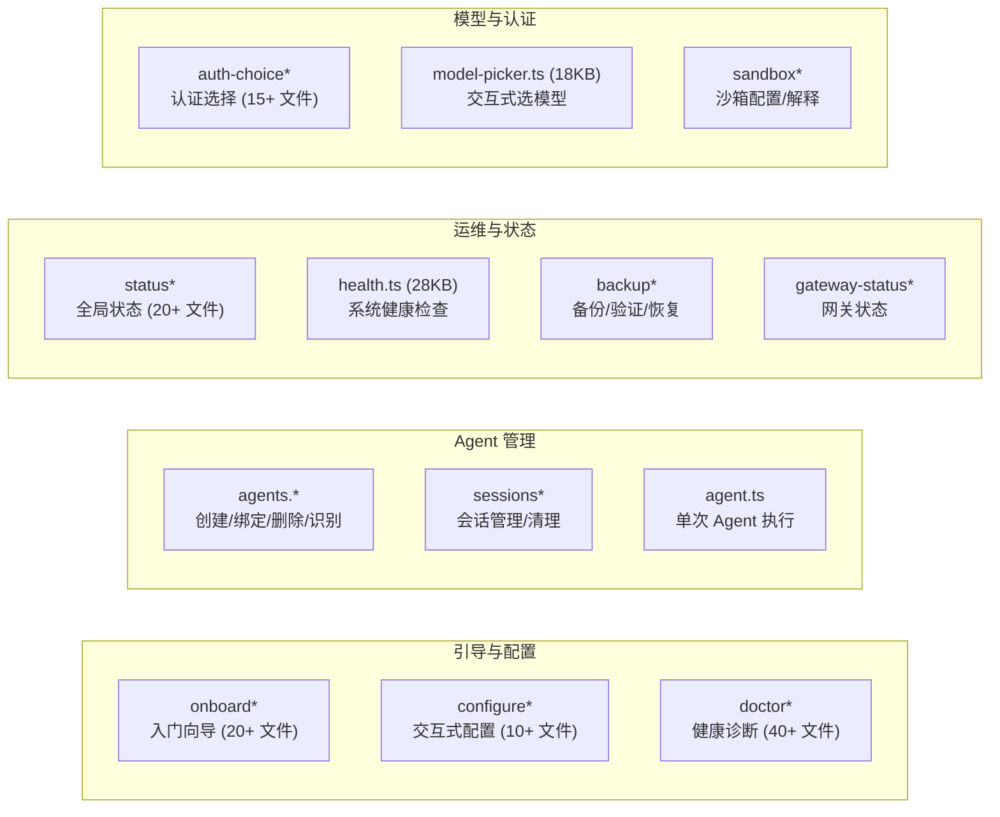

# 模块分析：CLI & Commands

## CLI 层 — `src/cli/` (176 文件)

基于 Commander.js 的延迟加载命令体系。

### 延迟加载机制

CLI 命令采用延迟加载（lazy import），确保冷启动时不加载不需要的模块：

- 根命令注册在 `program.ts` 中仅声明元数据
- 实际处理函数通过 `await import(...)` 按需加载
- `--version` 和 `--help` 走 Fast Path，跳过全量加载

### 关键 CLI 模块

| 文件                    | 大小 | 功能                                      |
| ----------------------- | ---- | ----------------------------------------- |
| `config-cli.ts`         | 44KB | 配置管理（set/get/edit/list）             |
| `plugins-cli.ts`        | 39KB | 插件管理（install/uninstall/update/list） |
| `memory-cli.ts`         | 30KB | 记忆管理（search/index/status）           |
| `hooks-cli.ts`          | 25KB | Hook 管理（install/list/test）            |
| `completion-cli.ts`     | 20KB | Shell 自动补全（bash/zsh/fish）           |
| `browser-cli-manage.ts` | 17KB | 浏览器自动化管理                          |
| `devices-cli.ts`        | 15KB | 设备配对管理                              |
| `models-cli.ts`         | 14KB | 模型管理（list/set）                      |
| `ports.ts`              | 12KB | 端口管理与冲突检测                        |
| `security-cli.ts`       | 7KB  | 安全审计 CLI                              |

---

## 命令层 — `src/commands/` (295 文件)

业务命令的具体实现，按功能域组织。

### 核心命令分类

### Doctor 诊断系统

`doctor*.ts` 系列文件（40+ 个）实现了全面的系统健康检查：

- 配置合规性检查（`doctor-config-flow.ts` 65KB）
- 安全审计（`doctor-security.ts`）
- 网关/守护进程状态（`doctor-gateway-daemon-flow.ts`）
- 遗留配置迁移（`doctor-legacy-config.ts` 16KB）
- 状态完整性校验（`doctor-state-integrity.ts` 27KB）
- 浏览器环境检查（`doctor-browser.ts`）
- 记忆搜索验证（`doctor-memory-search.ts`）
