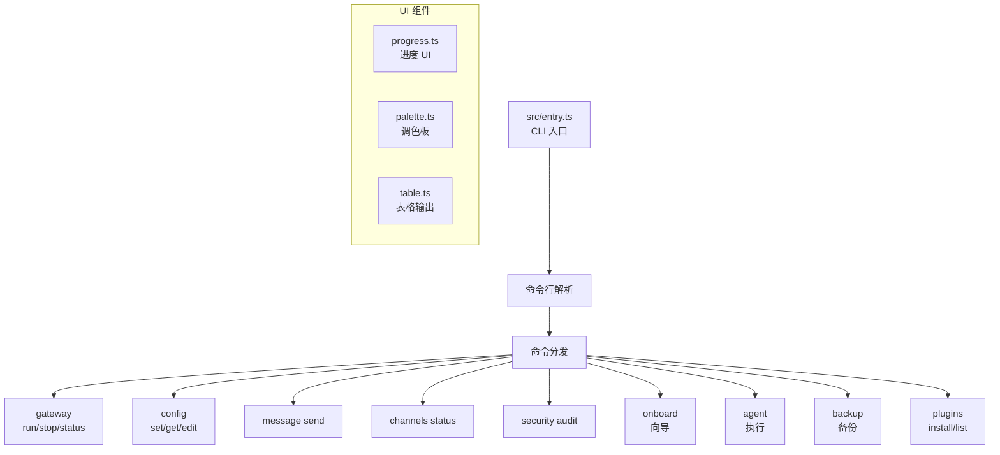
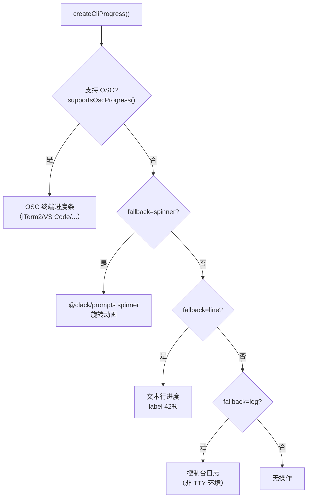

# CLI 命令与工具开发文档

> 基于 `src/cli/`、`src/commands/`（151 个文件）、`src/wizard/` 源码分析。

## 1. 架构概览



## 2. 命令体系（151 个文件）

### 核心命令

| 命令文件 | CLI 命令 | 说明 |
|----------|---------|------|
| `gateway.ts` | `openclaw gateway run` | 启动 Gateway |
| `config.ts` | `openclaw config set/get` | 配置管理 |
| `send.ts` | `openclaw message send` | 发送消息 |
| `channels.ts` | `openclaw channels status` | 渠道状态 |
| `security.ts` | `openclaw security audit` | 安全审计 |
| `agent.ts` | `openclaw agent` | Agent 执行 |
| `backup.ts` | `openclaw backup` | 备份/恢复 |
| `plugins.ts` | `openclaw plugins install` | 插件管理 |

### Agent 管理命令

| 文件 | 功能 |
|------|------|
| `agents.ts` | 主 Agent 命令 |
| `agents.commands.add.ts` | 添加 Agent |
| `agents.commands.delete.ts` | 删除 Agent |
| `agents.commands.list.ts` | 列出 Agent |
| `agents.commands.bind.ts` | 绑定 Agent |
| `agents.commands.identity.ts` | 身份管理 |
| `agents.bindings.ts` | 绑定配置 |

### 认证向导

| 文件 | 功能 |
|------|------|
| `auth-choice.ts` | 认证选择入口 |
| `auth-choice.api-key.ts` | API Key 配置 |
| `auth-choice.apply.ts` | 应用认证配置 |
| `auth-choice.apply.oauth.ts` | OAuth 认证 |
| `auth-choice.apply.api-key-providers.ts` | API Key Provider |
| `auth-choice.preferred-provider.ts` | 首选 Provider |
| `auth-choice.model-check.ts` | 模型检查 |

### Onboarding 命令

| 文件 | 功能 |
|------|------|
| `onboard-search.ts` | 搜索 Provider |
| `onboard-model-check.ts` | 模型检测 |
| `onboard-channel.ts` | 渠道配置 |

---

## 3. Progress UI 系统（`progress.ts` — 231L）

### 3.1 三层进度回退



### 3.2 ProgressReporter API

```typescript
type ProgressReporter = {
  setLabel: (label: string) => void;    // 更新标签
  setPercent: (percent: number) => void; // 设置百分比 (0-100)
  tick: (delta?: number) => void;        // 增量进度
  done: () => void;                      // 完成并清理
};
```

### 3.3 使用模式

```typescript
// 1. 自动管理模式
const result = await withProgress(
  { label: "加载插件...", total: plugins.length },
  async (p) => {
    for (const plugin of plugins) {
      await loadPlugin(plugin);
      p.tick();
    }
  }
);

// 2. 带总量更新的模式
await withProgressTotals(
  { label: "同步中..." },
  async (update) => {
    update({ completed: 50, total: 100, label: "同步文件..." });
  }
);

// 3. 延迟显示（避免瞬时操作闪烁）
createCliProgress({ label: "...", delayMs: 200 });
```

### 3.4 互斥保护

```typescript
let activeProgress = 0;
// 同一时刻只允许一个 Progress，后来的自动退化为 noop
if (activeProgress > 0) return noopReporter;
```

---

## 4. 终端表格（`src/terminal/table.ts`）

ANSI 安全的表格输出，支持：
- 自动列宽计算
- Unicode 字符宽度处理
- `status --all` 只读/可粘贴模式
- `status --deep` 探测模式

## 5. 调色板（`src/terminal/palette.ts`）

```typescript
import { palette } from "../terminal/palette.js";
palette.primary("主色");    // 品牌色
palette.success("成功");    // 绿色
palette.error("错误");      // 红色
palette.warn("警告");       // 黄色
palette.muted("次要");      // 灰色
palette.accent("强调");     // 亮色
```

> ⚠ **规范**：禁止硬编码 ANSI 颜色代码，必须使用 `palette.ts`。

## 6. Onboarding 向导（`src/wizard/`）

交互式设置流程：
1. Provider 选择（API Key / OAuth）
2. 模型检测与验证
3. 渠道配置（Telegram/Discord/...）
4. Gateway 启动

## 7. 依赖注入（`createDefaultDeps`）

```typescript
// src/cli/deps.ts
type CliDeps = {
  loadConfig: () => Promise<OpenClawConfig>;
  resolveConfigPath: () => string;
  // ... 其他依赖
};
// 测试时可注入 mock 依赖
```
