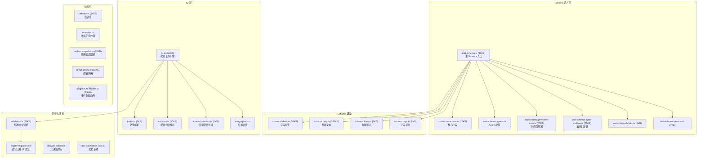

# 模块分析：配置系统 (Config System)

## 概览 — `src/config/` (215 文件)

配置系统是 OpenClaw 的"宪法"，通过 Zod Schema 定义一切可配置项，并提供验证、合并、热重载、环境变量替换等完整能力。

### Zod Schema 体系

配置 Schema 总计超过 **300KB**，定义了系统所有可配置项：

| 文件                           | 大小  | 覆盖范围           |
| ------------------------------ | ----- | ------------------ |
| `schema.help.ts`               | 162KB | 每个字段的帮助文本 |
| `zod-schema.providers-core.ts` | 57KB  | 供应商核心配置     |
| `schema.labels.ts`             | 51KB  | 字段中文/英文标签  |
| `zod-schema.ts`                | 32KB  | 主 Schema 定义     |
| `zod-schema.agent-runtime.ts`  | 25KB  | Agent 运行时       |
| `zod-schema.core.ts`           | 23KB  | 核心字段           |

### 配置 IO 引擎

`io.ts`（51KB）是配置读写的核心，负责：

- 配置文件查找与加载（支持多路径）
- Zod 验证并附带友好错误信息
- 环境变量 `${VAR}` 替换
- `includes` 指令解析（配置组合）
- 写回配置文件（保留注释和格式）
- 运行时快照写入
- 敏感信息自动脱敏

### 环境变量替换

`env-substitution.ts` 支持在配置中使用 `${ENV_VAR}` 语法：

- 支持默认值：`${VAR:-default}`
- 递归替换
- 安全性：禁止替换敏感路径

### 遗留配置迁移

`legacy.migrations.*.ts`（共 3 个文件，46KB）处理从旧版配置格式到新版的自动迁移：

- 字段重命名
- 结构重组
- 默认值补充
- 废弃字段清理

### 敏感信息脱敏

`redact-snapshot.ts`（22KB）确保配置快照中不泄露：

- API Key
- Token
- 密码
- Secret 引用
