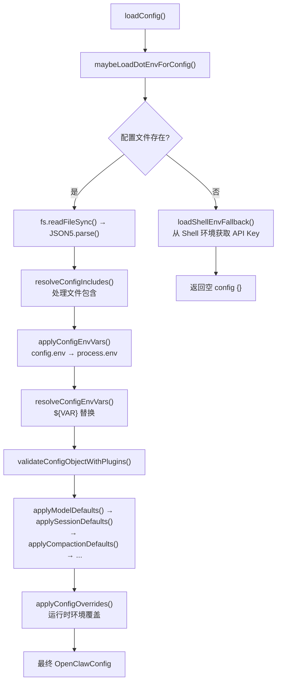

# 模块深度分析：配置系统

> 基于 `src/config/io.ts`（1560 行 / 51KB）源码逐行分析，覆盖配置读写的完整生命周期。

## 1. Config IO 架构

`createConfigIO()` 是配置系统的核心工厂（L725+），返回 `loadConfig`/`writeConfigFile`/`readConfigFileSnapshot` 等方法。



### 1.1 环境变量替换

```typescript
// env-substitution.ts — ${VAR} 模式替换
// 关键设计：缺失的 env var 不会崩溃，而是发出警告
const envWarnings: EnvSubstitutionWarning[] = [];
resolveConfigEnvVars(resolved, env, {
  onMissing: (w) => envWarnings.push(w),
  // 警告消息: `missing env var "${w.varName}" at ${w.configPath}`
});
```

**Shell 环境回退**（L738-L747）：当配置文件不存在且 `shouldEnableShellEnvFallback()` 为真时，调用 `loadShellEnvFallback()` 从用户 Shell（bash/zsh）中获取已定义的敏感环境变量（L62-L81 列出了 20 个检测键）：
- `OPENAI_API_KEY`, `ANTHROPIC_API_KEY`, `GEMINI_API_KEY` 等 AI Provider 密钥
- `TELEGRAM_BOT_TOKEN`, `DISCORD_BOT_TOKEN` 等渠道 Token
- `OPENCLAW_GATEWAY_TOKEN` 等内部凭据

### 1.2 配置文件包含系统

```typescript
// includes.ts — 支持 $include 指令
resolveConfigIncludes(parsed, configPath, {
  readFileWithGuards: ({ includePath, resolvedPath, rootRealDir }) =>
    // 安全守卫：防止目录遍历
    readConfigIncludeFileWithGuards({ ... })
});
```

---

## 2. 配置写入安全

### 2.1 写入审计日志

每次配置写入都会记录审计日志到 `~/.openclaw/logs/config-audit.jsonl`：

```typescript
type ConfigWriteAuditRecord = {
  ts: string;                  // ISO 时间戳
  source: "config-io";
  event: "config.write";
  result: "rename" | "copy-fallback" | "failed";
  configPath: string;
  pid: number;                 // 进程 PID
  ppid: number;                // 父进程 PID
  existsBefore: boolean;
  previousHash: string | null; // SHA-256 哈希
  nextHash: string | null;
  previousBytes: number | null;
  nextBytes: number | null;
  changedPathCount: number | null;
  suspicious: string[];        // 可疑行为标志
  // ...
};
```

### 2.2 可疑写入检测（L538-L565）

```typescript
function resolveConfigWriteSuspiciousReasons(params) {
  // 1. size-drop: 文件大小缩减超过 50%
  if (nextBytes < previousBytes * 0.5) reasons.push(`size-drop:${prev}->${next}`);
  // 2. missing-meta-before-write: 写入前缺少 meta 段
  if (!hasMetaBefore) reasons.push("missing-meta-before-write");
  // 3. gateway-mode-removed: gateway.mode 字段被移除
  if (gatewayModeBefore && !gatewayModeAfter) reasons.push("gateway-mode-removed");
}
```

### 2.3 环境变量引用恢复

写入时自动恢复 `${VAR}` 引用，而非写入解析后的明文值：

```typescript
// 读取时: API_KEY 解析为 "sk-abc123"
// 写入时: 未变更的路径恢复为 "${OPENAI_API_KEY}"
function restoreEnvRefsFromMap(value, path, envRefMap, changedPaths) {
  if (!isPathChanged(path, changedPaths)) {
    const original = envRefMap.get(path);
    if (original) return original;  // 恢复原始 ${VAR} 引用
  }
  return value;
}
```

### 2.4 目录权限加固

```typescript
// L167-L191 — 首次写入时收紧 ~/.openclaw 权限
async function tightenStateDirPermissionsIfNeeded() {
  const mode = stat.mode & 0o777;
  if ((mode & 0o077) !== 0) {  // 有 group/other 权限
    await fs.chmod(configDir, 0o700);  // 收紧为仅 owner
  }
}
```

---

## 3. 配置版本管理

### 3.1 版本戳记

```typescript
// L607-L617
function stampConfigVersion(cfg) {
  return { ...cfg, meta: { lastTouchedVersion: VERSION, lastTouchedAt: now } };
}
```

### 3.2 未来版本警告

```typescript
// L619-L633 — 检测来自更高版本的配置文件
if (compareOpenClawVersions(currentVersion, configVersion) < 0) {
  logger.warn(`Config was last written by a newer OpenClaw (${configVersion})`);
}
```

---

## 4. Merge Patch 机制

配置更新使用 RFC 7396 JSON Merge Patch 语义（L373-L406）：

```typescript
function createMergePatch(base, target) {
  for (const key of keys) {
    if (!hasTarget) patch[key] = null;        // 删除
    else if (!hasBase) patch[key] = clone(v);  // 新增
    else if (isObject(base[key])) {            // 递归
      const childPatch = createMergePatch(base[key], target[key]);
      patch[key] = childPatch;
    } else if (!deepEqual(base[key], target[key])) {
      patch[key] = clone(target[key]);         // 修改
    }
  }
}
```

### UnsetPath 实现

支持通过路径段数组精确删除配置节点（L233-L320），包含数组元素的 splice 删除和空对象的自动修剪。

---

## 5. Schema 验证（Zod）

`zod-schema.ts` 定义了完整的配置 Schema 体系，使用 Zod 进行运行时校验。关键 Schema 层级：

```
OpenClawConfig
├── meta (lastTouchedVersion, lastTouchedAt)
├── models.providers (Provider 配置表)
├── agents.defaults (Agent 默认配置)
│   ├── model (主模型 + fallback)
│   ├── models (白名单 + 参数)
│   ├── thinkingDefault, sandbox, contextTokens
│   └── subagents.model (子代理模型)
├── gateway (认证/绑定/TLS/Control UI)
├── channels (渠道配置)
├── plugins (插件启用/安装/加载路径)
├── session (作用域/持久化)
├── security (审计/DM 策略)
├── hooks (HTTP/Gmail Webhook)
├── cron (定时任务)
└── memory (记忆搜索/嵌入)
```
