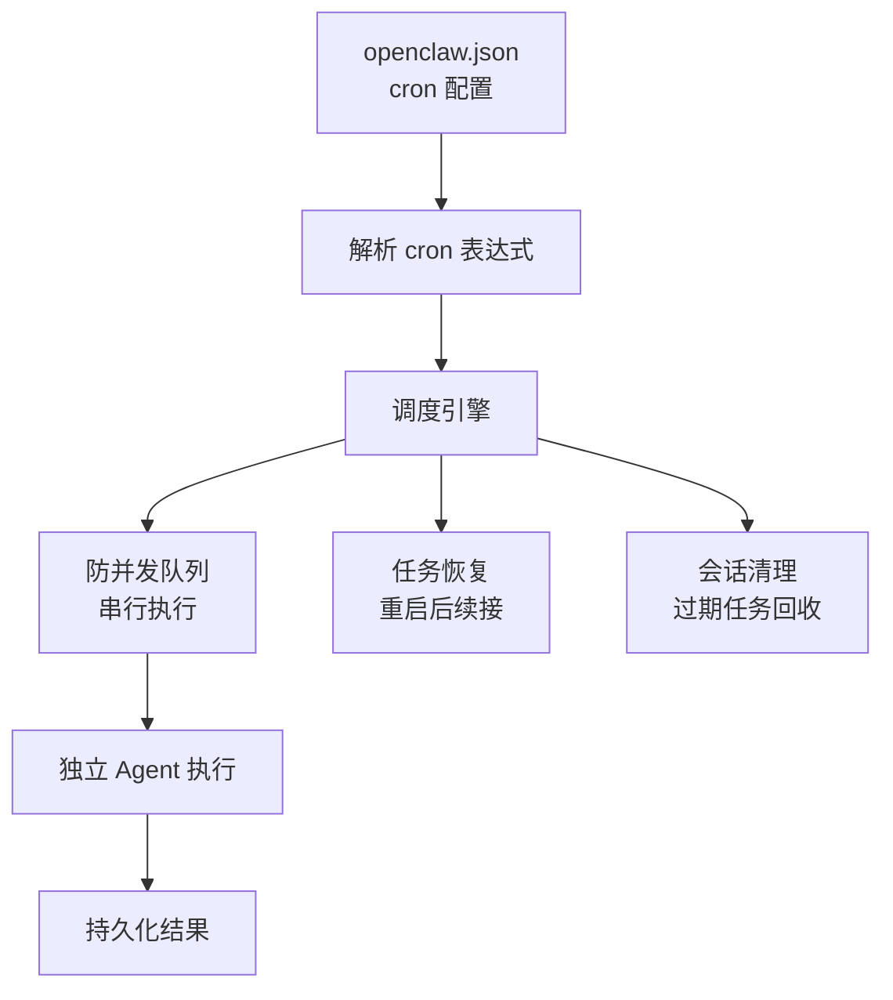

# 模块分析：定时任务与调度 (Cron & Background)

## 定时任务 — `src/cron/`

### 核心特性

- **防并发**：同一 cron 任务不会重叠执行，通过队列串行化
- **独立 Agent**：每个 cron 任务以独立 Agent 身份运行，有自己的会话和上下文
- **持久化恢复**：系统重启后自动恢复未完成的定时任务
- **会话清理**：过期的 cron 会话自动清理，防止存储膨胀

### Gateway 集成

`src/gateway/server-cron.ts`（17KB）将 cron 引擎集成到 Gateway：

- 启动时加载 cron 配置
- 配置热重载时更新调度
- 任务执行状态上报
- 失败重试策略
