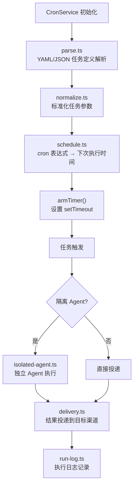
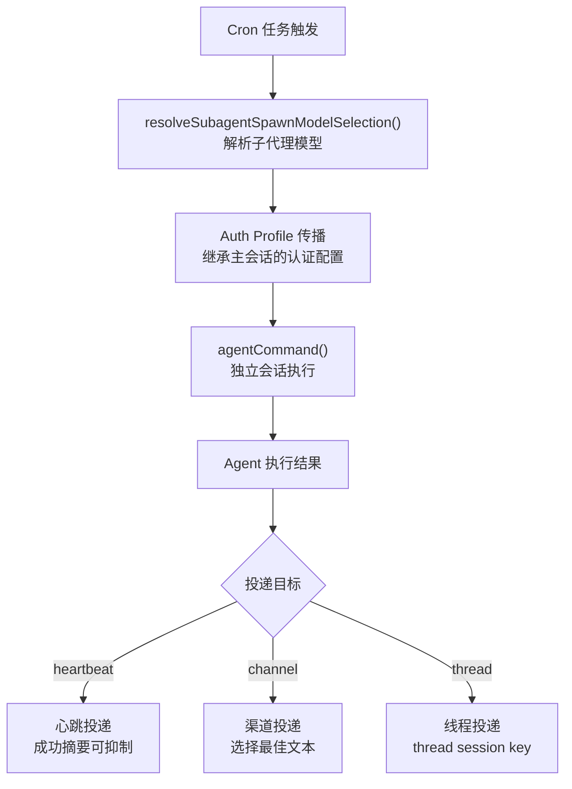

# 模块深度分析：Cron 定时任务

> 基于 `src/cron/` 目录（73 个文件）源码分析，覆盖调度引擎、任务投递、隔离 Agent 执行。

## 1. Cron 服务架构



## 2. 调度引擎（`schedule.ts`）

- 使用标准 cron 表达式（5/6 字段）
- 支持 `@daily`, `@hourly`, `@weekly` 等快捷方式
- **Top-of-hour Stagger**：为避免整点任务风暴，对 `every` 类型任务自动添加随机偏移
- **Daily Skip 修复**：解决跨日边界时的调度跳跃问题（#17852）
- **At Reschedule**：`@` 类型任务在错过执行窗口后的重新调度（#19676）

## 3. 隔离 Agent 执行（`isolated-agent.ts`）



关键功能：
- **Auth Profile 传播**：Cron 任务继承主 Agent 的认证配置
- **子代理模型**：支持独立的模型选择（`subagents.model`）
- **Lane 标记**：使用 `AGENT_LANE_SUBAGENT` 标记为子代理调用
- **超时控制**：Cron 任务有独立的超时设置

## 4. 任务投递（`delivery.ts`）

### 投递策略

- **心跳投递**：成功时摘要信息可被抑制（`heartbeat-ok-summary-suppressed`）
- **失败通知**：任务失败时发送告警通知
- **Best-effort Deliver**：对于某些渠道（如 WhatsApp），当无法确定接收方时跳过投递

### 核心渠道直投

支持直接投递到核心渠道（Telegram, Discord, Slack 等），无需经过渠道插件路由。

## 5. 执行日志（`run-log.ts`）

```typescript
// 记录每次 Cron 执行的结果
type CronRunLogEntry = {
  jobId: string;
  scheduledAt: number;
  startedAt: number;
  finishedAt: number;
  status: "success" | "failure" | "timeout";
  deliveryStatus: "delivered" | "skipped" | "failed";
  agentText?: string;
  error?: string;
};
```

## 6. 心跳策略（`heartbeat-policy.ts`）

- 检测 Cron 任务的心跳状态
- 决定是否包含心跳目标作为最后的投递对象
- 支持配置化的心跳检测间隔

## 7. 测试覆盖

Cron 模块拥有 50+ 测试文件，覆盖：
- 协议一致性（`cron-protocol-conformance`）
- 重复定时器防护（`prevents-duplicate-timers`）
- 任务列表排序守卫（`list-page-sort-guards`）
- 多个回归修复（issues #13992, #16156, #17852, #19676, #22895, #35195）
