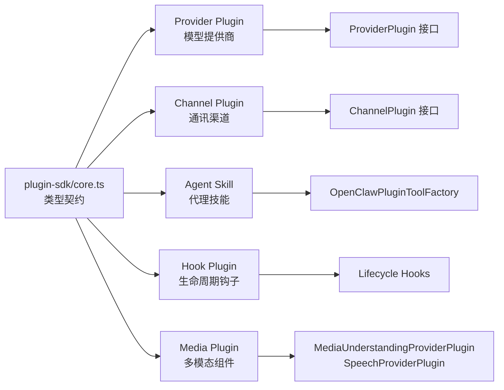

# 二次开发与扩展点指北 (Developer Extension Guide)

OpenClaw 通过标准化 SDK 提供完善的插件开发体系。本文档面向希望进行二次开发的工程师。

## 1. 核心扩展类型



## 2. Provider Plugin 开发

`ProviderPlugin`（定义于 `src/plugins/types.ts` 61KB）是最复杂的扩展接口。

### 核心能力

| 能力       | 接口方法                                 | 说明                  |
| ---------- | ---------------------------------------- | --------------------- |
| 认证向导   | `auth`, `wizard`                         | OAuth2 / API Key 录入 |
| 模型目录   | `catalog`, `augmentModelCatalog`         | 动态模型发现与注册    |
| 运行时劫持 | `prepareExtraParams`, `wrapStreamFn`     | 请求拦截、参数注入    |
| 特性声明   | `isBinaryThinking`, `isCacheTtlEligible` | 推理/缓存能力标记     |
| Token 统计 | 使用量覆写                               | 自定义计费逻辑        |

### 开发示例骨架

```typescript
// extensions/my-provider/src/index.ts
import { definePluginEntry } from "openclaw/plugin-sdk/core";

export default definePluginEntry({
  name: "my-provider",
  type: "provider",

  auth: {
    kind: "api-key", // 或 "oauth2"
    envVar: "MY_PROVIDER_KEY", // 环境变量名
  },

  catalog: async (ctx) => {
    // 从远程 API 获取可用模型列表
    return [{ id: "my-model-v1", name: "My Model" }];
  },

  prepareExtraParams: (params, ctx) => {
    // 在 LLM 调用前注入自定义参数
    params.headers["X-Custom-Auth"] = ctx.apiKey;
    return params;
  },
});
```

## 3. Channel Plugin 开发

通讯渠道插件负责消息收发。

### 接口要求

| 方法               | 必须 | 说明                    |
| ------------------ | ---- | ----------------------- |
| `start()`          | ✅   | 启动轮询/WebSocket 监听 |
| `stop()`           | ✅   | 停止监听                |
| `sendMessage()`    | ✅   | 发送文本/媒体消息       |
| `sendReaction()`   | 可选 | 发送 emoji 反应         |
| `setTyping()`      | 可选 | 设置打字状态            |
| `getAccountInfo()` | 可选 | 获取账户信息            |

## 4. Agent Skill 开发

通过 `OpenClawPluginToolFactory` 工厂模式创建工具：

```typescript
export const myTool: OpenClawPluginToolFactory = (ctx) => ({
  name: "my_tool",
  description: "执行自定义操作",
  parameters: {
    type: "object",
    properties: {
      input: { type: "string", description: "输入参数" },
    },
    required: ["input"],
  },
  execute: async ({ input }) => {
    // 访问 ctx.workspaceDir, ctx.senderRole 等上下文
    return { result: `处理完成: ${input}` };
  },
});
```

## 5. Hook 开发

钩子允许在系统生命周期的关键节点注入自定义逻辑：

```typescript
export default definePluginEntry({
  hooks: {
    "before-agent-start": async (event) => {
      // 修改 System Prompt
      event.systemPrompt += "\n\n自定义指令...";
    },
    "after-tool-call": async (event) => {
      // 记录工具调用日志
      console.log(`Tool ${event.toolName} completed`);
    },
  },
});
```

## 6. 开发实践

1. 在 `extensions/your-plugin` 创建包目录
2. `package.json` 中声明运行时依赖（`dependencies`），将 `openclaw` 放入 `devDependencies`
3. 通过 `definePluginEntry` 或 `defineChannelPluginEntry` 安全导出
4. 在 `openclaw.json` 的 `plugins` 字段注册
5. 运行 `openclaw plugins install ./extensions/your-plugin` 安装
