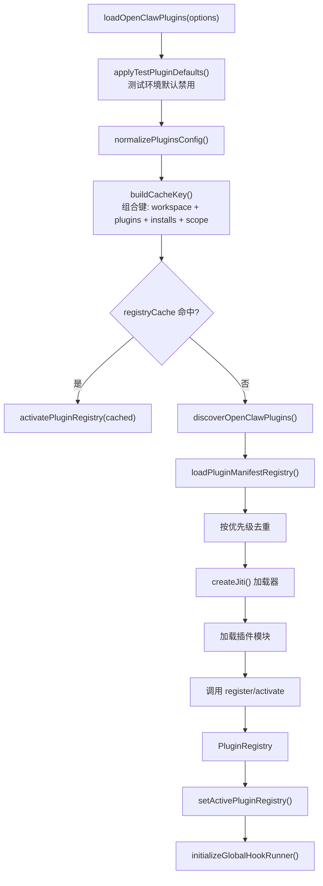

# 模块深度分析：插件系统

> 基于 `src/plugins/loader.ts`（1304 行 / 43KB）源码逐行分析，覆盖插件发现、加载、注册、安全的完整生命周期。

## 1. 插件加载全流程

`loadOpenClawPlugins()` 是插件系统的核心入口（L692+）：



### 1.1 插件发现优先级

重复插件通过 `resolveCandidateDuplicateRank()` 按来源优先级排序（L562-L594）：

| 优先级 | Origin | 说明 |
|--------|--------|------|
| 0 | `config` | 配置中显式指定的加载路径 |
| 1 | `global` + explicit install | 全局目录 + 显式安装记录匹配 |
| 2 | `bundled` | 内置插件（保留 ID 除非被覆盖） |
| 3 | `workspace` | 工作区本地插件 |
| 4 | 其他 global | 全局目录无安装记录 |

### 1.2 模块导出解析

```typescript
// L277-L298
function resolvePluginModuleExport(moduleExport) {
  // 处理 default export
  const resolved = moduleExport.default ?? moduleExport;
  // 方式一：直接导出注册函数
  if (typeof resolved === "function") return { register: resolved };
  // 方式二：导出定义对象（支持 register 或 activate）
  return { definition: resolved, register: resolved.register ?? resolved.activate };
}
```

---

## 2. Jiti 模块加载器

插件使用 [jiti](https://github.com/unjs/jiti) 实现 TypeScript 免编译加载：

```typescript
// L750-L772 — 惰性创建 Jiti 实例
const getJiti = (modulePath) => {
  const aliasMap = buildPluginLoaderAliasMap(modulePath);
  // 别名映射: "openclaw/plugin-sdk" → 实际路径
  // "openclaw/plugin-sdk/<subpath>" → 对应子路径
  const loader = createJiti(import.meta.url, {
    ...buildPluginLoaderJitiOptions(aliasMap),
    tryNative, // dist/*.js 使用原生加载，src/*.ts 使用 jiti 转译
  });
};
```

**SDK 别名系统**：`resolvePluginSdkScopedAliasMap()` 为每个插件建立 `openclaw/plugin-sdk/*` → 实际文件的映射，确保插件通过公共 API 而非内部路径引用 SDK。

---

## 3. 插件注册表（PluginRegistry）

### 3.1 PluginRecord 结构

```typescript
function createPluginRecord(params): PluginRecord {
  return {
    id, name, description, version,
    format: "openclaw",         // 插件格式
    bundleFormat,                // 打包格式
    source,                      // 加载路径
    origin,                      // 来源: bundled | global | workspace | config
    enabled, status: "loaded",
    toolNames: [],               // 注册的工具名
    hookNames: [],               // 注册的 Hook 名
    channelIds: [],              // 注册的渠道 ID
    providerIds: [],             // 注册的 AI Provider ID
    speechProviderIds: [],
    mediaUnderstandingProviderIds: [],
    imageGenerationProviderIds: [],
    webSearchProviderIds: [],
    gatewayMethods: [],          // 注册的 RPC 方法
    cliCommands: [],             // CLI 命令
    services: [],                // 后台服务
    httpRoutes: 0,               // HTTP 路由数
    hookCount: 0,
    configSchema: false,         // 是否有配置 Schema
  };
}
```

### 3.2 配置 Schema 验证

```typescript
// L256-L275 — JSON Schema 校验插件配置
function validatePluginConfig({ schema, value }) {
  return validateJsonSchemaValue({ schema, cacheKey, value: value ?? {} });
  // ok: true → 配置有效
  // ok: false → 返回错误列表
}
```

---

## 4. 安全机制

### 4.1 溯源追踪（Provenance Index）

```typescript
// L496-L527 — 构建插件加载来源索引
function buildProvenanceIndex(params) {
  // 1. 收集所有 loadPaths 到 PathMatcher
  for (const loadPath of normalizedLoadPaths) {
    addPathToMatcher(loadPathMatcher, loadPath, env);
  }
  // 2. 收集所有 install 记录的 installPath + sourcePath
  for (const [pluginId, install] of Object.entries(installs)) {
    addPathToMatcher(rule.matcher, install.installPath, env);
    addPathToMatcher(rule.matcher, install.sourcePath, env);
  }
}
```

### 4.2 未追踪插件警告

```typescript
// L655-L685 — 对加载的非内置插件检查溯源
function warnAboutUntrackedLoadedPlugins(params) {
  for (const plugin of registry.plugins) {
    if (plugin.origin === "bundled") continue;
    if (isTrackedByProvenance({ pluginId, source, index, env })) continue;
    // 警告: "loaded without install/load-path provenance"
  }
}
```

### 4.3 开放白名单警告

```typescript
// L624-L653 — plugins.allow 为空时对非内置插件发出警告
function warnWhenAllowlistIsOpen(params) {
  if (params.allow.length > 0) return;  // 已配置白名单
  const nonBundled = plugins.filter(e => e.origin !== "bundled");
  if (nonBundled.length > 0) {
    logger.warn(`[plugins] plugins.allow is empty; discovered non-bundled plugins may auto-load`);
  }
}
```

---

## 5. 渠道插件 Setup 模式

`shouldLoadChannelPluginInSetupRuntime()` 决定渠道插件是否使用轻量级 Setup 入口（L323-L343）：

```typescript
// Setup 模式条件：
// 1. 插件有 setupSource（setup-only 入口点）
// 2. 且渠道未在配置中启用
//    → 使用 setupEntry 注册渠道插件元数据，不加载完整运行时
```

---

## 6. 插件运行时（Runtime）

```typescript
// L774-L810 — 惰性解析运行时
const resolveCreatePluginRuntime = () => {
  const runtimeModulePath = resolvePluginRuntimeModulePath();
  const runtimeModule = getJiti(runtimeModulePath)(runtimeModulePath);
  return runtimeModule.createPluginRuntime;
};
```

**Lazy Runtime**：`LAZY_RUNTIME_REFLECTION_KEYS` 列出了 13 个反射键（L96-L111），运行时按需初始化各子系统：
`version`, `config`, `agent`, `subagent`, `system`, `media`, `tts`, `stt`, `tools`, `channel`, `events`, `logging`, `state`, `modelAuth`

---

## 7. 缓存管理

```typescript
const MAX_PLUGIN_REGISTRY_CACHE_ENTRIES = 128;
// LRU 策略：新条目插入末尾，访问时移动到末尾
// 超过上限时删除最旧条目
function setCachedPluginRegistry(cacheKey, registry) {
  registryCache.set(cacheKey, registry);
  while (registryCache.size > MAX_PLUGIN_REGISTRY_CACHE_ENTRIES) {
    const oldestKey = registryCache.keys().next().value;
    registryCache.delete(oldestKey);
  }
}
```
