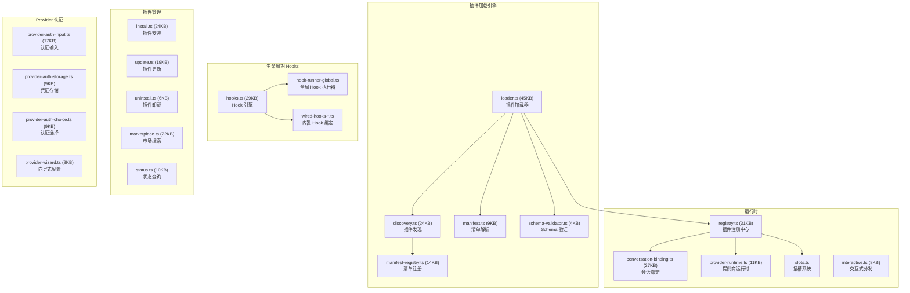
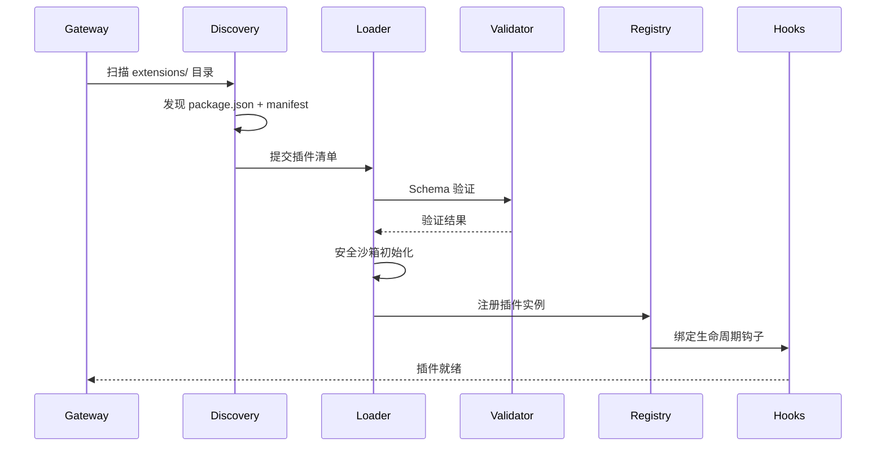

# 模块分析：Extensibility (扩展性)

## 插件系统 — `src/plugins/` (138 文件)

OpenClaw 的高度可扩展性建立在精心设计的插件架构之上。

### 插件加载流程

### Hook 系统

`hooks.ts`（29KB）支持的生命周期钩子：

| Hook                 | 触发时机     | 用途                  |
| -------------------- | ------------ | --------------------- |
| `before-agent-start` | Agent 开始前 | 修改配置、注入上下文  |
| `after-tool-call`    | 工具调用后   | 处理结果、日志记录    |
| `on-message`         | 收到消息     | 拦截/修改/过滤消息    |
| `on-compaction`      | 上下文压缩   | 自定义压缩策略        |
| `before-llm-call`    | LLM 调用前   | 修改 prompt、模型覆盖 |
| `on-session-start`   | 会话开始     | 初始化会话状态        |
| `on-subagent-*`      | 子代理事件   | 编排控制              |
| `inbound-claim`      | 消息认领     | 自定义路由策略        |

### 市场与分发

`marketplace.ts`（22KB）支持从远程注册表搜索和安装插件，`conversation-binding.ts`（27KB）管理插件到特定会话的绑定关系。
