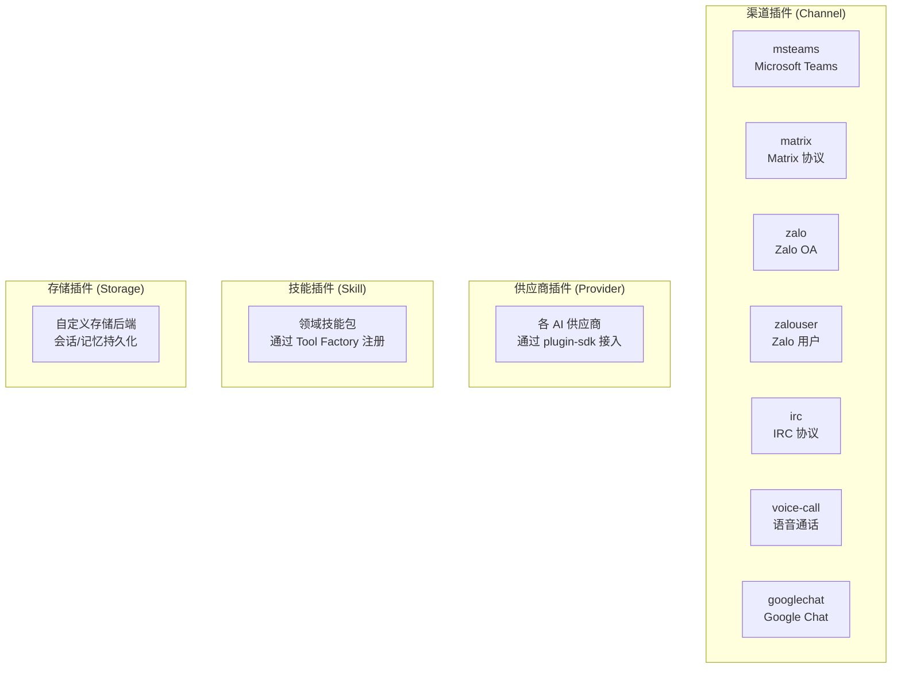

# 模块分析：扩展生态概览 (Extensions Ecosystem)

## 概览 — `extensions/` 目录

OpenClaw 的 `extensions/` 目录采用 Monorepo workspace 模式组织所有插件。



### 插件目录结构

每个插件遵循标准结构：

```
extensions/my-plugin/
├── package.json          # 声明依赖（不使用 workspace:*）
├── src/
│   ├── index.ts          # 插件入口（definePluginEntry）
│   ├── channel.ts        # 渠道实现（如有）
│   └── ...
├── tsconfig.json
└── README.md
```

### 依赖管理原则

- 运行时依赖 → `dependencies`（`npm install --omit=dev` 安装）
- `openclaw` → `devDependencies` 或 `peerDependencies`（运行时通过 jiti 别名解析）
- **禁止** `workspace:*` 出现在 `dependencies` 中

### 内置渠道

核心代码中还包含以下内置渠道实现：

- `src/` 内置：Telegram, Discord, Slack, Signal, iMessage, WhatsApp, Web
- `extensions/` 插件：MSTeams, Matrix, Zalo, IRC, Google Chat, Voice Call
