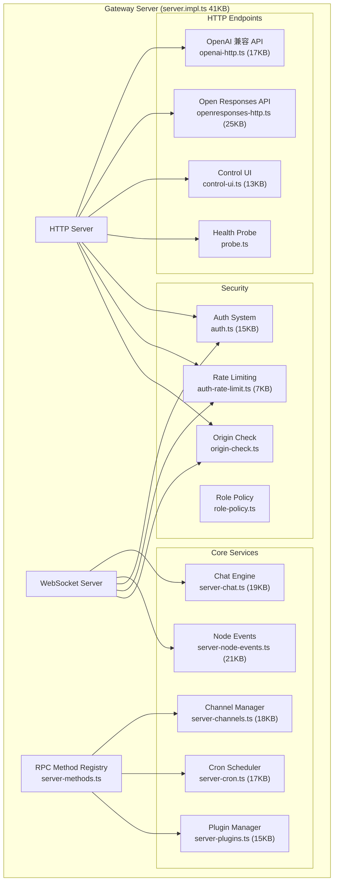
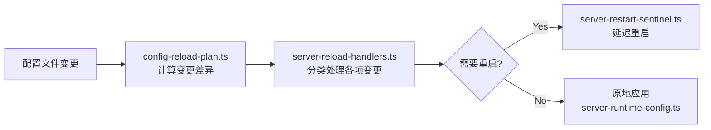

# 模块分析：Gateway & Daemon

## 网关 (Gateway) — `src/gateway/` (250 文件)

网关是 OpenClaw 的核心中枢，协调 Agent、渠道、插件、会话等所有模块的运行。

### 核心功能

#### RPC 方法注册

`server-methods.ts` 将核心方法、渠道方法和插件方法统一注册为 RPC 接口。方法分为多个作用域（`method-scopes.ts`）：

- **Core**：chat、config、sessions
- **Channel**：各渠道特有操作
- **Plugin**：插件定义的自定义方法
- **Control Plane**：管理面板 API

#### 配置热重载

#### OpenAI 兼容层

`openai-http.ts` 提供完整的 `/v1/chat/completions` 兼容接口，支持：

- 流式与非流式响应
- 图像预算控制
- 消息渠道映射

#### 会话管理

- `session-utils.ts` (32KB) — 会话 CRUD、历史记录、状态持久化
- `session-reset-service.ts` — 会话重置与清理
- `sessions-patch.ts` (15KB) — 会话配置实时修改
- `server-session-key.ts` — 稳定会话键生成

### 设计模式

| 模式     | 应用                                    |
| -------- | --------------------------------------- |
| Facade   | `GatewayServer` 为复杂后端提供统一接口  |
| 依赖注入 | `createDefaultDeps` 传入底层依赖        |
| 观察者   | 事件驱动处理 Agent 事件、心跳、渠道状态 |
| 策略模式 | Auth Mode 策略、Channel Health 策略     |

---

## 守护进程 (Daemon) — `src/daemon/`

解决 OpenClaw 在不同操作系统上作为后台服务运行的一致性问题。

### 平台适配

| 平台    | 实现          | 服务管理器                 |
| ------- | ------------- | -------------------------- |
| macOS   | `launchd.ts`  | launchd Plist              |
| Linux   | `systemd.ts`  | systemd Unit + Linger      |
| Windows | `schtasks.ts` | 计划任务 (Scheduled Tasks) |

### 服务接口 (`service.ts`)

统一的 `GatewayService` 抽象：

- `install()` — 安装系统服务
- `uninstall()` — 卸载
- `stop()` — 停止
- `restart()` — 重启
- `isLoaded()` — 状态查询

用户通过简单的 `openclaw daemon install` 即可完成复杂的后台服务配置。
