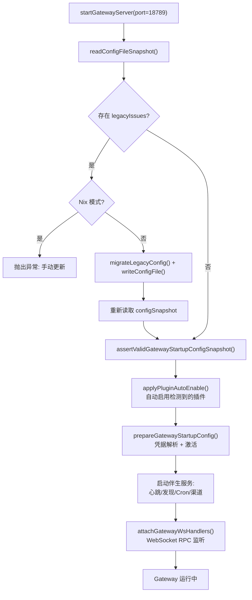
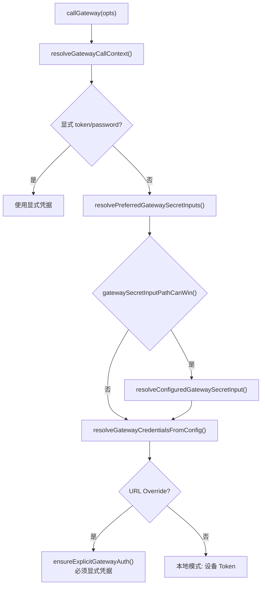

# 模块深度分析：Gateway 与 Daemon

> 基于 `src/gateway/` 源码逐行分析，覆盖启动流程、RPC 模型、安全机制等核心业务逻辑。

## 1. Gateway 启动全流程

`server.impl.ts`（1355 行 / 50KB）是整个系统的核心入口，`startGatewayServer()` 函数执行以下精确步骤：



### 1.1 凭据安全启动（Secrets Activation）

```typescript
// server.impl.ts L445-L489 — 核心凭据激活逻辑
const activateRuntimeSecrets = async (config, params) =>
  await runWithSecretsActivationLock(async () => {
    const prepared = await prepareSecretsRuntimeSnapshot({ config });
    if (params.activate) {
      activateSecretsRuntimeSnapshot(prepared);  // 全局激活
      logGatewayAuthSurfaceDiagnostics(prepared);
    }
    // 降级处理：凭据解析失败时保持 last-known-good
    if (secretsDegraded && params.reason !== "startup") {
      emitSecretsStateEvent("SECRETS_RELOADER_RECOVERED", ...);
    }
  });
```

**关键设计决策**：
- 使用 `runWithSecretsActivationLock` 实现**串行激活**，避免并发冲突
- **启动时严格失败**（`reason === "startup"` 时直接抛异常）
- **运行时优雅降级**（保持 last-known-good snapshot，发出 `SECRETS_RELOADER_DEGRADED` 事件）

### 1.2 绑定模式（Bind Mode）

`net.ts` 实现了 5 种绑定策略（L246-L296）：

| 模式 | 绑定地址 | 回退策略 |
|------|---------|---------|
| `loopback` | `127.0.0.1` | → `0.0.0.0`（极端回退） |
| `lan` | `0.0.0.0` | 无回退 |
| `tailnet` | Tailscale IPv4 | → `127.0.0.1` → `0.0.0.0` |
| `auto` | `127.0.0.1` | → `0.0.0.0` |
| `custom` | 用户指定 IP | → `0.0.0.0` |

**安全检查**（L436-L481）：`isSecureWebSocketUrl()` 实施 CWE-319 防护 — 阻止所有非回环的明文 `ws://` 连接，除非显式设置 `OPENCLAW_ALLOW_INSECURE_PRIVATE_WS=1`。

---

## 2. RPC 调用模型

`call.ts`（955 行）实现了客户端→Gateway 的安全 RPC 调用：

### 2.1 凭据解析链



**四个可解析的 Secret 路径**（L369-L374）：
1. `gateway.auth.token` — 本地认证 Token
2. `gateway.auth.password` — 本地认证密码
3. `gateway.remote.token` — 远程 Gateway Token
4. `gateway.remote.password` — 远程 Gateway 密码

### 2.2 URL 覆盖安全策略

```typescript
// call.ts L119-L148
export function ensureExplicitGatewayAuth(params) {
  // CLI URL 覆盖 → 必须提供显式 token 或 password
  // ENV URL 覆盖 → 必须有任何形式的已解析凭据
  // 目的：防止 URL 重定向静默复用隐式凭据
}
```

---

## 3. 配置热重载

`server-reload.ts` 与 `config-reload.ts` 实现了**无停机配置更新**：

1. 文件系统监控检测 `openclaw.json` 变更
2. 重新读取并验证 config snapshot
3. 重新激活 Secrets 运行时快照
4. 更新渠道管理器（`channelManager`）
5. 重建 Cron 调度
6. 刷新 Hook 配置
7. 广播 `config.reloaded` 事件给所有连接的节点

---

## 4. Daemon 平台层

Daemon 负责以系统服务形式运行 Gateway：

| 平台 | 实现 | 管理方式 |
|------|------|---------|
| macOS | `LaunchAgent` plist | `launchctl` |
| Windows | 独立进程 | `taskkill` |
| Linux | systemd unit | `systemctl` |

### 进程管理

- **SIGUSR1**：触发优雅重启（`setGatewaySigusr1RestartPolicy`）
- **Pre-Restart Deferral**：检查 `getTotalQueueSize() + getTotalPendingReplies() + getActiveEmbeddedRunCount()`，确保活跃任务完成后再重启
- **媒体文件 TTL**：最大 7 天（`168 小时`），由 `resolveMediaCleanupTtlMs()` 实施

---

## 5. 网络安全层

### 客户端 IP 解析（`net.ts` L160-L189）

```typescript
export function resolveClientIp(params) {
  // 1. 标准化 remoteAddr
  // 2. 如果不是受信代理 → 直接返回 remote
  // 3. 受信代理 → 从 X-Forwarded-For 右侧逆序查找第一个非受信 hop
  // 4. Fail-closed：代理场景下缺少客户端头 → 返回 undefined（不回退到代理 IP）
}
```

### CIDR 受信代理匹配（L145-L158）

`isTrustedProxyAddress()` 使用 `isIpInCidr()` 进行 CIDR 匹配，支持配置多个受信代理网段。
