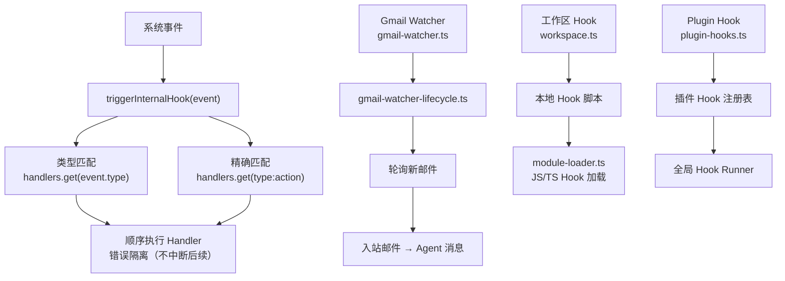
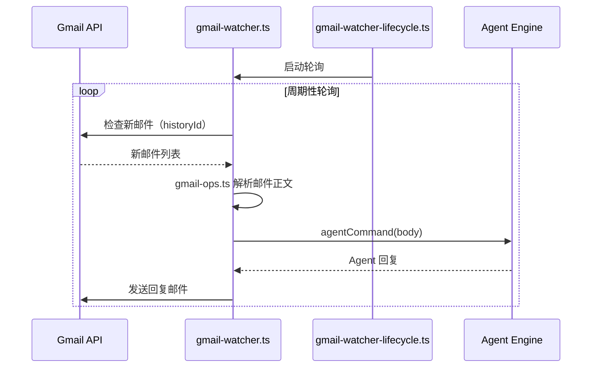

# 模块深度分析：Hook/Webhook 系统

> 基于 `src/hooks/`（37 个文件）源码逐行分析，覆盖内部 Hook 事件系统、Gmail Webhook、模块加载器。

## 1. 架构概览



## 2. 内部 Hook 事件系统（`internal-hooks.ts` — 422L）

### 2.1 事件类型体系

```typescript
type InternalHookEventType = "command" | "session" | "agent" | "gateway" | "message";
```

5 大事件类型，每种包含多个 action：

| type | action | 上下文类型 | 说明 |
|------|--------|---------|------|
| `agent` | `bootstrap` | `AgentBootstrapHookContext` | Agent 工作区初始化 |
| `gateway` | `startup` | `GatewayStartupHookContext` | Gateway 启动完成 |
| `message` | `received` | `MessageReceivedHookContext` | 收到消息 |
| `message` | `sent` | `MessageSentHookContext` | 发送消息 |
| `message` | `transcribed` | `MessageTranscribedHookContext` | 音频转录完成 |
| `message` | `preprocessed` | `MessagePreprocessedHookContext` | 消息预处理完成 |
| `command` | `new/reset/stop/...` | 通用 | Chat 指令执行 |
| `session` | `*` | 通用 | 会话生命周期 |

### 2.2 消息上下文字段

```typescript
// 消息接收上下文 — 8 个字段
type MessageReceivedHookContext = {
  from: string;              // 发送者 ID
  content: string;           // 消息内容
  timestamp?: number;        // Unix 时间戳
  channelId: string;         // 渠道标识（telegram/whatsapp）
  accountId?: string;        // 多账号 Provider 账号 ID
  conversationId?: string;   // 对话/聊天 ID
  messageId?: string;        // Provider 消息 ID
  metadata?: Record<string, unknown>; // Provider 特有元数据
};

// 消息发送上下文 — 10 个字段
type MessageSentHookContext = {
  to: string;                // 接收者
  content: string;           // 消息内容
  success: boolean;          // 是否成功
  error?: string;            // 错误信息
  channelId: string;         // 渠道标识
  accountId?: string;
  conversationId?: string;
  messageId?: string;
  isGroup?: boolean;         // 群组消息
  groupId?: string;          // 群组 ID
};

// 音频转录上下文 — 扩展自 MessageEnrichedBodyHookContext
type MessageTranscribedHookContext = MessageEnrichedBodyHookContext & {
  transcript: string;        // 转录后文本
};

// 预处理上下文
type MessagePreprocessedHookContext = MessageEnrichedBodyHookContext & {
  transcript?: string;       // 可选的转录文本
  isGroup?: boolean;
  groupId?: string;
};
```

### 2.3 全局单例注册表

```typescript
// 使用 globalThis 确保跨 chunk 共享（解决 bundle splitting 问题）
const _g = globalThis as typeof globalThis & {
  __openclaw_internal_hook_handlers__?: Map<string, InternalHookHandler[]>;
};
const handlers = (_g.__openclaw_internal_hook_handlers__ ??= new Map());
```

**设计决策**：使用 `globalThis` 单例而非模块级变量，解决打包器（bundler）将模块分割到多个 chunk 时，不同 chunk 中的注册和触发使用不同 Map 实例的问题。

### 2.4 事件触发双路匹配

```typescript
// triggerInternalHook(event) 执行两种匹配
const typeHandlers = handlers.get(event.type) ?? [];      // "command" → 所有 command 事件
const specificHandlers = handlers.get(`${event.type}:${event.action}`) ?? [];  // "command:new" → 仅 /new
const allHandlers = [...typeHandlers, ...specificHandlers];
// 顺序执行，错误不中断
```

### 2.5 类型守卫

6 个类型守卫函数用于安全类型缩窄：
- `isAgentBootstrapEvent()` — 验证 `workspaceDir` + `bootstrapFiles`
- `isGatewayStartupEvent()` — 验证 gateway context
- `isMessageReceivedEvent()` — 验证 `from` + `channelId`
- `isMessageSentEvent()` — 验证 `to` + `channelId` + `success`
- `isMessageTranscribedEvent()` — 验证 `transcript` + `channelId`
- `isMessagePreprocessedEvent()` — 验证 `channelId`

---

## 3. Gmail Webhook 集成



### 关键文件

| 文件 | 行数 | 职责 |
|------|------|------|
| `gmail.ts` | ~300 | Gmail API 交互（OAuth、消息读取） |
| `gmail-ops.ts` | ~200 | 邮件操作（读/发/标记已读） |
| `gmail-watcher.ts` | ~400 | 邮件监控轮询（基于 historyId） |
| `gmail-watcher-lifecycle.ts` | ~150 | 监控启停生命周期 |
| `gmail-setup-utils.ts` | ~100 | OAuth 配置辅助 |

---

## 4. Hook 加载器（`module-loader.ts`）

支持从文件系统加载 JS/TS Hook 脚本：
- 使用 `jiti` 实现 TypeScript 免编译加载
- 解析 YAML frontmatter 获取事件绑定信息
- `import-url.ts` 支持从 URL 导入 Hook

## 5. Fire-and-Forget 模式（`fire-and-forget.ts`）

```typescript
// 异步触发 Hook，不等待结果
export function fireAndForgetHook(event: InternalHookEvent): void {
  triggerInternalHook(event).catch((err) => {
    log.error(`Hook fire-and-forget error: ${err.message}`);
  });
}
```

## 6. 消息 Hook 映射（`message-hook-mappers.ts`）

将渠道消息事件映射为 Hook 事件，提取标准字段（from、to、channelId、accountId 等）。

## 7. 关键文件清单

| 文件 | 职责 |
|------|------|
| `hooks.ts` | 主导出 barrel（re-export） |
| `internal-hooks.ts` | 内部事件注册/触发（422L） |
| `plugin-hooks.ts` | 插件 Hook 集成 |
| `hooks-status.ts` | Hook 状态查询 |
| `module-loader.ts` | JS/TS Hook 脚本加载 |
| `workspace.ts` | 工作区 Hook 发现 |
| `install.ts` / `installs.ts` | Hook 安装管理 |
| `config.ts` | Hook 配置类型 |
| `types.ts` | 类型定义 |
| `message-hook-mappers.ts` | 消息事件映射 |
| `import-url.ts` | URL Hook 导入 |
| `llm-slug-generator.ts` | LLM 辅助 Hook 命名 |
| `frontmatter.ts` | YAML 前端标记解析 |
| `bundled-dir.ts` | 内置 Hook 目录 |
| `fire-and-forget.ts` | 异步触发（不等待） |
