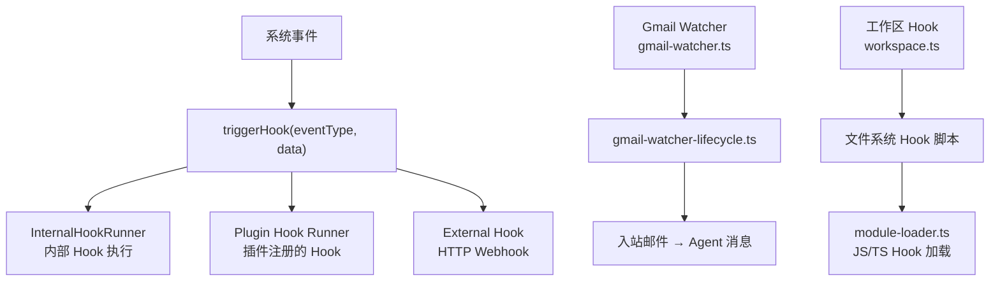

# 模块深度分析：Hook/Webhook 系统

> 基于 `src/hooks/`（37 个文件）源码分析，覆盖内部 Hook、Gmail Webhook、模块加载。

## 1. 架构概览



## 2. 内部 Hook 系统

```typescript
// internal-hooks.ts
type InternalHookEventType =
  | "message.before"     // 消息处理前
  | "message.after"      // 消息处理后
  | "agent.before"       // Agent 执行前
  | "agent.after"        // Agent 执行后
  | "config.reloaded"    // 配置重载
  | "gateway.started"    // Gateway 启动
  // ...

// 注册 Hook
registerHook("message.before", async (event) => {
  // 可修改消息内容或阻止处理
  return { modified: true, data: event.data };
});
```

## 3. Gmail Webhook 集成

```
src/hooks/
├── gmail.ts                    # Gmail API 交互
├── gmail-ops.ts                # Gmail 操作（读/发/标记）
├── gmail-watcher.ts            # 邮件监控轮询
├── gmail-watcher-lifecycle.ts  # 监控生命周期管理
└── gmail-setup-utils.ts        # Gmail OAuth 配置
```

### Gmail Watcher 流程
1. OAuth 认证完成 → 启动轮询
2. 检测新邮件 → 提取正文
3. 邮件内容 → `agentCommand()` 处理
4. Agent 回复 → Gmail 发送回复邮件

## 4. Hook 来源

| 来源 | 配置 | 说明 |
|------|------|------|
| 配置文件 | `hooks.http[]` | HTTP Webhook URL |
| 插件 | `api.registerHook()` | 插件注册的回调 |
| 工作区 | `hooks.workspace[]` | 本地脚本文件 |
| 内部 | `registerInternalHook()` | 系统内部事件 |

## 5. Fire-and-Forget 模式

`fire-and-forget.ts` — 异步触发 Hook，不等待结果，不阻塞主流程。

## 6. Hook 代码前端标记映射

`frontmatter.ts` — 解析 Hook 脚本中的 YAML 前端标记：
```yaml
---
event: message.before
priority: 10
---
```

## 7. 关键文件清单

| 文件 | 职责 |
|------|------|
| `hooks.ts` | 主导出（re-export barrel） |
| `internal-hooks.ts` | 内部事件注册/触发 |
| `plugin-hooks.ts` | 插件 Hook 集成 |
| `module-loader.ts` | JS/TS Hook 脚本加载 |
| `workspace.ts` | 工作区 Hook 发现 |
| `install.ts` / `installs.ts` | Hook 安装管理 |
| `config.ts` | Hook 配置解析 |
| `types.ts` | 类型定义 |
| `message-hook-mappers.ts` | 消息 Hook 事件映射 |
| `import-url.ts` | URL Hook 导入 |
| `llm-slug-generator.ts` | LLM 辅助 Hook 命名 |
