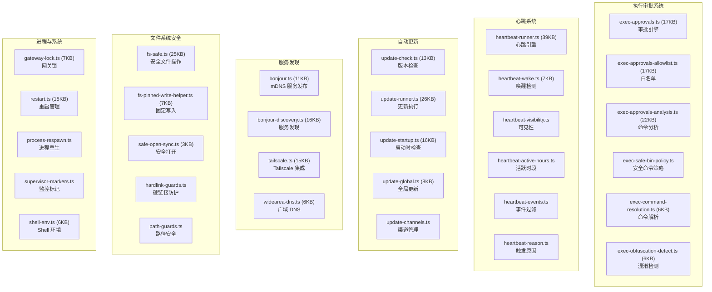
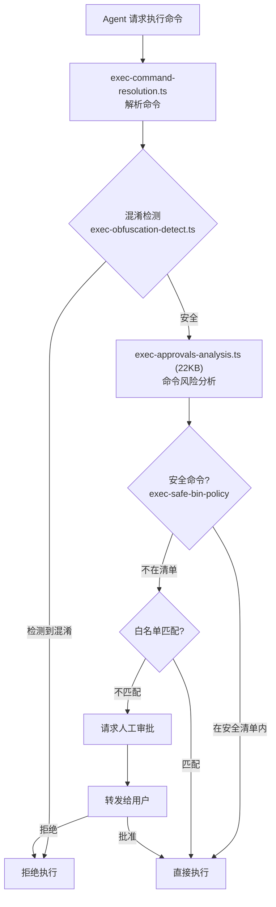

# 模块分析：基础设施 (Infra Core)

## 概览 — `src/infra/` (393 文件) ⭐ 第二大模块

基础设施模块提供系统级服务：执行审批、心跳监控、服务发现、自动更新、文件系统安全、进程管理等。

### 执行审批系统

保护系统免受 Agent 执行危险命令的核心机制：

### 心跳系统

`heartbeat-runner.ts`（39KB）实现后台心跳监控：

- 定期检查 Agent 健康状态
- 活跃时段控制（`heartbeat-active-hours.ts`）
- 唤醒检测（`heartbeat-wake.ts`）
- 事件过滤与汇总（`heartbeat-events-filter.ts`）
- 重影提醒（`ghost-reminder`）

### 服务发现

| 方案         | 文件                                  | 场景           |
| ------------ | ------------------------------------- | -------------- |
| mDNS/Bonjour | `bonjour.ts` + `bonjour-discovery.ts` | 局域网自动发现 |
| Tailscale    | `tailscale.ts` (15KB)                 | 跨网络 VPN     |
| 广域 DNS     | `widearea-dns.ts`                     | 互联网级发现   |

### 自动更新

`update-runner.ts`（26KB）管理自动更新生命周期：

- 版本检查（`update-check.ts` 13KB）
- 包下载与验证
- 原子更新与回滚
- 启动时更新检查（`update-startup.ts` 16KB）
- 更新渠道管理（stable/beta/dev）

### 文件系统安全

`fs-safe.ts`（25KB）包装所有文件操作确保安全：

- 原子写入（防止写入中断导致数据损坏）
- 路径安全检查（防止路径遍历攻击）
- 硬链接防护
- 临时文件安全管理

### 其他核心设施

| 文件                           | 功能                    |
| ------------------------------ | ----------------------- |
| `gateway-lock.ts` (7KB)        | 防止多 Gateway 实例并发 |
| `restart.ts` (15KB)            | 平滑重启策略            |
| `state-migrations.ts` (31KB)   | 状态数据迁移            |
| `push-apns.ts` (28KB)          | Apple Push 通知         |
| `session-cost-usage.ts` (31KB) | 会话成本追踪            |
| `device-pairing.ts` (21KB)     | 设备配对                |
